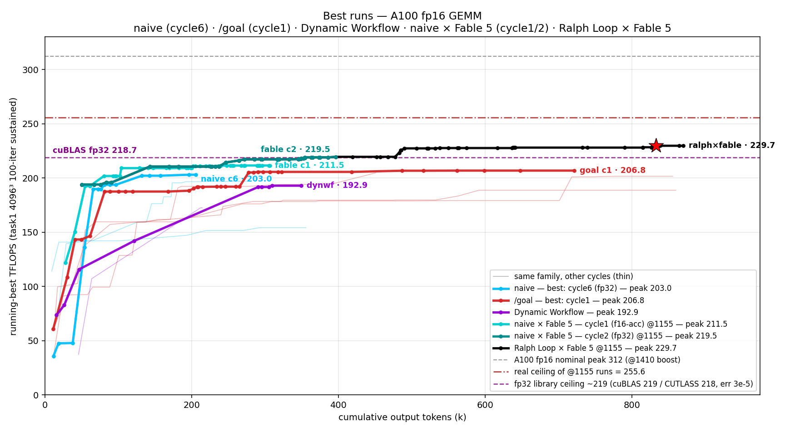

# VibeKernel

> Benchmarking different **coding-agent paradigms** on a single, fixed task — writing a high-performance CUDA GEMM kernel — to compare their final performance, iteration curves, and individual limitations under one shared scoring rubric.

**[中文版 README →](README.zh.md)**

---

## 1. What & Why

When you ask Claude Code to write a GEMM kernel, how much does the *method* matter — plain prompt vs. a skill-based agent vs. a `/goal` watchdog loop vs. an autoresearch-style self-driving loop? Lots of kernel-writing agent recipes exist, but they all report under different setups, so they're **hard to compare fairly**.

VibeKernel is the *referee bench* built for that comparison:

- **Fixed task**: one A100 fp16 GEMM task, one correctness check, one performance rubric.
- **Single variable**: the model (`claude-opus-4-8 --effort max`), the prompt (seed), and the scoring are all pinned — **the only variable is the *method***. (One deliberate exception: a controlled **model arm** re-runs the same harness with only the model swapped to `claude-fable-5` — `naive_fable`, `ralph_loop_fable` — see §4.)
- **Auditable results**: every run archives per-version TFLOPS curves, token/wall-clock cost, kernel source snapshots, and a reproducible patch.
- **Anti reward-hack**: only the fixed rubric counts as a score, so a run can't cheat with "hot peaks" or library calls (see §5).

> Original sources for each method (articles / papers / repos): [`methods.md`](methods.md). Full orchestration design: [`META.md`](META.md).

## 2. The task: high-performance GEMM on the A100

- **Goal**: hand-write an fp16 (Tensor Core) / fp32 (CUDA Core) GEMM on the NVIDIA A100 and **push toward the hardware peak** (A100 fp16 theoretical peak ≈ **312 TFLOPS**).
- **No library baseline**: the base repo has cuBLAS / CUTLASS **completely removed** — there is no library to match or beat, the hardware peak is the only yardstick. `v0` (cBLAS, on CPU) is only the correctness ground truth and **does not count as a result**.
- **Must be written from scratch**: for `--ver ≥ 1`, the tiling / Tensor Core (`mma.sync` / `wmma`) / `cp.async` / swizzle / register pipelining must all be your own. **No including or calling any existing GEMM library** (CUTLASS/CuTe/cuBLAS/cuDNN). After each run, [`scripts/check_handwritten.sh`](scripts/check_handwritten.sh) scans the sources — a version caught pulling in a library is marked invalid.
- **Scoring rubric**: only the task's built-in scoring counts — a fixed **4096³, 10 warmup + 100-iteration average** sustained TFLOPS. **No self-built sweep / best-of-N / hot-peak** numbers (a short burst at full boost clock inflates results by 10–20%, which isn't real sustained performance and is rejected).
- The full worker task manual is [`CLAUDE_For_KernelAgent.md`](CLAUDE_For_KernelAgent.md) (method-agnostic; copied into each worker's workspace as `CLAUDE.md` at launch).

## 3. The method ladder

Ordered from thin to thick "scaffolding". ⚠️ **naive**, **`/goal`**, **Ralph Loop** and **Dynamic Workflow** are implemented with results; the rest are external projects whose ideas we'll re-implement ourselves — **not yet done** (the table below is a roadmap). On top of the *method* axis there is one controlled **model arm**: `naive_fable` / `ralph_loop_fable` re-run the naive / Ralph harness with the model — and only the model — swapped to **Claude Fable 5**.

| Method | Added mechanism | Status |
| --- | --- | --- |
| **naive** | No scaffolding; a pure prompt (NEVER STOP) self-drives with zero human intervention — measures how long it keeps going on its own and how far it gets | ✅ run |
| **[`/goal`](https://code.claude.com/docs/en/goal)** | Same seed as naive + an external LLM-as-judge ("watchdog", Haiku by default) that, **inside one long-lived session**, reads the transcript whenever the worker tries to stop and pushes it back to work until the `condition` is met — a "keep the agent running" loop that never leaves the session | ✅ run |
| **[Ralph Loop](https://ghuntley.com/ralph/)** | Same "keep the agent running" goal as `/goal`, but **every iteration is a brand-new session** — `while :; do cat PROMPT.md \| claude -p; done` — so a fresh judge re-reads the on-disk state and decides whether to loop again. Kernel progress persists on disk while the **context window is wiped clean each loop** (vs. `/goal`'s single ever-growing transcript) → cleaner, less-drifted context per iteration, plus natural crash-recovery (a dead session just restarts). See [the loop write-up](https://ghuntley.com/loop). | ✅ run (Opus c1 + **Fable 5 arm**) |
| **[Dynamic Workflow](https://claude.com/blog/introducing-dynamic-workflows-in-claude-code) / ultracode** | Same seed as naive + the `ultracode` keyword, which makes the worker auto-orchestrate fan-out subagent [workflows](https://code.claude.com/docs/en/workflows) for each substantive subtask (here: parallel-build + serial-benchmark config tournaments), at the same `--effort max` — measures what self-organized multi-agent search adds | ✅ run |
| KDA (+skill) | MIT-HanLab [kernel-design-agents](https://github.com/mit-han-lab/kernel-design-agents) skill | ⏳ planned |
| AKO (+skill) | [AKO4ALL / AKO4X](https://github.com/TongmingLAIC/AKO4ALL) | ⏳ planned |
| AI-Infra-Auto-Driven-SKILLS | [BBuf's inference-framework workflow skill](https://github.com/BBuf/AI-Infra-Auto-Driven-SKILLS) | ⏳ planned |
| autoresearch / autokernel | The "autonomous research loop" idea from [autoresearch](https://github.com/karpathy/autoresearch) / [autokernel](https://github.com/rightnow-ai/autokernel) | ⏳ planned |
| Heuristic Learning | The [learning-beyond-gradients](https://trinkle23897.github.io/learning-beyond-gradients/) idea | ⏳ planned |
| K-Search | UC Berkeley [K-Search](https://github.com/caoshiyi/K-Search) | ⏳ planned |

## 4. Results so far

> All numbers are **4096³ / 100-iteration sustained**. Two precision tiers are shown: **fp32-acc** (err ~3e-5, the primary cross-method tier) and **fp16-acc** (err ~0.018, a lower-precision trade-off some workers explored — compare it only against other fp16-acc numbers). naive has 3 clean cycles, `/goal` 4, Dynamic Workflow 1 (+1 guided variant), Ralph Loop 1 — plus the **Fable 5 model arm** (naive ×2, Ralph ×1). **Peaks are dominated by path variance** — naive's own cycles span 154–203 — so read single-method gaps as indicative, not conclusive. ⚠️ **Clock caveat**: the Ralph & Fable rows ran with **the GPU stuck at 1155 MHz** (driver fault) → their clock-true ceiling is **255.6**, and their absolute TFLOPS carry a ~−18% bias vs the Opus-era runs (~1410 boost / 312 nominal; clock wasn't logged back then) — **across arms compare % of own ceiling, not absolutes**. Per-run reports in each `results/<method>/result.md`; cross-method detail in [`results/SUMMARY.md`](results/SUMMARY.md).

| Method | Best peak — fp32-acc / fp16-acc | Runs (peak range) | Termination | Report |
| --- | --- | --- | --- | --- |
| **naive** | **203 / 208** (cycle6, pre-crash) | 3 cycles, 154–203; clean self-stop 196.9 (c4) | self-stop / crash | [c6](results/naive_cycle6/result.md) · [c4](results/naive_cycle4/result.md) |
| **`/goal`** | **206.8** / — | 4 cycles, 188.7–206.8 (c4 = f16-acc tier) | watchdog + self-stop | [c1](results/goal/result.md) |
| **Dynamic Workflow** | **192.9 / 194.8** | 1 run (+1 guided, 172.5) | self-stop | [result](results/dynamic_workflow/result.md) |
| **Ralph Loop** (Opus) | 196.1 / 196.6 | 1 run, 2 substantive iters (iter2 crashed) | crash → hot-loop guard | [RESUME](results/ralph_loop/RESUME.md) |
| **naive × Fable 5** | **219.5** (c2) / 211.5 (c1) | 2 cycles, 211.5–219.5 | clean self-stop ×2 | [c2](results/naive_fable_cycle2/result.md) · [c1](results/naive_fable/result.md) |
| **Ralph Loop × Fable 5** | **227.3** strict (relaxed-fp32 **229.1**) / — **above cuBLAS** | 1 run, 3 iters (iter1 = naive_fable c2 as seed) | clean self-stop per iter | [result](results/ralph_loop_fable/result.md) |

<p align="center">
  
</p>

<sub>Headline view — six runs (naive c6, /goal c1, Dynamic Workflow, both naive×Fable cycles, Ralph×Fable; red star = its champion, and the black Ralph curve continues from where the dark-teal naive×Fable c2 self-stopped, since that run is its iteration 1) plus faint same-color thin lines for each family's other cycles. `@1155` runs sat in the clock-stuck regime — real ceiling 255.6 (dash-dot); don't compare absolutes across arms. The [full cross-method chart](results/comparison.png) (every run labeled, incl. naive_strong, Ralph-Opus and the guided arm) has the complete picture.</sub>

**A few honest takeaways (resisting over-interpretation):**

- **naive is already strong on its own**: a pure-prompt session, zero scaffolding, fully ncu-driven, climbs to ~197–203 and then **decides on its own it has hit the practical ceiling and wraps up**. Across 3 cycles its peak swings **154–203** — that 49-point spread is the path-variance yardstick every other method has to beat.
- **`/goal`'s watchdog is a floor-raiser, not a ceiling-raiser** (now robust across 4 cycles): the worker rides its own NEVER-STOP drive most of the way up; the watchdog only acts where it tries to stop. The lower it self-stops, the more the watchdog extracts — marginal gains **+1.3 / +9.7 / +22.7 / +9.8** anti-correlate with self-stop points **205.5 / 195 / 178.9 / 178.9**, and in cycle 3 being pushed back 13 times forced a genuine barrier-free `mbarrier` rewrite (+13%). But the headline peak stays ~205, at much higher token/cost.
- **Dynamic Workflow (ultracode) is a structured searcher, not a ceiling-raiser**: the worker spontaneously fans out **7** "build-in-parallel, benchmark-serially" config tournaments and pins the bottleneck cleanly (mma-latency-bound), reaching 192.9 in ~2h — but every workflow stays at the "tune the config" level, so it lands in the same ~193 wall as naive. Forcing a rigorous leave-one-out search (the *guided* arm) is faithfully executed yet peaks **lower** (172.5); its payoff is a unique by-product — a table proving **4 of 6 optimizations are worthless standalone yet jointly worth +137 TFLOPS** (the cooperative-blindspot evidence).
- **The Fable 5 model arm is the strongest naive variant**: same harness, only the model swapped — both cycles cleanly self-stop at **82.7% / 85.9%** of the clock-true ceiling (family records), with cycle2 reaching fp32 **219.5 ≈ measured cuBLAS fp32 (218.7)** by pure prompting; it deliberately *rejected* fp16-acc (+0.7 TF for 500× the error) and caught a real cp.async commit-race. Behavioral signature: ~13× less visible prose yet *more* tool calls, self-commits milestones to git; cost signature: many short turns → cache-read-heavy ($53–60 vs $13–21 for Opus naive).
- **Ralph Loop (fresh-session outer loop) is the plateau-breaker — so far on the Fable arm**: the Opus run (2 substantive iterations) only re-explored its own ~196 plateau, but **Ralph × Fable 5** — seeded with naive_fable cycle2, which had self-declared its 219.5 a source-level ceiling ("tail-wave has no economical fix") — attacked exactly that abandoned bottleneck on the *first* fresh iteration (in-kernel last-wave K-split) and climbed to **229.1 / 89.7% of the clock-true ceiling, beating same-card same-clock measured cuBLAS by ~4%** (strict-precision tier 227.3 vs 218.7). Mechanism: a fresh session inherits the kernel + design notes from disk but **not the previous session's "already gave up on this" conclusions**. Quantified: fresh restarts > single-session continuation at a plateau (+9.6 TFLOPS for 2 iterations / $87) — though the two Ralph arms differ in model, so the gain is established on Fable only.
- **Ceiling analysis**: all hand-written fp32 methods cluster at **~190–207 / 312**, bound by a Tensor-Core throughput bubble; same-precision library ceilings measured on this box are cuBLAS **218.7** / CUTLASS **217.9**, so the hand-written gap is **~5–8% — a pipelining-craft / structural-maturity gap, not a paradigm or hand-SASS gap** (CUTLASS reaches 218 with no hand-written assembly). **Update — on the Fable arm that gap is now closed and inverted**: naive×Fable c2 sits on the cuBLAS fp32 line and Ralph×Fable goes ~4% past it (same card + clock); the remaining ~10% to its 255.6 ceiling lives at the SASS level (the worker hand-rolled a CuAssembler probe and judged it a no-go). Full library-vs-handwritten breakdown in [`results/SUMMARY.md`](results/SUMMARY.md).

## 5. Experiment design: keeping it fair

Fair comparison isn't about running more — it's about **controlling variables + preventing cheating**. VibeKernel's hard protocols:

1. **Workers don't know they're being compared.** The orchestration doc (`META.md`) that reveals "we're comparing methods" **never enters a worker's context**; a worker only sees its task manual (`CLAUDE.md`) and its seed.
2. **Structural isolation (git-worktree flow).** Each run opens an independent git worktree off the clean base `playground-base` → independent working directory → transcript / agent-memory are naturally isolated, with zero cross-talk between methods/cycles. The base is never modified, it's only a source.
3. **Pinned model & effort**: every method uses `claude-opus-4-8 --effort max` for comparability. The **model arm** (`naive_fable`, `ralph_loop_fable`) is the controlled exception — identical harness, only the model swapped to `claude-fable-5` — and is compared against its own method's Opus runs, never across methods.
4. **One shared seed prompt** ([`scripts/seed_gemm.txt`](scripts/seed_gemm.txt)), verbatim across naive and `/goal`, so the only variable is the method itself.
5. **Anti-reward-hack scoring discipline**: (a) a score only counts for points satisfying `4096³ && iters≥100 && error<0.1`; off-rubric points (e.g. 8192² inflated by the wave-quantization tail) are demoted to grey crosses on the curve and don't count; (b) library-cheating versions are invalidated by `check_handwritten.sh`; (c) token / wall-clock are tallied from Claude's own transcript, deduped by `message.id` (the model can't see its own token count, so it can't self-report a fake one).
6. **Each method should be run several times for mean/variance** (naive now has 3 clean cycles, `/goal` 4; newer methods — Ralph Loop, the Fable arm — still need more runs, see the §4 caveat on path variance).

## 6. Repository layout

```
VibeKernel/
├── README.md / README.zh.md     # this file (EN default) / Chinese version
├── META.md                      # full orchestration design (human-read; never enters worker context)
├── methods.md                   # original sources for the method list (articles / papers / repos)
├── CLAUDE_For_KernelAgent.md    # worker task-manual master (method-agnostic; copied to each workspace as CLAUDE.md)
├── runbooks/                    # per-method runbook (task prompt + harness instructions)
│   ├── naive.md  goal.md  ralph_loop.md
│   └── dynamic_workflow.md  naive_fable.md
├── scripts/                     # the experiment harness
│   ├── seed_gemm.txt            #   shared seed prompt (identical across methods)
│   ├── launch_naive.sh          #   start a naive worker (open worktree, pin GPU, detached)
│   ├── launch_goal.sh           #   start a /goal worker (with watchdog evaluator)
│   ├── launch_ralph_loop.sh     #   Ralph fresh-session outer loop (launch_*_fable.sh = Fable model arm)
│   ├── finish_run.sh            #   one-shot wrap-up: archive transcript + snapshot src/patch + curve + delete worktree
│   ├── check_handwritten.sh     #   anti-library-cheating scan
│   ├── _run_common.sh           #   shared launcher logic
│   └── ...                      #   link_memory.sh / ncu-doctor.sh / ...
├── results/                     # per-run archives (one subdir per method/cycle)
│   ├── parse_run.sh             #   parse → result.csv / result_table.md / curve.png
│   ├── watch_run.sh             #   live-tail run.jsonl
│   ├── TEMPLATE.md              #   human-read report template
│   ├── naive/  goal/  ...       #   per run: result.md/.csv, curve.png, src/ snapshot, worker.patch, logs/
│   └── ...
├── playground-base/             # the clean GEMM-task base (git submodule → silencelamb/playground-base)
└── .claude/
    ├── memory/                  # orchestration memory (auto-loaded by the main session; workers can't see it)
    └── settings.json
```

> Scratch that's never committed: `worktrees/` (per-run temporary worktrees), run logs / profiler reports (`*.log` / `*.ncu-rep`, etc.), `env.sh` (your machine-specific GPU pin), and each run's raw `run.jsonl` / `transcript.jsonl` (kept local; summaries, CSVs and plots derived from them are committed) — see [`.gitignore`](.gitignore).

## 7. Running a method

**Prerequisites**: a GPU docker container (A100-80GB), CUDA 13.0, vcpkg, CMake ≥ 3.30 + Ninja, C++20/CUDA20.

```bash
# Clone WITH the playground-base submodule (the GEMM-task base)
git clone --recurse-submodules https://github.com/silencelamb/VibeKernel.git
cd VibeKernel
# (already cloned without --recurse-submodules? run:)
git submodule update --init

# Point the harness at your free GPU
cp env.sh.example env.sh        # then edit CUDA_VISIBLE_DEVICES in env.sh

# 1) Start a worker — run-name defaults to the method name; pass naive_cycle2 / goal_cycle2 for more cycles
bash scripts/launch_naive.sh [run-name]        # or launch_goal.sh / launch_ralph_loop.sh / launch_naive_fable.sh (Fable model arm)
#    live view:  results/watch_run.sh results/<run-name>/run.jsonl
#    stop:       kill -TERM -- -$(cat results/<run-name>/run.pid)

# 2) When done (natural termination / manual kill), one-shot wrap-up & archive
bash scripts/finish_run.sh <run-name>
#    → archive transcript + check_handwritten + snapshot src/include/logs/worker.patch
#      + parse_run curve + delete worktree (the base is never touched)

# 3) Write results/<run-name>/result.md from results/TEMPLATE.md (human-read report)
```

**Reproduce a run's kernel** (the base is already present via the submodule):

```bash
git -C playground-base worktree add ../repro HEAD
git -C repro apply ../results/<run-name>/worker.patch
cd repro && ./task1.sh run --float f16 --ver <N>     # prints TFLOPS / Average Error
```

`results/<run-name>/src/` also holds a readable snapshot of the kernel source.

## 8. Caveats

- **Path variance dominates**: naive has 3 clean cycles, `/goal` 4, Dynamic Workflow 1 (+1 guided), Ralph Loop / the Fable arm 1–2 each, but a single method's peak still swings widely (naive 154–203), so **don't treat a single number as conclusive**. The takeaways lean on "trend + mechanism analysis"; tighter quantitative comparison awaits more runs per method.
- **A GPU clock fault split the data into two regimes**: the GPU got stuck at 1155 MHz mid-study (NVRM driver assertion, unfixable in-container). All Ralph/Fable runs sat on it → their absolute TFLOPS carry a ~−18% bias and only %-of-255.6 is cross-arm comparable; Opus-era runs didn't log clocks. Every future run logs the SM clock.
- **Single GPU, serial**: one GPU is used; methods/cycles run serially (parallel runs share worker auto-memory and cross-contaminate — it cost us one cycle already).
- **Not cheap**: a single `/goal` run was ~$87.5 / 817k output tokens; the Ralph × Fable run added $86.7 on top of its $60.5 seed cycle; mind your quota.
- **Public-disclosure note**: `.claude/memory/` and each `results/*/result.md` contain fairly candid internal working notes (including self-corrections and rubric "red line" discussions), published along with the repo on purpose — they're a deliberate "be honest" record, not an oversight.

## 9. Acknowledgements & references

The methods compared here draw on ideas from many community efforts; the source list is in [`methods.md`](methods.md), covering MIT-HanLab KDA, AKO, BBuf's AI-Infra-Auto-Driven-SKILLS, Karpathy's autoresearch, rightnow-ai's autokernel, UC Berkeley K-Search, the Ralph loop, and an OpenAI researcher's Heuristic Learning, among others. The GEMM task itself is based on the internal playground task-1.

---

<sub>Experiment orchestration and docs done by a human + Claude Code. Peaks are path-variance-dominated; read them through the lens of mechanism analysis.</sub>
