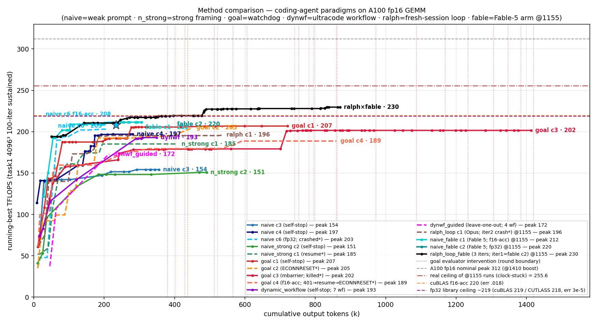

# 方法对比总览 — coding-agent 范式 × A100 fp16 GEMM

> 本文 = **各方法的文字说明 + 跨方法对比图 + 当前结论**(人读总览)。逐 run 细节见各自 `results/<run>/result.md`;编排/口径见 `META.md`。
> **任务**:让 Claude Code(worker 默认 `claude-opus-4-8 --effort max`;另有**受控模型臂** = 同 harness 唯一变量换成 `claude-fable-5`,见 §6–7)在 A100-80GB 上**纯手写** fp16 GEMM,向硬件峰值 312 TFLOPS 逼近。**无库基线**(基座已去 cuBLAS,`v0` cBLAS 仅作正确性 GT)。
> **口径(硬红线)**:只认 task1 `4096³ / iters==100` sustained(8192² / 暖机长跑 / ncu -t1 全 off-口径,不计分);相对误差 < 0.1 才算正确。峰值一律取 scored 点。
> **时钟口径(硬红线)**:ralph / fable 各轮跑时 **GPU 被 NVRM 驱动故障锁在 1155 MHz(真天花板 312×1155/1410 = 255.6)**,绝对 TFLOPS 带 ~−18% 病态偏置;Opus 老轮历史**未记录时钟**(按 ~1410/312 解读)。**跨时钟臂不比绝对值、只比「占各自真天花板 %」**;@1155 各轮之间(fable c1/c2、ralph 两臂)同钟可直接比。见 memory `gpu-1155-driver-fault-not-lgc`。
> **每个方法只是换"脚手架/外部控制",worker 看到的任务指令尽量一致**——隔离靠 git worktree(独立 cwd-slug,见 META §3),worker 不知道自己在被对比。⚠️ **全部 N=1~2,LLM 有路径随机性,下面任何单点差异先按"路径变异"看,别急着归因到机制。**

---

## 七个方法族的文字说明

### 1. `naive` — 纯 prompt 自驱(基线)
- **机制**:`claude -p "$SEED"`,seed = `scripts/seed_gemm.txt`(弱 framing:"你是 CUDA 专家,NEVER STOP 不断优化,每轮简报 TFLOPS/Error/改了什么")。**零脚手架、无外部控制、worker 想停就停。**
- **测什么**:纯 prompt 下 worker 自己能撑多久、冲到多少——是所有方法的对照基线。
- **结果**:**fp32-acc {154.2 (c3), 196.9 (c4), 203.0 (c6)}**(err 3e-5)。`naive_cycle4` 干净自停于 196.9(自判"~197 是 sm_80 天花板");**`naive_cycle6`(干净串行、跑在优化 base)崩前到 fp32 203 / f16-acc 208.3,且【自己】摸到 XOR swizzle + f16-accumulate**。全程 0 sub-agent、ncu 驱动、诚实收尾。⚠️ `naive_cycle5` 与 goal_cycle3 并行串味、污染作废(见 §核心结论 6);`naive_cycle6` 是其干净替身(但死于 ConnectionRefused、部分轮)。
- **瓶颈(ncu 实测,naive_cycle6)**:**tensor-core-bound ~82%**、DRAM 仅 17%(非访存限);剩 ~18% = HMMA `wait` 延迟 + barrier stall(每 scheduler 仅 2 warp)。**register-walled occupancy**:64×64 warp fp32 = 128 累加寄存器 → 1 block/SM、12.5% occ;**提 occupancy 反而更慢**(2-block/16-warp 缩 warp tile、杀 ILP/reuse)。卡 ~200/312。
- **关键**:**同方法 fp32 三轮 154 / 197 / 203 差 49** = N=1 路径变异标尺;**c6 干净独立摸到 f16-acc(208.3)** → 坐实 cycle5 的 218 不是"只有抄 goal 才到"(naive 自己也能走 f16-acc;干净版 208 < 抄了 goal config 的 cycle5 的 218)。

### 2. `naive_strong` — 强 framing prompt,无 hook(第三臂)
- **机制**:同 naive 的纯 prompt 流,但 seed 换成**强 framing 版**(`scripts/seed_gemm_strong.txt`:堵死"已到上限 / practical ceiling / 等我指示"等一切收尾借口;**要求每次想停前先列 ≥5 个【还没实测过】的方向、逐一用 ncu 数据否决,只要有一个没被否决就立刻去试**)。**仍无 Stop-hook——纯靠 prompt 文字。**
- **测什么**:把 naive→naive_strong 当受控对照,**单独拆出"framing 文字"的贡献**(有强话术、无强制执行)。
- **结果**:**{185.2 (c1), 150.7 (c2)}**;🟡 **两轮都不幸 ECONNRESET 崩、resume 续跑**(c1 resume 时还注入过一句 nudge,有瑕疵;c2 resume 后干净自停于 v10=151,自报"thoroughly-characterized optimum",并**逐条列出每个被 ncu 否决的方向**)。0 sub-agent。
- **瓶颈**:同一堵墙——**ILP-vs-occupancy Pareto 前沿、mma-bound**;c2 自停前把 16-warp / 2-block / fp16-acc / rasterization 逐一 ncu 实测否决("穷尽证明撞墙"),峰值 151–185 仍在墙下。
- **关键**:**framing 明显改变了行为**(c2 自停前把 16-warp/2-block/fp16-acc/rasterization 等逐个 ncu 实测否决,比 naive 更穷尽地"证明到顶")——**但 TFLOPS 没因此更高**(151–185 ⊂ naive 的 154–203 区间)。**强话术 → 更彻底的自我论证,不 → 更高天花板。**

### 3. `goal` — naive seed + 外部 evaluator 看门狗(Stop-hook)
- **机制**:`claude -p "/goal <condition>"`,condition = **与 naive 完全相同的弱 seed**;`/goal` 是 session 级 **Stop hook**——每当 worker 想交还控制(想停),一个独立 **evaluator(Haiku,只读 transcript)** 判 condition 是否达成,**未达成就强制再续一 turn**。condition 是 "NEVER STOP" 无终止态 → evaluator 永判未达成 → **在 worker 每个"想停"点把它顶回去**。
- **测什么**:naive→goal 拆出**"硬性执行(hook)"的贡献**(弱 seed + 真·强制不许停)。看门狗**只挡自愿停**,挡不了崩溃。
- **结果**:**fp32-acc {206.8 (c1, 自停), 204.7 (c2, 🔴 ECONNRESET), 201.6 (c3, ⏹️ 用户 kill)}** + **f16-acc {188.7 (c4, 🔴 401→resume→ECONNRESET)}**。四轮都纯手写无库参照。⚠️ **c4 走 f16-acc 档(err 0.017)、与 c1-c3 fp32-acc(err 3.7e-5)不同档,别直接并列**;c4 是 goal 族最弱路径(详见下)。
- **关键(三轮实锤,最重要的结论)**:看门狗 = **高方差的「地板抬升器」,且自停点越低、它逼出的越多——低到一定程度能逼出【真突破】**:

  | 轮 | worker 自停点 | 接入次数 | 看门狗净加 | 性质 |
  |---|---|---|---|---|
  | c1 | 205.5 | 3 | **+1.3** | 长尾打磨 |
  | c2 | 195 | 2(崩) | **+9.7** | 中段提升 |
  | **c3** | **178.9** | **13** | **+22.7** | **真突破:逼出 v18 barrier-free mbarrier 流水(+13%)** |
  | **c4** | **178.9** | 5(2崩→resume→3) | **+9.8** | 被顶后做出 epilogue 访存合并(179→188.7);part2 三接入在收敛后=净 0 |

  - **干净的反相关**:自停/首接入点 {205.5, 195, 178.9, 178.9} → 净加 {+1.3, +9.7, +22.7, +9.8}。**c3 worker 自封 "v15=178 是 validated optimum" 想停,被顶 13 次后才做出 mbarrier 突破** → /goal 最有力的正面证据:不只"不让停的长尾",worker 过早自封顶时它能**逼出范式级改进**。
  - **★c4 = c3 的"同起点不同路径"对照**:两轮 worker 都独立爬到 v23 级 **178.9 plateau**、用同一套机理(78% of 230 pure-HMMA 探针、64-reg 累加器卡 2 blocks)自封天花板;但 c3 被顶→mbarrier(+22.7→201.6),c4 被顶→epilogue 合并(+9.8→188.7)即真收敛。**同 plateau、不同 lever、不同幅度 = 净增量由随机探索路径主导,非看门狗剂量**。
  - **c4 是 goal 族最弱路径(且精度档救不回)**:c4 走 f16-acc(累加器 64 reg → 2 blocks/SM 的 occupancy 优势),拿着这优势仍只 188.7——**比 naive 自己的 f16-acc 208.3 还低**、更比 c1-c3 fp32-acc 201-207 低。说明 c1-c3 的 200+ 靠的是 **1-block 下 mbarrier/深流水「结构藏延迟」的真本事**,c4 没摸到。
  - **sub-agent c1=129 / c2=0 / c3=0 / c4=0,峰值 188–207** → c1 的 129 是路径变异、**不是 /goal 效应**(已坐实)。
  - ⚠️ 但峰值仍是路径变异主导:c1 206.8 > c2 204.7 > c3 201.6,跑越久(c3 ~1.46M tok/6h)不等于越高。
- **瓶颈**:同 **register-walled occupancy + tensor-latency wait**(1 block/SM、64×64 warp fp32 = 128 累加寄存器)。c3 的 no-barrier mbarrier 干掉了墙里"`__syncthreads` barrier stall"那一分量(+13% → 201.6),但 occupancy 墙(剩 HMMA `wait` 延迟)仍在 → ~205 封顶。**三族瓶颈本质同一堵墙**(手写 mma+cp.async GEMM 在 A100 的 ~200–207/312),差别只在用什么边角技法逼近它。

### 4. `dynamic_workflow` — ultracode 自动多 agent workflow 编排(新方法族)
- **机制**:headless `claude -p "<seed>\n\nultracode" --effort max`,seed = **与 naive 完全相同的 `scripts/seed_gemm.txt`**;末尾 `ultracode` 关键字触发 Claude Code 的 **Dynamic Workflow**(worker 对每个实质子任务自己 fan-out 多 agent workflow),且**保留 `--effort max` 不压成 xhigh**。**单一变量 vs naive = workflow 编排开/关**(与 /goal 用 `/goal ` 前缀包同一份 seed 对称)。
- **测什么**:给 worker「自动编排子 agent」的能力(ultracode),它会不会自发组织出更高效的优化、冲得更高?
- **结果**:**fp32-acc 192.9**(err 3e-5,干净)/ f16-acc 194.8(err 0.017,降精度边际)。**自愿停**(~2h,自称 "reached the practical ceiling for a hand-written Ampere kernel"——无看门狗 → 行为同 naive)。**7 次 workflow fan-out**:worker 没人教就反复复用「2-phase config tournament」——并行 build 一批 tile/STAGES/occupancy 配置(一配置一子 agent、纯编译)→ 单 GPU **串行** benchmark(task1 100 轮)→ 排序选赢家 → ncu 深 profile 赢家 → 固化进新版本 → 围绕赢家起下一 tournament。$37.47 / ~349k out token(fan-out 显著比 naive/goal 贵)。详见 `results/dynamic_workflow/result.md`(含 workflow 机制逐段还原)。
- **瓶颈**:同一堵墙——**mma-latency-bound、tensor pipe 76.4%**,其它 stall 近零(worker 自评 ncu)。撞 naive 同款 tensor-pipe barrier 天花板。
- **关键**:**workflow 的价值 = 结构化搜索 + 干净瓶颈定位,不是更高天花板**。它把 config-space(tile/占用率/STAGES)扫得彻底、~2h 系统逼到 192.9,但 **7 个 workflow 全停在「调配置」这一层,没有一个去试范式级重写**(persistent / mbarrier / 计算-访存结构重叠)——即 **spontaneous workflow ⇒ 搜索深、范式保守**,正与 goal_cycle3 被顶 13 次才逼出 mbarrier 突破成对照。
- **guided 臂(`dynamic_workflow_guided`)结果**:规定死 leave-one-out backward elimination + synergy 组合后,worker **忠实执行了全 4 phase**(4 workflow,其中 `phase2-3-ablation` 真做了"从全栈逐项移除重测",产出规定的 standalone-vs-LOO 表),自停于 **fp32 172.5**。**但峰值反比主臂自发的 192.9 低 ~20** —— 规矩执行 ≠ 更高数。三条制约机制:① 预算被"方法论严谨"(搭可切换全栈 + 6 项 LOO + 3 组 synergy 四角 + 6 项 standalone = 十几个证明实验)吃掉,而非主臂那样全砸在激进调 tile/STAGES;② "先锁全栈再消融"把搜索钉死在 Phase1 选定的 `128×128×64 2×2 S2` 局部最优,backward elimination 只优化"该不该留某 ingredient"、不优化"tile 选得对不对"(而峰值主要由后者定);③ seed 给了可完成的"交付排序表"目标 → 达到即收(对照主臂纯 NEVER-STOP 无终点只能继续磨)。**guided 的价值不在峰值,在它产出的那张 load-bearing 表**(主臂/naive/goal 都给不出):**6 个 ingredient 里 4 个(cp.async/pipeline/ldmatrix/vectorize)standalone Δ≈0 或负、贪心会全丢,却贡献 172 里的 +137,只有 leave-one-out 救得回**——量化坐实了 cooperative blindspot。详见 `results/dynamic_workflow_guided/result.md`。⚠️ 首跑死于 ECONNRESET(orientation,作废重跑)。

### 5. `ralph_loop` — fresh-session 外循环(Ralph Loop,Opus 臂)
- **机制**:`launch_ralph_loop.sh` 外循环 ≈ `while :; do cat PROMPT | claude -p; done` —— **每轮全新 session(干净 context)**,kernel 进度与 worker memory 靠磁盘跨轮持久;与 `/goal` 的单变量 = **跨-session 重启 vs 单-session 续**(两者都是"不让停",差别在 context 是否清空)。旋钮 `RALPH_MAX_ITERS/JUDGE/BUDGET_USD`;hot-loop 防护(连续 3 轮 <30s 自动停)。
- **测什么**:plateau 上,"扔掉历史上下文、重新看盘面"能否破单 session 自封的天花板。
- **结果(c1,Opus,⚠️@1155)**:**fp32 196.1 / f16-acc 196.6 = 占真天花板 255.6 的 ~77%**。2 个实质 iter(iter1 从零爬到 ~195;iter2 读盘续做 v11–v18、全在 192–196.6,崩前 196.1),iter3–5 撞 API 故障秒退、hot-loop 防护自动停。$38.89 / ~536k tok / 0 sub-agent。
- **关键**:**iter2(全新 session)没破 iter1 的 ~196 plateau,只在同一 plateau 重新探索** → Opus 臂 N=1(且 iter2 崩)下 fresh-restart 未显示突破;对照 Fable 臂(§7)同一机制突破成功——**但两臂模型不同,Ralph 的增益目前只在 Fable 臂坐实**。
- **口径坑**:每轮独立 transcript(`iters/`),`run.jsonl` 尾是 iter5 崩(0 tok)→ 总计须合并 iter1+2 重算(已修进 `result.csv`);本轮无 result.md,细节与 resume 指南见 `results/ralph_loop/RESUME.md`。

### 6. `naive_fable` — naive 的模型对比臂(Claude **Fable 5**)
- **机制**:`launch_naive_fable.sh` 与 `launch_naive.sh` **逐字相同,唯一变量 = 模型** `claude-opus-4-8` → `claude-fable-5`。**只与 naive(Opus)家族横比**,别与 /goal、dynwf 混比。
- **结果(两轮,均 ⚠️@1155 → 真天花板 255.6)**:
  - **c1:f16-acc 211.5 / fp32 201.8 = 占真峰 82.7%**,13 版,✅ 干净自停;$53.14 / 310k tok / 145 turns。
  - **c2:fp32-acc 219.5(err 3e-5)= 占真峰 85.9%(naive 家族最高)**,22 版,✅ 干净自停;$60.46 / 398k tok / 149 turns。**主动拒 f16-acc**(实测只 +0.7 TF、err ×500 → 判不值,与 c1 路径相反)→ 全精度反而走得更高;**v9 抓到并修了 cp.async commit/wait 计数竞态**(空 commit group 使 `wait_group` 保证错位、`ldmatrix` 可能读到在飞数据,110 连跑验证)。冠军 v19 = 256×128 镜像 tile + GW8 panel 铺排 + persistent block + epilogue 预取;同 kernel 在 8192² 达 235 = 92% 锁频峰 → 残差是 **4.74-wave 尾波量化**,c2 据此自判"无经济解"收尾(**这句后来被 ralph_loop_fable 推翻**,见 §7)。
- **行为/成本签名(两轮稳定)**:可见叙述文字比 Opus 少 ~13×(1.7–2.1k vs 22.5k 字符)、tool_use 反而更多、**自发 git commit 打里程碑**(踩出 finish_run `worker.patch`=0 行坑,已改 merge-base 修复)、0 sub-agent;贵在 turn 多 → cache-read 重($53–60 vs naive Opus $13–21)。
- **关键**:c2 的 fp32 219.5 ≈ 本机实测 cuBLAS fp32 218.74(**同卡同钟**)→ **纯 prompt 手写已摸到库天花板**。⚠️ 绝对 TFLOPS 与 Opus 轮跨钟不可比;Opus 老轮时钟未记录 → 占比对照(86% vs naive c6 的 ~65–67%@假定 1410)也只能存疑待复核。
- **资格说明**:模型臂动机最初含"输出文字是否更少"之问 —— 答案是(13×),且不是少干活(tool_use 更多、out_tok 相近)。

### 7. `ralph_loop_fable` — Ralph Loop × Fable 5(突破轮)
- **机制**:`launch_ralph_loop_fable.sh`(`RALPH_MODEL` 钉死 Fable);**iter1 = naive_fable_cycle2 整轮当种子**(kernel 已到 v22 / fp32 219.5),之后 2 轮 fresh session(iter2/iter3,各自干净 context 重读盘上 kernel + worker memory)。
- **结果(⚠️@1155)**:**冠军 v42 = 229.1(5 样本均值,单样本最高 229.7;放宽 fp32 档 err ~1–3e-4,仍 ≪0.02)= 占真峰 89.7%;严格 3e-5 档(与 fable c2 同档)= 227.3(v24/v25)**。**两档都反超本机同卡同钟实测 cuBLAS(f16 219.8 / fp32 218.7)约 +4%**。Ralph 新增开销 = iter2+3 = $86.70 / 161min / ~499k tok;三轮均 ✅ 干净自停;0 sub-agent;防作弊门通过(54 文件零库)。
- **突破点 = v23 wavesplit(iter2 第一刀)**:用 **in-kernel last-wave K-split** 把 cycle2 自封"无经济解"的 4.74-wave 尾波砍开(225.5,一举越过 cuBLAS)。**机制 = fresh session 不继承上一轮"已放弃"的结论包袱**(只继承 kernel + 设计 memory),敢直接打被自封死刑的方向。iter3 精修出 v42(形状特化编译期常量化 + 寄存器 shuffle 转置 epilogue(零 smem/零 barrier)+ acc 分相边界 + epilogue 内禁 `__syncwarp`),并把残差探到汇编层(**自己手搓 CuAssembler SASS 探针 → 判 no-go**:剩的 HMMA cadence ~+7TF 需 SASS 级重排、工具链不可得)。89.7% 已贴 CUTLASS-class sm80 实际包络(88–92%)上沿。
- **关键**:**fresh-restart > 单 session 续跑,在"自封天花板"plateau 上拿到量化证据**:219.5 → 229.1(+9.6 TF / +4.4%),代价 2 轮 $86.7 —— 正面回答了 Ralph 的核心假设(对照:`/goal` 是"同一 session 里不让停",Ralph 是"换个干净脑子再看一遍",后者在这个 plateau 上更有效)。
- **口径坑**:每轮独立 transcript 已合并进 `transcript.jsonl` 再 parse;`run.jsonl` 尾部单个 result 事件只是 iter3、**不是全量**(全量 = 三轮 result 之和)。报数必须标精度档(229.1 = ~2e-4 放宽档;严格 3e-5 = 227.3)。

---

## 跨方法对比表(全部 scored 4096³/100 口径)

| 方法族 | 机制增量 | run | 峰值 TFLOPS | 结束方式 | turns | out_tok | cost | sub-agent |
| --- | --- | --- | --- | --- | --- | --- | --- | --- |
| **naive** | 纯弱 prompt,无控制 | `naive_cycle3` | 154.2 (fp32) | ✅ 自停 | 92 | 360k | $20.7 | 0 |
| | | **`naive_cycle4`** | **196.9 (fp32)** | ✅ 自停 | 97 | 287k | $17.6 | 0 |
| | | ~~`naive_cycle5`~~ | 🚨 **污染作废**(并行读了 goal_cycle3 memory;曾测 f16-acc 218 / fp32 188) | — | — | — | — |
| | | **`naive_cycle6`** | **203 (fp32)** / 208.3 (f16-acc) | 🔴 ConnectionRefused(崩前) | 72 | 234k | $12.6 | 0 |
| **naive_strong** | + 强 framing 话术 | **`naive_strong`** (c1) | **185.2** | 🟡 崩+resume(注入 nudge) | 161 | ~410k | ~$32.7 | 0 |
| | | `naive_strong_cycle2` | 150.7 | 🟡 崩+resume,后干净自停 | 55(+121崩) | ~492k | ~$43.7 | 0 |
| **goal** | + evaluator 看门狗(hook) | **`goal`** (c1) | **206.8** | ✅ 自然终止 | 284 | 817k | $87.5 | 129 |
| | | `goal_cycle2` | 204.7 | 🔴 ECONNRESET(崩前地板) | 186 | 478k | $41.4 | 0 |
| | | `goal_cycle3` | 201.6 (13 接入,逼出 mbarrier) | ⏹️ 用户 kill | — | ~1.46M | —(kill 无 result) | 0 |
| | | `goal_cycle4` | **188.7 (f16-acc)** (5 接入;首接入 178.9→epilogue +9.8) | 🔴 401→resume→ECONNRESET(两段) | 223 | 863k | $79.7 | 0 |
| **dynamic_workflow** | + ultracode 自动 workflow 编排 | **`dynamic_workflow`** | **192.9 (fp32)** / 194.8 (f16-acc) | ✅ 自停("practical ceiling") | 54+6 | ~349k | $37.5 | 7 workflows |
| | + guided seed(规定死 leave-one-out 消融+synergy) | **`dynamic_workflow_guided`** | **172.5 (fp32)** | ✅ 自停(交付报告) | 35+15 | ~212k | $18.2 | 4 workflows（2 sweep+2 ablation）|
| **ralph_loop** | + fresh-session 外循环(每轮新 session) | `ralph_loop` (c1, Opus) | 196.1 (fp32) ⚠️@1155 = 77% | 🔴 iter2 崩 → hot-loop 停 | — | ~536k | $38.9 | 0 |
| **naive_fable**(模型臂) | naive 同 harness,模型 → **Fable 5** | `naive_fable` (c1) | 211.5 (f16-acc) / 201.8 (fp32) ⚠️@1155 = 82.7% | ✅ 自停 | 145 | 310k | $53.1 | 0 |
| | | **`naive_fable_cycle2`** | **219.5 (fp32)** ⚠️@1155 = **85.9%** | ✅ 自停 | 149 | 398k | $60.5 | 0 |
| **ralph_loop_fable** | Ralph × Fable 5(iter1 = fable c2 种子 + 2 轮 fresh) | **`ralph_loop_fable`** | **229.1 均值 / 227.3 严格 3e-5** ⚠️@1155 = **89.7%**(反超 cuBLAS) | ✅ 3 iter 均自停 | 446(3 轮) | ~896k(增量 ~499k) | $147.2(增量 $86.7) | 0 |

> ⚠️ `dynamic_workflow_guided` 的 seed ≠ 共享 seed(规定死搜索策略)→ **只与主臂 dynamic_workflow 对照,不与 naive/goal 比峰值**。它首跑死于 ECONNRESET(orientation 崩、作废),已清理重跑得上表数。
> ⚠️ **`@1155` 标注的 run(ralph / fable 族)跑在驱动故障锁 1155 MHz 的时钟态(真天花板 255.6)**:绝对 TFLOPS 带 ~−18% 偏置,与上方 Opus 轮(时钟未记录、按 ~1410/312 解读)**不可直接比绝对值**;表中 % = 占 255.6。ralph_loop_fable 的"反超 cuBLAS"是**同卡同钟**实测对照(cuBLAS f16 219.8 / fp32 218.7,@1155 复测 220.5)。ralph_loop_fable 的 turns/tok/cost 含 iter1(= naive_fable_cycle2);"增量"= iter2+iter3。

> 排除:`naive_cycle2_deprecated`(206.3,🚨 污染——worktree 共享 worker memory、抄了 goal 的最优设计,见其 result.md)、`naive`(c1,无 scored 点)、`naive-break`/`naive_no_ncu`/`naive_ncu_cublas`(早期含库/崩坏归档)。

---

## 综合对比曲线

> 各 run 的 **running-best vs 累计 output token**,**曲线末端直接标方法文字**(`goal c1·207`、`fable c2·219` 等);按方法族着色(naive 蓝 / naive_strong 绿 / goal 红橙系 / dynwf 紫 / **ralph 棕 / naive×Fable 青 / ralph×Fable 黑**);**goal 族竖点线 = evaluator 接入(= round 边界)**;横虚线 = **实测库天花板**(cuBLAS f16-acc 219.85 / fp32 库 ~218:cuBLAS 218.74、CUTLASS 217.9);**砖红点划线 255.6 = `@1155` 各轮(ralph/fable 族)的真天花板**(灰虚线 312 = @1410 名义峰)。一眼看出:Opus 四族(goal 201.6–206.8、naive 154–203、n_strong 151–185、dynwf 192.9)**峰值区间高度重叠**、手写 fp32 全贴在 fp32 库天花板 ~218 下方 ~5–8%;naive_cycle6 的 f16-acc 裸峰 208(★)更贴近 cuBLAS f16;**Fable 臂(@1155)占真天花板比例更高:fable c2 青线 219.5 摸到库线,ralph×fable 黑线 229.7(严格档 227.3)越过库线** —— ⚠️ 但 @1155 与 Opus 轮跨钟**不可直接比绝对值**(见头部时钟口径);ralph c1(棕,Opus@1155)196 则停在 iter1 同款 plateau。dynwf_guided(品红虚线)172.5 最低 —— 规定死 leave-one-out 后峰值反降,但产出独有的 load-bearing 表(见 §4 与结论 #8)。

> **头牌图:6 条粗线 + 同族淡细线衬底**:naive c6(fp32 203)/ goal c1(206.8)/ dynwf(192.9)/ naive×Fable c1(亮青,f16-acc 211.5)/ **naive×Fable c2(深青,fp32 219.5 自停)**/ **ralph×Fable(黑线,从 c2 终点接着续顶到 229.7,红★ = 冠军点)**——黑线 csv 含 iter1(= fable c2 整轮),前 397k 与深青线重合、深青画在其上,视觉即"cycle2 自停、Ralph 接力"。淡细线 = 同族其余 cycle(naive c3/c4、goal c2/c3/c4、guided;无标签纯衬底,goal c3 长尾按主曲线范围裁掉)。横线:灰 312 名义峰、砖红点划 255.6(@1155 各轮真天花板)、紫 cuBLAS fp32 库线 ~219(线上左侧有字标)。naive_strong / ralph-Opus 与全部细节见上面 comparison.png。

### goal 的 `round` 区间(逐 run,看门狗接入可视化)

`/goal` 的核心证据 = evaluator 接入点(竖红虚线)与其切出的 **round 区间**(红色 `<->` 箭头)。四轮 goal 的 `curve.png` 都带此标注:

| run | 接入次数 | round 区间读法 |
|---|---|---|
| `results/goal/curve.png` (c1) | 3 | round 1 = 起点→430k(自驱到 205.5);round 2–4 在 205–206 长尾打磨 |
| `results/goal_cycle2/curve.png` (c2) | 2 | round 1 = 起点→403k(自驱到 195);round 2 后崩前推到 204.7 |
| `results/goal_cycle3/curve.png` (c3) | **13** | round 1 = 起点→380k(自驱到 178.9、自封 optimum);round 4–5(~718k)**逼出 v18 mbarrier 突破→201**;round 6–13 在 201 打磨 |
| `results/goal_cycle4/curve.png` (c4) | 5 | round 1 = 起点→437k(自驱到 178.9、同 c3 自封 optimum);round 2–3 后**逼出 epilogue 合并→188.7**;**round 4–5 在 part2(742k/782k/863k)= v25 收敛后,净 0** |

> round 区间读法:**round 1 永远是 worker 自驱那一大段**(头次接入前看门狗没参与);从第 1 条红线起才是看门狗"顶回去续"。**对比四图 round 1 终点高度(205.5 / 195 / 178.9 / 178.9)= 看门狗能发挥多大作用的关键**——越低,后面 round 越值钱(c3 的 round 4–5 直接逼出 mbarrier 突破;c4 同起点但只逼出较弱的 epilogue lever 即收敛)。**c4 的 round 4–5 是真收敛后的接入(净 0)= 看门狗的反例:worker 真到顶后,"不许停"只剩烧钱长尾。**

---

## 📌 库天花板对照(本研究的实测参照基准)

> 几轮讨论的落档:拿这台 A100 上**真·cuBLAS / CUTLASS** 当尺子,**先分精度档再比**。两条线都画进了 `comparison.png`。cuBLAS 两值在 **@1155 故障态复测一致**(`results/_baseline_cublas_f16.log` = 220.5)→ `@1155` 各轮(fable/ralph 族)可与下表**同卡同钟**直接对照。

| 实现 | 累加 | TFLOPS | err | 出处 / 关键 |
|---|---|---|---|---|
| **cuBLAS** | **f16** | **219.85** | 0.018 | `computeType=CUDA_R_16F`(最新实测) |
| **cuBLAS** | **f32** | **218.74** | 3.4e-5 | `computeType=CUDA_R_32F`(最新实测)——**与 goal/naive fp32 同档可比** |
| **CUTLASS** | **f32** | **217.9** | 3.2e-5 | `Gemm<half_t,…,float acc,Sm80,**128×256/64×64/BK32**>`(`results/naive_no_ncu` v7)—**与 goal tile 配置完全相同** |
| 实习生手写(参考) | f16 | 214 | 0.02 | 普通 `__syncthreads` + XOR swizzle + 256×128;= cuBLAS f16 档 97% |
| goal_cycle1 / 2 / 3 | f32 | 206.8 / 204.7 / 201.6 | 3.7e-5 | 本研究 /goal,纯手写 fp32 |
| naive_cycle6 / 4 | f32 | 203.0 / 196.9 | 3e-5 | 本研究 naive 干净 fp32(c6 崩前) |
| naive_cycle6 | f16-acc | 208.3 | 0.018 | 本研究 naive **独立**走到 f16-acc(崩前) |
| **goal_cycle4** | **f16-acc** | **188.7** | 0.017 | 本研究 /goal,纯手写 f16-acc(= cuBLAS f16 的 86%)——**goal 族走 f16-acc 的唯一一轮,且最弱**:f16-acc 给 2-block occ 优势仍 < naive c6 的 208.3,说明 c1-c3 的 200+ 靠的是 fp32 1-block 下 mbarrier/深流水结构,非精度档 |
| **naive_fable_cycle2**(Fable 5) | **f32** | **219.5** ⚠️@1155 | 3e-5 | 本研究 naive×Fable 第 2 跑,纯 prompt 手写 —— **≈ 同卡同钟 cuBLAS fp32(218.74),摸到库天花板** |
| **ralph_loop_fable**(Fable 5) | **f32(严格)** | **227.3** ⚠️@1155 | 3e-5 | v24/v25 —— **> cuBLAS fp32 218.74(+3.9%),同档同卡同钟反超库** |
| **ralph_loop_fable**(Fable 5) | f32(放宽) | **229.1**(均值) ⚠️@1155 | ~2e-4 | 冠军 v42;> cuBLAS f16 219.85;仍 ≪0.02 纠错门,**非** f16-acc 档 |

**要落档的结论:**
1. **同精度档对标:goal/naive 的 fp32 峰值(goal 201.6–206.8 / naive c6 203)= fp32 库天花板(cuBLAS 218.74 / CUTLASS 217.9 ≈ 218)的 ~92–95%**(CUTLASS 还与 goal 同 tile 配置)。这 ~5–8% 是**实现结构成熟度**,不是精度、不是 tile、**不是手写 SASS**。
4. **cuBLAS f16(219.85)≈ cuBLAS fp32(218.74),只差 ~1** —— 对调好的库,**f16-acc 几乎不提速**。所以手写里"f16-acc 比 fp32 高一截"(naive_cycle6 203→208、deprecated cycle5 188→218)是**手写 fp32 卡在 1-block register-wall 的产物**,不是 f16>fp32 的本质;库的 fp32 没那个 wall,两档基本齐平。
2. **差距≠手写 SASS:CUTLASS 开源、纯 C++ 模板 + inline PTX、SASS 由 ptxas 出(无一行手写汇编),照样到 217.9**(fp32)。所以那 ~6% **在可读的 C++/PTX 里就能拿**(更优 multistage mainloop 结构),不是够不着的汇编层。
3. **逼近库不需要 mbarrier-无-sync:实习生 214(cuBLAS f16 档 96%)用的就是普通 `__syncthreads`。** goal_cycle3 的 no-barrier mbarrier 在"去 barrier"轴上反而更先进(+13%),但它把先进性花在了 **fp32 这个更低吞吐档**(seed 导向)。要破 214 得换 f16-acc 框架(+XOR swizzle + 它已有的 no-barrier)——干净串行重跑该验的格子。详见 `results/goal_cycle3/result.md` §库对照。
5. **(2026-06-10 更新)"手写差库 ~5–8%"只对 Opus 臂成立;Fable 臂已闭合并反超**:naive_fable_c2 纯 prompt fp32 **219.5 ≈ cuBLAS fp32 218.74(100.3%)**;ralph_loop_fable **严格档 227.3 = +3.9%、放宽档 229.1 还越过 cuBLAS f16 219.85**。这是 **@1155 同卡同钟实测对照**(复测 cuBLAS = 220.5)、不是跨钟错觉;但与 Opus 轮的绝对值对比仍无效(时钟不同)。也即:**同钟同精度下,纯 prompt 手写 kernel 已可反超 cuBLAS ~4%** —— "够不着库"的结论被模型/方法升级推翻,剩的 ~10% 残差(89.7% vs 100%)在 SASS 层(CuAssembler 探针判 no-go)。

---

## 核心结论(截至 2026-06-10,naive N≈4 / goal N=4 / dynwf N=1+guided / ralph_loop N=1(Opus)+1(Fable) / naive_fable N=2)

1. **同精度档(fp32-acc,err ~3e-5)峰值排序 goal(201.6–206.8)≳ naive(154–203)≳ dynamic_workflow(192.9)> naive_strong(151–185),四族区间高度重叠**(本条全为 Opus 臂、按 ~1410/312 解读;**Fable 模型臂 @1155 另列 #9–10,跨钟不与此并列**);所有纯手写 fp32 方法都卡 ~200/312(dynamic_workflow 主臂 192.9 落在 naive 区间内)。**同档库天花板 = cuBLAS fp32 218.74 / CUTLASS fp32 217.9(实测,见上节),手写到它的 ~92–95%**——那 ~5–8% 是实现结构成熟度,**非精度、非 tile、非手写 SASS**(CUTLASS 无手写汇编也到 218)。**`naive_cycle6`(干净)fp32 203 已逼近 goal 下沿 → goal 对 naive 的优势进一步缩小、更像路径变异。**
2. **看门狗(goal)= 地板抬升器,且自停越低逼出越多——能逼出真突破**:四轮边际 **+1.3 / +9.7 / +22.7 / +9.8** 与 worker 自停/首接入点(**205.5 / 195 / 178.9 / 178.9**)**反相关**。**c3 worker 自封"178 是 optimum"想停、被顶 13 次,逼出 v18 barrier-free mbarrier 流水(+13% → 201.6)= 范式级真突破,不只长尾**。**c4 = c3 的同起点对照(同 178.9 plateau、同自封天花板机理),但被顶后只摸到较弱的 epilogue 访存合并 lever(+9.8 → 188.7)即真收敛 → 净增量是路径变异、非看门狗剂量**。但天花板仍 ~205(峰值由路径变异主导:跑越久≠越高),代价 token/cost 大(c3 ~1.46M tok / 6h、c4 $79.7 / 4.8h 两段)。**c4 还给出看门狗的反例**:它 part2 的 3 次接入全在 v25 真收敛之后(净 0)——**worker 真到顶后,"不许停"只剩烧钱长尾,看门狗无法凭空造增益**。⚠️ **c4 走 f16-acc 档(188.7,err 0.017)、与 c1-c3 fp32-acc 不同档**,且 f16-acc 的 2-block occ 优势仍 < naive c6 的 f16-acc 208.3 → c4 是 goal 族最弱结构路径(精度档救不回)。
3. **强 framing(naive_strong)改变行为不改变天花板**:话术让 worker 更穷尽地 ncu-证伪每个停点,但峰值仍落在 naive 区间内。
4. **路径变异 >> 机制差异**:naive 自己三轮就 154↔203(差 49);goal 自停/首接入点 178.9↔205.5(差 27)、峰值 188.7↔206.8(差 18,含 c4 的 f16-acc 路);**单点跨方法差异多在此噪声量级内,结论需更多 N**。naive c6 的 fp32 203 已与 goal fp32(201.6–206.8)区间重叠;**c3/c4 同从 178.9 plateau 起步却分叉到 201.6 vs 188.7 = 路径变异的最干净标尺(同方法、同起点、同 seed)**。
5. **方法学:API 崩溃反复咬人(已 7 处:naive_strong ×2、goal c2、naive_cycle6、goal c4 ×2[401+ECONNRESET]、ralph_loop c1 iter2[崩后 iter3–5 API 故障秒退、hot-loop 防护自停])**——ECONNRESET / ConnectionRefused / 401-auth,看门狗救不了进程级崩溃;Ralph 的 fresh-session 外循环天然抗崩(下一轮重起),但要配 hot-loop 防护;长无界跑建议挂 `--max-budget-usd` + 重试兜底,崩了的轮按"部分轮"归档、干净结论以未崩轮为准。**✅ resume 实操坐实可行(goal c4)**:`claude -p "/goal $COND" --resume <session_id>`,session_id 不变 → transcript 同文件续写、worker 完整记得全部历史(part2 第一句准确接上崩前下一步);前置 = 先 haiku one-shot 验 auth 已恢复,且**总计须手工合两段 result 事件**(`parse_run` 只读单段、少报)。
6. **🚨 方法学事故:并行跑 = worker memory 串味(naive_cycle5 因此作废)。** worker auto-memory **按 git 仓库键**,两个 worktree 并行跑 = **共享同一份 base-slug memory**。`naive_cycle5` 与 `goal_cycle3` 同时跑,读了 goal_cycle3 写进共享 memory 的设计笔记(172/178 winning config、sustained-clock、"fp16-acc 1-block 没收益")并在其上做出 f16-acc 218 → **非独立、作废**(与 `naive_cycle2_deprecated` 同因)。goal_cycle3 经查只读了自己的 memory、且已把 naive 文件移出共享 dir 保护,暂判干净(finish 后全量复核)。**教训:这套 worktree 隔离只防串行;要并行必须 (a) 串行排队,或 (b) 每轮加 `CLAUDE_CODE_DISABLE_AUTO_MEMORY=1`。** 附:f16-acc→2-block 那条**技法本身成立**;**✅ `naive_cycle6`(干净串行)已回答前半:naive 能【自发】走到 f16-acc(独立做到 208.3),无需抄 goal** —— 串味只是给了 cycle5 更高的跳板(218);framing 是否影响"擦精度门"那半仍待更多 N。
7. **dynamic_workflow(ultracode 自动 workflow)= 结构化搜索器,非天花板抬升器**:主臂 fp32 **192.9** 落在 naive 区间、撞同款 tensor-pipe 墙(~193)。价值在 worker **自发**(没人教)反复复用 config-tournament 模式——并行 build 一批配置(一配置一子 agent)+ 单 GPU 串行 bench + 排序选赢家 + ncu 深 profile 赢家 + 围绕赢家细化,**7 次 fan-out**、~2h 系统扫配置 + 干净定位瓶颈。但 **7 个 workflow 全停在「调 tile/占用率/STAGES」层、无一个试范式级重写** → **spontaneous workflow ⇒ 搜索深、范式保守**(对照 goal_cycle3 被顶 13 次才逼出 mbarrier 突破);且 fan-out 代价高(**$37.5 / ~349k tok**,远超 naive)。⚠️ **多-result 事件口径坑**:headless workflow 跑会发**多个** `result` 事件(主 agent 每次把活交后台 workflow 就发一个 end_turn/completed result,非跑完)→ `parse_run`「总计」取 `tail -1` = **末段值、少报**;正确:总 token 用 transcript 曲线 x 轴末值(~349k),cost 用最后 result 的累计 `total_cost_usd`($37.5)。**guided 臂**(规定死 leave-one-out)结果见结论 #8。

8. **规定死搜索策略(guided)= 被忠实执行,但峰值反降、价值在副产物**:`dynamic_workflow_guided` 把 seed 规定成「禁贪心 / Phase1 全栈→Phase2 leave-one-out 消融→Phase3 synergy→Phase4 排序」,worker **逐字照做**(workflow 脚本命名 `phase2-3-ablation`、判定准则反转成 backward elimination、产出规定的表 —— 合规证据链见其 result.md)。**但 fp32 172.5 < 主臂自发 192.9(低 ~20)**:① 预算从"找更快 kernel"被重定向到"严格证明哪些 ingredient 重要"(十几个消融实验);② "先锁全栈再消融"钉死在 Phase1 的局部最优(LOO 不优化 tile 形状,而峰值主要由它定);③ 给了"交付排序表"的可完成目标 → 达到即自停(对照主臂无终点只能继续磨 config)。**核心价值在它独有的交付物**:那张 standalone-vs-LOO 表量化坐实了 cooperative blindspot —— **6 个 ingredient 里 4 个(cp.async +0.3 / pipeline +2.3 / ldmatrix −0.2 / vectorize +2.5)standalone 近零或负,贪心全丢,却合贡献 +137/172,只有 leave-one-out 救得回**。即:**强加严谨方法论 ≠ 更高峰值,但能产出 naive/goal/主臂都给不出的"哪些优化只协同才生效"的可复用知识**(与 goal 的看门狗"逼出突破"是两种不同的人为干预效果:看门狗抬峰值、guided 抬知识严谨度)。

9. **模型臂(naive_fable,N=2):同 harness 只换模型,Fable 5 把 naive 推到家族最高占比、并摸到库天花板**:两轮干净自停于 **82.7%(c1,f16-acc 211.5)/ 85.9%(c2,fp32 219.5)真天花板占比**;c2 **主动拒 f16-acc**(+0.7TF / err×500 → 不值)坚持全精度反而更高,且 **219.5 ≈ 同卡同钟实测 cuBLAS fp32 218.74** —— 纯 prompt 手写摸到库 fp32 线;v9 还抓修了 cp.async commit 竞态(会偶发出错的正确性地雷,110 连跑验证)。**行为签名稳定**:可见叙述文字少 ~13×(1.7–2.1k vs Opus 22.5k 字符)但 tool_use 更多(不是少干活)、自发 git commit 打里程碑、0 sub-agent;**成本签名** = 多短 turn → cache-read 重($53–60 vs naive Opus $13–21)。⚠️ 两轮都在 @1155 故障态(真天花板 255.6):绝对 TFLOPS 带 −18% 偏置,跨模型只能比占比,而 Opus 老轮时钟未记录 → 占比对照也存疑;**今后每轮必须 log SM 时钟**。harness 坑:Fable 自 commit 使 `worker.patch`(diff --cached 口径)算出 0 行,已改 merge-base 修复并生产验证(c2 7514 行 patch)。

10. **Ralph Loop(fresh-session 重启 vs 单 session 续)= 在"自封天花板"的 plateau 上,干净 context 能破单 session 破不了的墙(Fable 臂坐实)**:Opus 臂 c1(2 实质 iter、iter2 崩)**没破** iter1 的 ~196 plateau、只在原地重探(@1155 = 77%);**Fable 臂(iter1 = naive_fable_c2 种子 + 2 轮 fresh)iter2 第一刀就打 cycle2 自封"无经济解"的 4.74-wave 尾波(v23 in-kernel last-wave K-split)并打开 → v42 229.1(89.7% 真峰)、严格 3e-5 档 227.3,反超同卡同钟实测 cuBLAS(f16 219.8 / fp32 218.7)约 +4%**。机制 = fresh session 只继承磁盘 kernel + 设计 memory、**不继承"已放弃"的结论包袱**;增量 +9.6TF 花 2 轮 $86.7。worker 还把天花板探到汇编边界(手搓 CuAssembler SASS 探针 → 判 no-go)。⚠️ 两臂模型不同(Opus vs Fable),"Ralph 增益"目前只在 Fable 臂坐实;ralph 族口径 = 合并 `iters/` 各 transcript,`run.jsonl` 尾事件 ≠ 全量。

---

## 数据来源 / 复现

- 各 run:`results/<run>/{result.md, result.csv, result_table.md, curve.png, src/, worker.patch, labels.json}`;曲线/表由 `results/parse_run.sh` 自动生成(含 goal 的 round 区间)。
- 本页对比图:`results/plot_comparison.py` → `results/comparison.png`(全部 run)+ `results/comparison_best.png`(每族最优加粗、同族其余同色细线);读各 run 的 `result.csv` scored 点 + goal 族 `transcript.jsonl` 的 evaluator 接入 token。
- ralph / fable 族补充口径:逐轮特制曲线脚本 `results/<run>/plot_fable.py`(画 @1155 真天花板 255.6 与同钟 cuBLAS);ralph 族全量 token/cost = 合并 `iters/*.transcript.jsonl`(`run.jsonl` 尾事件 ≠ 全量);`ralph_loop` 无 result.md,见其 `RESUME.md`。
- 复现 kernel:基座 submodule `playground-base` + `results/<run>/worker.patch`(`git apply`;fable/ralph 族的 patch 按 merge-base 计算、含 worker 自提交)。
