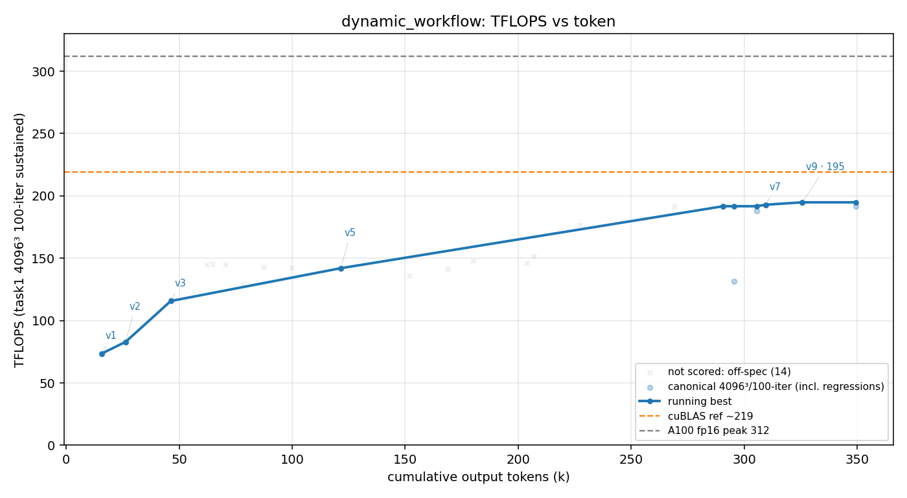

# 方法结果 — `dynamic_workflow`（Claude Code Dynamic Workflow / ultracode 主臂：headless `claude -p` + `ultracode` 关键字 + `--effort max`）

> 数据由 `results/parse_run.sh dynamic_workflow run.jsonl transcript.jsonl` 自动生成；本文手动补充「关键发现」与口径修正。N=1。

## 一句话结论

dynamic_workflow worker 用 **7 次 Workflow fan-out**（config / occupancy tournament，并行 build + 串行 bench）在 ~2h 内系统性逼到 **fp32-acc 192.9 TFLOPS（干净，err 3.4e-05）/ f16-acc 194.8（err 0.017，降精度技法）**，约 **62% of 312**，然后**自愿停**（自称 "practical ceiling"，无看门狗 → 行为同 naive）。落在 **naive 家族区间（178–208）**，低于 goal 最佳（~205–207）；代价 **$37.47 / ~349k output token**（fan-out 显著比 naive/goal 贵）。

## 环境与口径

| 项 | 值 |
| --- | --- |
| GPU / 形状 | A100-80GB / 4096³ fp16 |
| 计分口径 | task1 二进制 100 轮均值（sustained） |
| 参照 | 无库基线（基座已去 cuBLAS）；`v0` cBLAS 仅 CPU 正确性 ground truth；目标 = A100 fp16 峰值 312 |
| 模型 | claude-opus-4-8, `--effort max`（CLI flag 覆盖了 settings 里的 `effortLevel:xhigh`） |
| 方法机制 | seed 末尾追加 `ultracode` 关键字（`ultracodeKeywordTrigger:on`）→ 触发 Dynamic Workflow，**保留 max 不压 xhigh**。单变量 vs naive = workflow 编排开 |
| profiler | ncu 可用（worker 用其定位瓶颈） |
| 手写校验 | `scripts/check_handwritten.sh` **通过**（扫 15 文件，ver≥1 无 cutlass/cute/cublas/cudnn） |
| Workflow fan-out | **7 次**（`gemm-config-tournament` 14 配置、`gemm-occ16-tournament` 占用率对照 等；并行 build + 单 GPU 串行 bench） |
| 终止 | **自愿停**（`stop:end_turn, terminal:completed, is_error:false`，自称到 "practical ceiling"）；非崩、非 5h 额度 |
| 总计（修正） | wall_clock ~6534s（末个 scored 点；全程 ~2h）、**output_tokens ~349k（transcript 曲线末值）**、turns 54+6（两段）、**cost $37.47** |

> ⚠️ **多-result 事件口径坑**：本跑发了 **2 个 `result` 事件**（主 agent 每次把活交给后台 workflow 就发一个）。parse_run 的「总计(权威,来自 result 事件)」取 `tail -1` → 抓到**末段值** `wall 280s / output_tokens 17995`，**严重少报**。正确口径：**总 token 用 transcript 曲线 x 轴末值 ~349k**；**cost $37.47** 取自第 2 个 result 的 `total_cost_usd`（累计、对）。

## 迭代曲线（每个版本最佳一行，scored canonical 4096³/100；wall_clock / tokens 为累计）

| cycle | wall_clock(s) | tokens(累计 out) | correctness(err) | tflops | 方法改进说明 | 瓶颈分析 | log |
| --- | --- | --- | --- | --- | --- | --- | --- |
| 1 | 234 | 15,750 | 3.7e-05 | 73.6 | v1 wmma（WMMA 起步） | | |
| 2 | 376 | 26,331 | 5.3e-05 | 82.9 | v2 async（cp.async 流水） | | |
| 3 | 645 | 46,285 | 5.9e-05 | 115.7 | v3 mma（mma.sync） | | |
| 4 | 1,756 | 121,542 | 3.8e-05 | 142.0 | v5 tuned（v4 占用率 2 blk/SM + race fix 后调参） | | |
| 5 | 5,823 | 309,526 | 3.4e-05 | **192.9** | v7 regpipe（寄存器流水，tournament 调出的 tile/STAGES） | mma-latency-bound；tensor pipe 76.4%，其它 stall 近零 | |
| 6 | 6,037 | 325,736 | **0.0173** | **194.8** | v9 f16acc（**降累加精度**） | ⚠️ f16-acc 精度档（非 fp32-acc 可比） | |

> v4 occ / v6 swizzle / v8 raster 仅有 off-口径（iters 1/30/50）测点、无 100 轮 scored 点，未进本表；共 14 个 off-口径点被排除出计分（明细见 `result.csv` 的 canonical/scored 列）。曲线另含 v7 在 187.8 / 191.7 / 192.9 间的测量散布与 131.7 的回归点。

## 关键发现

- **自愿停 = 行为同 naive，不是看门狗方法**。seed 是 "NEVER STOP"、无外部判停（不像 /goal 有 Stop-hook 看门狗），worker 在 ~2h 自称 "reached the practical ceiling for a hand-written Ampere kernel" 后**主动收**。即 dynamic_workflow ≈ "naive 的自驱 + workflow 编排"，停点由 worker 自己决定（参 [[goal cycle 系列]]：看门狗才是地板抬升器）。
- **Workflow 的可见价值 = 结构化搜索 + 干净定位,不是更高天花板**。7 次 fan-out 主要用于 **config/occupancy tournament**（并行 build 一批 tile/STAGES/warp/occupancy 配置、单 GPU 串行 benchmark、排序选赢家），并把瓶颈干净定位到 **mma-latency-bound（tensor pipe 76.4%）**。收敛快（~2h 到 192.9）、瓶颈分析清晰是亮点；但**峰值仍撞在 naive 同款 tensor-pipe barrier 天花板**（naive 家族 178–208），**未出现 goal_cycle3 那种范式级突破**（v18 mbarrier +13%）。
- **f16-acc 194.8 ≈ 噪声级提升,别误读为新高**。v9 把累加降到 f16（err 0.017）仅比 fp32-acc 192.9 高 **+1.9**，与 [[library ceilings a100 gemm]]（cuBLAS f16≈fp32、f16-acc 几乎不提速）一致；194.8 是已知**精度-confound**（[[f16-accumulate precision confound]]）的边际抬升,横比应以 **fp32-acc 192.9** 为准。
- **成本是 method 的显著代价**。$37.47 / ~349k output token —— fan-out 出的子 agent（并行 build/bench）把 token/钱烧得远比 naive/goal 多。性价比要在 SUMMARY 里和 naive（更便宜、同区间峰值）对比记。
- **横比位置**：fp32-acc **192.9** 在 naive 家族（178–208）中上,低于 goal 最佳（~205–207）。"用 workflow 系统扫 → 快速到 192.9 + 清晰瓶颈" 是它相对 naive 的差异化,但**单变量（workflow 开/关）下并未把峰值推过结构天花板**。

## Dynamic Workflow 实际工作流程详解(本跑实证)

> 7 个 workflow 脚本原文留存于 `~/.claude/projects/<worktree-slug>/.../workflows/scripts/*.js`（finish_run 只删 git worktree、未删该 slug 目录）。下面是从脚本 + transcript 还原的真实机制。

**总览**：worker 在 ultracode 自主授权下,把「探索 GEMM 配置空间」这个反复出现的子任务,**7 次 fan-out 成结构完全一致的「2-phase config tournament」**——没有人教它这个模式,是它自己反复复用的。

**单个 tournament 的内部机制**(以首个 `gemm-config-tournament` 为例,脚本逐字还原):

1. **主 agent 在脚本里枚举 ~14 个配置**:每个是一组 `(BM,BN,BK,STAGES,WARP_M,WARP_N,MIN_BLOCKS)` tile/流水/占用率宏组合(如 `128×128 BK32 S4 W2×8 = 16 warps`、`256×256 W4×4`、`64×128 高占用` …)。
2. **Build 阶段 = `parallel()` fan-out,一个配置一个子 agent**:每个 build 子 agent 只干一件确定事——把它那组宏 `cmake -B build_tourney/cfgK -DCMAKE_CUDA_FLAGS="-DPG_BM=.. .." && ninja` 编进**隔离 build 目录**,再 `ls` 确认 binary 在,返回 `{id, built, note}`(`BUILD_SCHEMA`;失败则 note 填一行 `grep -m1 error` 的编译错)。prompt 里**明确禁止跑任何 GPU 代码**——纯编译 → N 个能安全并行(编译不抢 GPU)。
3. **Benchmark 阶段 = 1 个子 agent 串行**:**单个** bench 子 agent 把所有编出来的 binary **严格 ONE-AT-A-TIME 串行**逐个 `-m 4096 -n 4096 -k 4096 -t 100`(= task1 计分口径),解析 `TFLOPS/Average Error`,返回 `results[]`(`BENCH_SCHEMA`;error<0.05 才 ok)。prompt 原话:"You MUST run them strictly ONE AT A TIME (serially) — never in parallel — so timings are clean"——worker 自己意识到单卡不能并行跑分。
4. **脚本汇总**:`rows.sort(by tflops)` → `log()` 出完整排名 → `return { sorted, failedBuilds }` 给主 agent。

**主 agent 干完之后怎么用结果**(transcript 实证):

- 取 `sorted[0]` 的**赢家配置** → **ncu 深 profile 赢家**(本跑 3 次 `--- deep profile of winning config ---`)定位真瓶颈 → 把赢家宏**固化进一个新命名版本 `vN`** → 据新瓶颈形成下一假设 → 起**下一个 tournament 围绕赢家细化**。原话:
  - "winning config, then immediately build v6 on top of it"
  - "promote winning config to v8 (raster) as its default, and test whether L2 rasterization stacks on top"
  - "winner (cfg9) as the default and **deeply profile it** to find the true ceiling on Tensor-Core utilization"
- **7 个 tournament 各自的假设**(description 原文,可见它在逐步收窄搜索):①`config-tournament` v5 的 14 宏配置基线扫 → ②`v7-tournament` 12 个 swizzle+regpipe 配置 → ③`occ-ilp-tournament` 占用率 vs ILP 权衡(小 warp tile 多 blocks/SM ↔ 大 64×64 warp 多 ILP)→ ④`64x64-refine` 围绕 64×64 甜点(单缓冲 v6 vs 双缓冲 v7、STAGES、block、MIN_BLOCKS)→ ⑤`v7fixed-sweep` 修了 local-mem 再扫 → ⑥`occ16-tournament` 16-warp 能否胜 8-warp → ⑦`f16acc-tournament` fp16 累加解锁 64×128 warp + 16-warp 双缓冲。

**关于并行度(单 GPU 任务的关键约束)**：workflow 的**并行只发生在编译**(不抢 GPU);**benchmark 一律串行**(worker 自己强制)。所以在这个单卡任务上,workflow 加速的是 build 批量、以及「一次性结构化扫一批配置 + 客观排序选赢家」的**搜索组织方式**,而非 benchmark 吞吐。这正是它相对 naive「一个个手敲试」的差异化——但也解释了**为何峰值没破天花板**:它把 config-space 扫得很彻底,却始终停在「调 tile/占用率/STAGES」这一层,**没有一个 workflow 去尝试范式级重写**(persistent kernel / mbarrier / 计算-访存重叠的结构改造),而 goal_cycle3 恰恰靠被顶到第 13 次后才逼出 v18 mbarrier 突破。即:**spontaneous workflow ⇒ 搜索深、但范式保守**。

## 复现 / 数据来源

- kernel 源快照：`results/dynamic_workflow/src/`（9 个 vN）+ `worker.patch`（2238 行，`git apply` 复现；worktree 已删，基座未动）
- transcript（token/曲线**权威**来源，508 行）：`results/dynamic_workflow/transcript.jsonl`
- stream-json 重定向（⚠️ 本跑有 2 个 result 事件，`tail -1` 的总 wall/token 是**末段值、少报**；cost $37.47 取第 2 个 result 累计值）：`results/dynamic_workflow/run.jsonl`
- 防作弊门日志 + ncu/build 日志：`results/dynamic_workflow/logs/`（22 个）
