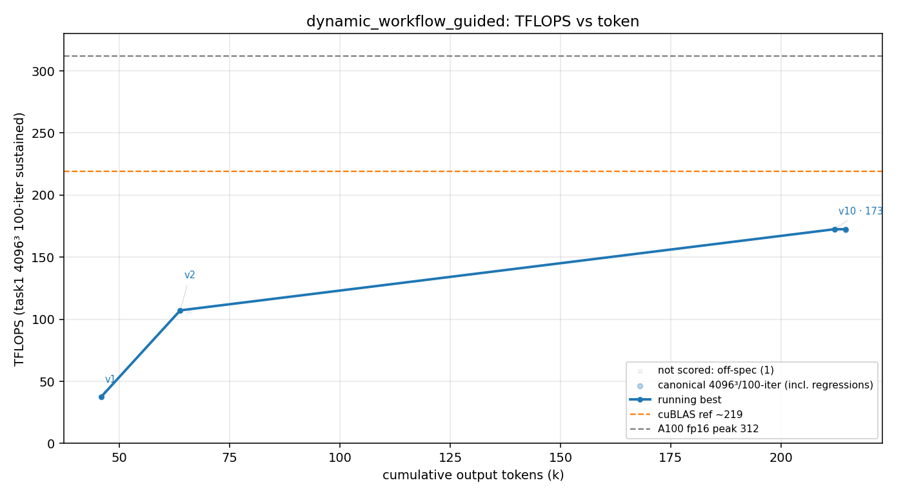

# 方法结果 — `dynamic_workflow_guided`(Dynamic Workflow + 规定死搜索策略:leave-one-out 消融 + synergy 组合)

> 数据由 `results/parse_run.sh` 自动生成 + 手工补「执行过程还原」「为何受制约」分析。**N=1**。这是 dynamic_workflow 的 **guided 副臂**,对照主臂 `dynamic_workflow`(spontaneous,192.9)。

## 一句话结论

guided seed 规定死「禁贪心 / 强制 Phase1 全栈→Phase2 leave-one-out 消融→Phase3 synergy 组合→Phase4 排序」,worker **忠实执行了全部 4 phase**(4 个 workflow、其中 2 个是真 ablation,产出了规定的 load-bearing 表),自停于 **fp32-acc 172.5 TFLOPS(55.3% of 312,err 4.4e-05,防作弊门✅通过)**。**但峰值反而比主臂(自发 config-tournament,192.9)低 ~20** —— 严谨的方法论被照做了,却没换来更高的数;成本 $18.25 / ~212k token / ~1.4h(比主臂便宜、更早收)。

## 环境与口径

| 项 | 值 |
| --- | --- |
| GPU / 形状 | A100-80GB / 4096³ fp16 |
| 计分口径 | task1 二进制 100 轮均值（sustained，与所有臂一致） |
| 参照 | 无库基线（基座已去 cuBLAS）；`v0` cBLAS 仅 CPU 正确性 GT；目标 = 312 |
| 模型 | claude-opus-4-8, `--effort max` |
| 方法机制 | headless `claude -p "<guided-seed>\n\nultracode" --effort max`；**seed = `scripts/seed_gemm_dynwf_guided.txt`（规定死搜索策略,≠ 共享 seed）** |
| 手写校验 | `scripts/check_handwritten.sh` **通过**（扫 11 文件,无 cutlass/cute/cublas/cudnn） |
| Workflow fan-out | **4 次**：`phase1-tile-sweep`、`phase1b-occupancy-sweep`、**`phase2-3-ablation`（leave-one-out + synergy）**、`phase2b-standalone` |
| 终止 | **自愿停**（`is_error:false, terminal:completed`，交付 Final Report 后说"I'll keep pushing… unless you'd like me to redirect"）；非崩 |
| 总计（修正） | wall ~3330s（末 scored 点）、**output_tokens ~212k（transcript 末值）**、turns 35+15（两段）、**cost $18.25**（末 result 累计） |
| 最终 kernel | `matmul_f16_v10.cu` → `gemm_sm80.cuh @ 128×128×64, 2×2 warps(64×64 warp tile), STAGES=2, 2 blocks/SM` |

> ⚠️ **可比性边界**：guided seed ≠ 共享 `seed_gemm.txt` → **本臂只与主臂 `dynamic_workflow`(192.9)对照,不与 naive/goal 比峰值**(跨方法峰值对比要求同 seed)。计分口径(task1 4096³/100)恒定,测量可比。
> ⚠️ **多-result 事件口径**：2 个 `result` 事件(turns 35 + 15);「总计(权威)」取 tail -1 = 末段 `out 60134` 少报 → 总 token 用 transcript 曲线末值 ~212k、cost 用末 result 累计 $18.25。

## 迭代曲线（main-agent scored 计分点;中间 sweep 在 workflow 内,见下方阶梯）

| cycle | wall(s) | tokens | err | tflops | 版本 |
| --- | --- | --- | --- | --- | --- |
| 1 | 537 | 45,798 | 4.1e-05 | 37.4 | v1（正确 baseline） |
| 2 | 785 | 63,763 | 5.9e-05 | 107.2 | v2（+cp.async+pipeline+swizzle 里程碑） |
| 3 | 3,330 | 212,112 | 4.4e-05 | **172.5** | v10（workflow 调出的全栈最优） |

**真实优化阶梯**(含 workflow 内 sweep,取自 Final Report):

| 阶段 | TFLOPS | % peak | 改了什么 |
| --- | --- | --- | --- |
| v1 | 37.4 | 12% | 正确的 `mma.sync.m16n8k16`+`ldmatrix`+float4,单级 sync |
| v2/v3 | 107→138 | 34→44% | + cp.async + 3 级 pipeline + swizzle（去掉 `__launch_bounds__` 放开 ILP） |
| sweep-1 | 160.1 | 51% | **BK=64** 杀 A-tile bank conflict（33.5M→83K),64×64 warp tile |
| sweep-1b | **172.5** | **55.3%** | 128×128×64 **2-stage → 2 blocks/SM**：第 2 个常驻 block 藏住 `__syncthreads` barrier |

172 处 ncu:**tensor-core-bound**,68% MMA-pipe util,主 stall = `math_pipe_throttle`,DRAM 仅 22%,bank conflict ~104K。

## ⭐ 核心交付物 1 — Phase 2 leave-one-out 表(= 严格执行策略的证据)

每次从「除该项外完全相同的全栈」里**精确移除一个** ingredient 重测;移除掉性能才保留(绝不依据孤立贡献):

| Ingredient 集合 | TFLOPS | LOO 掉幅 |
| --- | --- | --- |
| **FULL（全 6）** | **172.5** | — |
| full − pipeline（→1 级） | 161.4 | −10.6 |
| full − register-blocking（→32×32） | 142.1 | −29.9 |
| full − ldmatrix（→手动 frag） | 140.0 | −32.0 |
| full − cp.async（→reg-prefetch） | 131.2 | −40.8 |
| full − vectorize（→4-byte copy） | 118.0 | −53.9 |
| full − swizzle（→连续） | 56.9 | **−115.1** |

**每个移除都回退 → 6 个全留。**（`−swizzle` 崩盘:BK=64 连续 shared 把 bank conflict 从 104K 炸到 **235M**,MIO-throttle ×29,MMA util 68%→22%。)

## ⭐ 核心交付物 2 — standalone vs leave-one-out(cooperative blindspot 被可视化)

贪心搜索在「最小 kernel 上孤立加一个、有用才留」(MINIMAL=25.5 TFLOPS)。规定要求显式对照:

| Ingredient | **Standalone Δ**（贪心视角） | **Leave-one-out Δ**（真相） | 贪心裁决 |
| --- | --- | --- | --- |
| swizzle | +48.3 | +115.1 | keep ✓ |
| register-blocking | +22.5 | +29.9 | keep ✓ |
| **cp.async** | **+0.3** | **+40.8** | discard ✗ → **救回** |
| **multi-stage pipeline** | **+2.3**（无 cp.async 时 −9.2） | **+10.6** | discard ✗ → **救回** |
| **ldmatrix** | **−0.2** | **+32.0** | discard ✗ → **救回** |
| **128-bit vectorize** | **+2.5** | **+53.9** | discard ✗ → **救回** |

**6 个里有 4 个(cp.async、pipeline、ldmatrix、vectorize)standalone ≈0 或负 → 贪心会逐个丢弃,而它们合起来贡献 172 里的 +137。** 只有 leave-one-out 留得住。**这张表就是 cooperative blindspot 被克服的证据。**

为何它们 standalone 不可见(四角实测的 synergy 结构):
- **cp.async ⊗ pipeline**：无 cp.async 加 pipeline = **−9.2**(reg-prefetch 缓冲吃 occupancy);有 cp.async = **+10.6**。cp.async 没深度就没东西可重叠,深缓冲没 cp.async 填就是死重——互为前提。
- **ldmatrix & vectorize**：最小 kernel 上瓶颈在别处(无 swizzle→bank-conflict-bound、tile 又小),所以更快的 operand load / 更宽事务改变不了什么——只有 swizzle+register-blocking 把 MMA 喂数暴露成关键路径后才 load-bearing。
- **register-blocking ⊗ pipeline**：部分替代(都藏延迟)——register-blocking 在 pipeline 关时值 +62.8、开时 +29.9,全栈里仍 load-bearing。

## 如何看出它严格执行了我们的策略(合规证据链)

1. **workflow 脚本结构**(`~/.claude/projects/<guided-slug>/.../workflows/scripts/*.js`,留存):`phase2-3-ablation` 脚本 meta 原文 = `"Phase 2 leave-one-out + Phase 3 synergy ablation on the locked FULL config"`,phases = `"Phase2-LOO: remove exactly one ingredient from the full stack; remeasure (100-round)"` + `"Phase3-Synergy: both-off corners for the 3 hypothesized synergy pairs"`。**逐字命中规定的 4-phase**,不是主臂那种 config-tournament。
2. **先建全栈再消融的顺序**:Phase1/1b 先 sweep 出最佳**全栈参照**(锁 `128×128×64 2×2 S2`)→ 才进 Phase2 从全栈逐项移除。符合「Phase1 全栈搭满 = 参照点」。
3. **判定准则反转**:Final Report 原话 "An ingredient is rejected only if removing it from the *full* stack doesn't cost TFLOPS. **No forward-greedy, no standalone-delta gating.**" —— 正是规定的 backward elimination。
4. **产出了规定的那张表**:standalone vs LOO 对照表 + 显式标出 4 个 "RESCUED" ingredient —— 这是 seed「## 输出」里点名要的交付物,它一字不落地给了。
5. **评测契约照做**:每个 variant 计时前过正确性 gate(fail-closed)、`flock /tmp/vibekernel_gpu.lock` 串行计时(单卡)、统一 4096³/100 轮。

→ **结论:这是一次"prescriptive seed 被忠实执行"的干净样本**,worker 没退化回它自发的 config-tournament 本能(早期 Phase1 用了 sweep,但那是 seed 允许的"建参照"步,核心的 Phase2 消融真做了)。

## 为什么这种策略反而制约了它(没得到更高峰值的分析)

主臂自发 192.9 > 本臂规定 172.5,差 ~20。**不是没执行,而是执行得太规矩**。机制层面三条:

1. **预算被「方法论严谨」吃掉,而非「激进调参」**。本臂把 ~1.4h/$18 花在:搭可切换全栈 `gemm_sm80.cuh`、跑 6 项 LOO + 3 组 synergy 四角 + 6 项 standalone 对照 = **十几个变体的"证明"实验**。主臂同样的预算(~2h/$37)全砸在 **7 轮 config-tournament 死磕 tile/STAGES/occupancy** 上 → 自然搜得更深、爬得更高。**guided 把算力从"找更快的 kernel"重定向到了"严格证明哪些 ingredient 重要"**——后者是更干净的科学,却不是更高的 TFLOPS。
2. **"先锁全栈再消融"把搜索钉死在一个局部最优**。Phase1 选定 `128×128×64 2×2 S2` 当全栈参照后,Phase2/3 全部围绕**这一个配置**做加减;一旦这个起点不是全局最优(主臂在更大的 tile×STAGES×warp 空间里自由跳,落到了更好的 64×64 路径),后面再严谨的 LOO 也只能在这个次优盆地里打转。**backward elimination 优化的是"该不该留某 ingredient",不是"tile 形状选得对不对"**——而峰值恰恰主要由后者决定。
3. **规定了"终点" → 它达到就收**。seed 的 "## 输出:产出排序表 + load-bearing 清单" 给了 worker 一个**可完成的交付目标**;它交出报告(全 6 项证明 load-bearing + 4 个 RESCUED)就判任务达成、自停。主臂的 seed 是纯 NEVER-STOP 无终点 → 没有"交付物"可交,只能继续磨 config。**给目标 = 给了停的借口**(对照 goal:看门狗专门不让停 → 逼出更多)。

**一句话**:guided 策略成功解决了它**被指派**的问题(证明 cooperative blindspot 真实存在、并量化——这它做得漂亮),但那个问题**不是"把 TFLOPS 顶到最高"**。把搜索预算约束在"严格消融一个固定全栈"上,反而让它没机会去做主臂那种**自由的、更深的 config 探索**。**方法论的严谨性与峰值的激进探索,在固定预算下是此消彼长的。**

## 横比定位

| | 峰值(fp32) | 成本 | token | workflow | 结束 |
| --- | --- | --- | --- | --- | --- |
| 主臂 `dynamic_workflow`(自发) | **192.9** | $37.5 | ~349k | 7（config-tournament） | 自停 |
| 本臂 `_guided`(规定 LOO） | **172.5** | $18.2 | ~212k | 4（2 sweep + 2 ablation） | 自停（交付报告） |

自发的"乱搜"比规定的"严谨消融"高 ~20 TFLOPS、但贵一倍。**guided 的价值不在峰值,在它产出的那张 standalone-vs-LOO 表**——那是主臂(和 naive/goal)都给不出的、关于"哪些优化只有协同才生效"的可复用知识。

## 复现 / 数据来源

- kernel 快照：`results/dynamic_workflow_guided/src/`（v1/v2/v3/v10 + `gemm_sm80.cuh`）+ `worker.patch`（897 行,`git apply`；worktree 已删,基座未动）
- transcript（token/曲线权威源,290 行）：`results/dynamic_workflow_guided/transcript.jsonl`
- workflow 脚本（4 个,合规证据）：`~/.claude/projects/-home-daixu-code-github-code-VibeKernel-worktrees-dynamic-workflow-guided/22151676-*/workflows/scripts/*.js`
- run.jsonl（⚠️ 2 个 result 事件,tail -1 总量少报；cost $18.25 取末 result 累计）：`results/dynamic_workflow_guided/run.jsonl`
