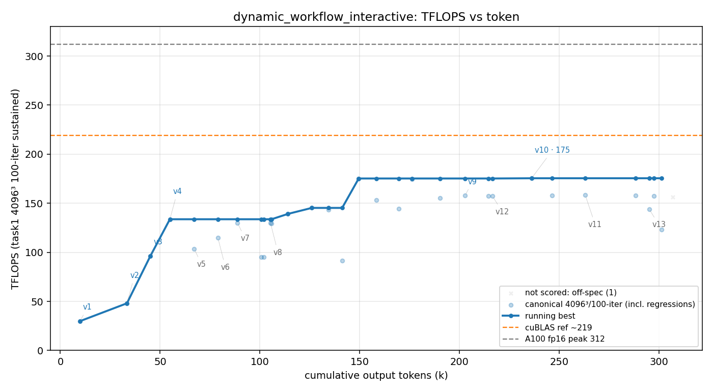

# 方法结果 — `dynamic_workflow_interactive`(交互式 `/effort ultracode` 忠实预设臂)

> dynamic_workflow 的**第三臂(交互式)**:在交互终端里 `claude` → `/effort ultracode`(= 产品字面预设 xhigh + 自动 Dynamic Workflow 编排)→ 粘贴共享 seed 开跑。对照 headless 主臂(自发 7 workflow,192.9)与 guided 臂(规定 leave-one-out,172.5)。**N=1**。
> ⚠️ **快照说明**:本 run 用 `--keep-worktree` 思路保留(`claude --resume 8138c39c-d192-4e49-ba0d-92a392ecd173` 可继续人工对话);下列数字是**截至当前暂停点**的软归档(transcript 604 行),session 可被 resume 后继续变化。

## 一句话结论

`/effort ultracode` **确实生效**(transcript 有 `Set effort level to ultracode: xhigh + dynamic workflow`),**但 worker 全程零 Workflow / 零子 agent fan-out** —— 它退化成一个 **xhigh 普通单 agent 循环**,自停于 **fp32-acc 158.4 / f16-acc 175.5 TFLOPS**(防作弊门✅通过)。**是三臂里最低的**,且核心原因正是「没触发 workflow」:交互式逐轮 NEVER-STOP 的紧凑增量节奏,反而压制了 ultracode 的并行编排。

## 环境与口径

| 项 | 值 |
| --- | --- |
| GPU / 形状 | A100-80GB / 4096³ fp16 |
| 计分口径 | task1 二进制 100 轮均值(sustained,与所有臂一致) |
| 模型 / effort | claude-opus-4-8;**交互式 `/effort ultracode`(= xhigh + 自动 workflow 编排)** |
| seed | 共享 `scripts/seed_gemm.txt`(与 naive/goal/主臂同一份) |
| 手写校验 | `scripts/check_handwritten.sh` **通过**(扫 18 文件,无 cutlass/cute/cublas/cudnn) |
| **Workflow fan-out** | **0 次** ⚠️(tool_use 全程 Bash×72 / Edit×27 / Read×16 / Write×8,零 Workflow、零 Task 子 agent) |
| fp32-acc 峰值 | **158.4**(err 4.2e-05,干净档) |
| f16-acc 峰值 | **175.5**(err 0.018,降精度档) |
| kernel 版本 | v1–v12(12 个,单 agent 增量) |
| 终止 | 自停(自称撞到 "structural ceiling":1 block/SM、latency-bound) |
| human steering | 极少(基本 NEVER-STOP 自驱;~少数 user 消息,非重度人工干预) |
| session_id | `8138c39c-d192-4e49-ba0d-92a392ecd173`(`claude --resume` 可续) |

> ⚠️ **可比性**:seed 与主臂/naive/goal 同一份(单变量本应是「交互式 ultracode vs headless ultracode」),但**它没触发 workflow** → 实际测到的是「xhigh 单 agent」,不是「Dynamic Workflow」。计分口径恒定,峰值可与各臂横比。

## 执行过程:一步步怎么爬的(fp32 scored 阶梯)

```
29.9 → 48 → 96 → 133 →(回退 103/114)→ 130 →(回退 95)→ 130 → 139 → 145
→(回退 91)→ 155 → 157 → 158 → 平台 ~158（之后 v10 起转 f16-acc → 175.5）
```

典型**单 agent 增量手调**:写一个 kernel 版本 → task1 measure → 好就留、差就退,中间大量回退/噪声(91、95、123 等失败点)。版本脉络 `v1 wmma → v2 mma → v3 pad → v4 pipeline → v5 swpipe → v6 warptile → v7 ldm → v8 sweep → v9 interleave → v10 f16acc → v11 split → v12 swizzle`。fp32 爬到 ~158 平台后,v10 起把累加降到 f16(err 0.018)把 headline 推到 175.5。



## ⭐ 核心发现:ultracode 开了,Workflow 却一个没起

`/effort ultracode` 在 transcript 里确认生效(`xhigh + dynamic workflow`)。但**整段 604 行 transcript 里零 `Workflow` tool_use、零 `Task` 子 agent**,workflow 脚本目录空。它**没做主臂那种「并行编译 + 串行 benchmark 的 config tournament」**,而是从头到尾一个 agent 串行手调。

**所以「交互式 dynamic workflow」这次实际上没跑成 dynamic workflow** —— 它是个 xhigh 单 agent 跑。这是个干净的负向对照。

## 为什么是这个水平(158 fp32,三臂最低)—— 分析

三臂横比把因果摆得很清楚:

| 臂 | 机制 | workflow 数 | fp32 峰值 |
| --- | --- | --- | --- |
| 主臂(headless,自发) | `-p "<seed>\n\nultracode"` | **7** | **192.9** |
| guided(headless,规定) | guided seed | 4(含 ablation) | 172.5 |
| **interactive(本臂)** | 交互式 `/effort ultracode` | **0** | **158.4** |

**workflow 数与峰值正相关,本臂提供最强证据**:

1. **没有 workflow = 没有系统性并行 config 搜索 = 搜得浅**。主臂 192.9 主要靠 7 个 config tournament 并行扫 tile/STAGES/occupancy 扫出来;本臂只能串行手调,预算内探索面窄 → 平台停在 158,落到 **naive 区间下沿**(naive 最低 cycle3=154),比主臂低 ~35。

2. **为什么 ultracode 开了却不 fan-out?**(推断,硬证据 = 零 Workflow + seed 框架)共享 seed 是「每轮简报…**立刻继续下一轮**」的紧凑 NEVER-STOP 增量循环:每一步都是个小增量,模型**没把任何一步判成「值得起一个并行 workflow 的实质任务」**,于是一直待在单 agent 逐步模式。对比 headless 主臂——`ultracode` 关键字挂在一个**大的自治目标 prompt** 上,模型才会 step back 去规划并行搜索。**交互式逐轮节奏反而抑制了 workflow 编排**;这说明 ultracode 是否真 fan-out **高度依赖任务被呈现的「颗粒度」**,不是开了就必然并行。

3. **撞的还是同一堵墙,只是停得更低**:worker 自报 1 block/SM(64×64 warp tile = 128 fp32 累加寄存器 + 159KB smem 焊死)、latency-bound at 8 warps/SM、tensor pipe 67%。天花板与全家族同(~200/312 的 tensor-pipe barrier),但因为搜索不系统,它在通往墙的路上停在了更低的 158。

## 附:本 run 里的 native→sm_75 缓存插曲(已查清,无害)

跑中 worker 一度发现 `build/CMakeCache.txt` 是 `CMAKE_CUDA_ARCHITECTURES=75`。查清:`native` 在某次 GPU 不可见的 configure 时静默退回 nvcc 13.0 默认 sm_75 并缓存;但 **build.ninja 实测 `arch=compute_80,code=sm_80`、所有 v1–v12 二进制 SASS 全是 sm_80**(cuobjdump 实证)→ 缓存 75 ≠ 实际编译,**性能数未受影响**。根因是 `native` 探测失败会静默回退(机制坑,非本 run 污染、非跨 run);根治 = 基座把 `native` 钉成 `80`。详见编排 memory `ncu-base-clock-vs-bench-boost` 旁注 / 本次对话记录。

## caveat 现实校正

建臂时担心的「human-in-loop 污染」**这次基本没发生**(几乎没 steer,let it NEVER-STOP)。真正的故事不是「ultracode + 你」,而是 **「交互式 ultracode 根本没触发 workflow」** —— 反而是更有价值的发现:**忠实复刻产品预设 ≠ 一定会 fan-out workflow**。

## 复现 / 续跑 / 数据来源

- **续跑(人工对话)**:`cd worktrees/dynamic_workflow_interactive && claude --resume 8138c39c-d192-4e49-ba0d-92a392ecd173`(worktree 已用 `--keep-worktree` 思路保留)。
- transcript(权威源,604 行):`results/dynamic_workflow_interactive/transcript.jsonl`;曲线/表 `result.csv` / `curve.png`(parse_run 软归档;无 headless result 事件 → 总 token 取曲线 x 轴末值)。
- kernel 快照 `src/` + `worker.patch`:**待最终 `finish_run.sh dynamic_workflow_interactive [--keep-worktree]`** 时写(本软归档未动 worktree,故暂缺)。
