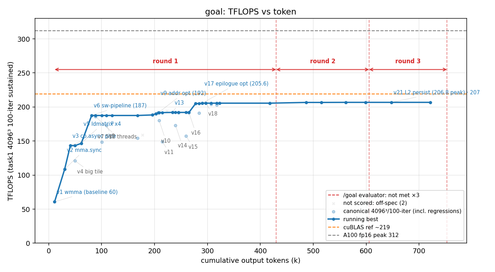

# 方法结果 — `goal`(naive seed + 外部 evaluator 看门狗 `/goal`;ncu 可用)

> harness = **/goal**:`claude -p "/goal <condition>"`,condition = **与 naive 完全相同的 seed**(共享 `scripts/seed_gemm.txt`);唯一增量 = 一个**不让 worker 自愿停**的外部 evaluator(Haiku)。worker 仍是 opus-4-8 / effort max。
> 与 `results/naive`(cycle2,**同 seed / base / model 但无看门狗、自停于 178**)构成**受控对照**——唯一变量 = "谁决定停"。⚠️ 两边都 N=1。

## 一句话结论

同一个 naive worker(opus max),纯手写冲到 **206.8 TFLOPS(v21,scored 4096³/100)= naive 家族最高**;~4.03h / 284 turn / 817k token / $87.5。防作弊门通过(纯手写 PTX、零库)。

> ⚠️ **看门狗的真实贡献远小于初版结论(已更正)。** transcript 实锤:worker 靠自己的 NEVER-STOP 动力把 60→**~205.5**(v17/v18)一路冲完,**全程 evaluator 没介入一次**;直到 ~205.5 第一次想停才被顶回去。evaluator 共只接入 **3 次**(都在 205–206),净把它从 **205.5 推到 206.8(+1.3,靠 L2 persistence)** + 逼出 ~2.5h 复验。**与 naive 178 的差(178 vs 205.5)是两个 N=1 跑的路径变异,不是看门狗的功劳**——初稿误把 178→206.8 全归给看门狗,错了。

## 环境与口径

| 项 | 值 |
| --- | --- |
| GPU / 形状 | A100-80GB / 4096³ fp16 |
| 计分口径 | task1 二进制 100 轮均值(sustained);禁 sweep/best-of-N 热峰 |
| 参照 | 无库基线(基座已去 cuBLAS);v0 cBLAS 仅 CPU 正确性 GT;目标 = A100 fp16 峰值 312 |
| worker | claude-opus-4-8,`--effort max` |
| **evaluator(看门狗)** | **Haiku**(small-fast 槽;只读 transcript 判 condition、不跑工具) |
| profiler | ncu **可用**(worker 全程 ncu 驱动,末段用 SOL roofline 定瓶颈) |
| 手写校验 | `check_handwritten.sh playground-base` **通过**(扫 16 文件、ver≥1 无 cutlass/cublas/cute) |
| 总计(权威 result 事件) | wall **4.03h**(15:24→19:26)、out_tok **817,132**、turns **284**、cost **$87.51** |
| 结束方式 | **自然终止**(早于我设的 2h 计时器,kill 时进程已不在):4 个 `goal_status` **全 met:false**(1 个 sentinel 启动 + 3 次顶回去,token≈430k/605k/752k)——**evaluator 从没判过达成**;第 3 次后 worker 继续 re-verify、run 在 ~817k token 收尾(clean success)。**不是被判达成而停**,确切终止机制日志没明说 |

## `/goal` 机制实况(本方法的核心)

- condition = naive seed(NEVER STOP、无终止态)。**实际发生**:worker 把 60→~205.5(v17/v18,约 1.4h)全程**没触发 evaluator 一次**(一路在进步、没想停、就没被判);到 ~205.5 第一次想停 → evaluator 第 1 次接入(token≈430k)顶回去。
- **evaluator 共接入 3 次**(transcript 的 `goal_status` met:false,token≈430k/605k/752k,都在 205–206;**4 个 goal_status 全 met:false、从没判过 met:true**)。每次被顶回去,worker 就再跑一段**复验**(SOL roofline、f16-acc 2-CTA occupancy 测试、issue-efficiency、power/clock 复查),其间靠 L2 persistence 抠出 +1.3 到 v21 206.8。3 次后 run 在 ~817k token 收尾(clean success,不是被判达成而停)。worker 自己也写了 **46 个 "Round brief"**——那是它**自己**的 NEVER-STOP 节奏(每轮简报),≠ evaluator 接入(后者只 3 次)。
- ⚠️ worker 自发 spawn 了 **129 个 sub-agent**(Task 工具,做并行 config 微实验,如 "test cp.async.ca vs .cg"、"test missProp=Normal so A caches better"、"test n-outer m-inner mma order"、"test v25 serpentine n-order")—— Task 是所有方法都有的受控常量,但本轮 worker 明显比 naive 更 agentic,放大了 token / cost。是 `/goal` 效应还是路径变异,待多跑判定。

## 迭代曲线（每版本最佳一行；wall / token 为累计）

| cycle | wall(s) | tokens | err | tflops | 方法改进说明 |
| --- | --- | --- | --- | --- | --- |
| 1 | 185 | 11,253 | 3.4e-05 | 60.8 | v1 wmma(基线) |
| 2 | 425 | 30,192 | 4.1e-05 | 108.4 | v2 mma.sync |
| 3 | 589 | 40,981 | 3.6e-05 | 143.3 | v3 cp.async pipe |
| 5 | 938 | 61,613 | 3.3e-05 | 146.6 | v5 ldmatrix x4 |
| 6 | 1,202 | 81,287 | 3.8e-05 | **187.5** | v6 软件流水(大跳) |
| 9 | 3,462 | 207,658 | 3.7e-05 | 191.8 | v9 寻址优化 |
| 13 | 3,913 | 234,038 | 3.5e-05 | 192.0 | v13 |
| 17 | 4,990 | 290,274 | 3.7e-05 | 205.6 | v17 epilogue 优化 |
| 18 | 5,119 | 297,230 | 3.7e-05 | 205.6 | v18 |
| **18行** | **11,311** | **647,890** | 4.1e-05 | **206.8** | **v21 L2 persistence(全局峰值)** |

> 完整 18 个计分版本 + 35 次 scored 点见 `result.csv`(canonical/scored/invalid 三列)。**注意 v17 205.6 在 ~1.4h 就到了,v21 206.8 拖到 ~3.1h** —— 中间 ~1.7h 只换来 +1.2。

## 关键发现

1. **🎯 看门狗只在 ~205.5 才介入,真实增量仅 +1.3(初稿在此写错、已更正)。** transcript 时间线实锤:evaluator 全程只接入 **3 次**(transcript 的 `goal_status` met:false,接入时累计 token ≈ **430k / 605k / 752k**,都在 205–206 区间;曲线上红色竖虚线就是它们);worker 靠自己的 NEVER-STOP 动力把 60→**~205.5**(v17/v18)一路冲完、**全程没触发一次 evaluator**(它在进步、就没想停、就没被判)。**第一次想停时已经 205.5** → 看门狗顶 3 次 → 只推到 **206.8(+1.3,L2 persistence)**。**所以 `/goal` 机制的真实贡献 ≈ +1.3 TFLOPS(~0.6%),代价是后段 ~2.5h + 海量 token/sub-agent。** 与 naive 178 的差(+15%)是**两个 N=1 跑的路径变异**,不能记到看门狗头上(本轮 worker 自己就走到 205.5,naive cycle2 那轮路径只到 178)。**⚠️ 2026-06-07 更正 + 干净对照已补(`results/naive_cycle3`)**:本想用 `naive_cycle2` 对照,但它**被污染作废**(worktree 共享 worker auto-memory、读到 goal 的 `fp16-gemm-best-kernel.md` 重建,见 `results/naive_cycle2_deprecated/`)。**已修隔离并重跑 `naive_cycle3`(干净、泄漏标记全 0)**:无看门狗、纯 naive 自停于 **fp32 级 ~142 / f16 级 154**(对比本轮 goal worker 自达 205.5)。**这印证"看门狗机制增量仅 +1.3"**——因为 goal worker 是【靠自己】到 205.5 的,看门狗 205.5 后才接入;**205.5 vs 142 的大 gap 出现在看门狗接入之前,机制上不能归给 evaluator**。该 gap 更像「探索强度差」(本轮 goal 129 sub-agent vs naive_cycle3 **0**)或 `/goal` framing 效应或路径变异——**N 太小(naive 干净自停 {142–154(c3),178(c2-valid)})、未定论**。本结论(看门狗只 +1.3)不依赖污染对照,仍稳。详见 `results/naive_cycle3/result.md`。
2. **但边际收益急剧递减、代价陡增。** ~1.4h 到 v17 205.6 → 之后 ~1.7h 仅 +1.2(v21 206.8,靠 L2 persistence)再加海量复验。**后半程 = 长尾打磨 + 重复确认**,换来 ~2.2× token / $87.5(naive ~370k token)。看门狗"不让停"的代价就是这条长尾——它不会因为"边际太低"而停,只在 evaluator 被说服时停。
3. **峰值 206.8 是 naive 家族最高,且纯手写、无任何库参照。** vs naive 178(自停)、`naive_ncu_cublas` 195.5(**靠 ncu profile/复刻 cuBLAS** 才上去的)、`naive-break` 167(崩)。本轮**没有 cuBLAS 可抄**,纯靠 ncu 驱动的手写探索到 206.8 —— 这点比 `naive_ncu_cublas` 更"硬"。
4. **诚实的瓶颈收尾(worker 自己 ncu 实测,无虚报)。** v21 SOL roofline:compute-bound **81% tensor SOL**,L2 71% / DRAM 11% 有 headroom → 非访存限;19% gap = register-walled occupancy(acc=128 regs 锁 1 CTA/SM,加 warp 被硬件禁)。且 GPU **power-capped ~1200MHz**(tensor 峰 ~265 而非 312)。worker 结论:"手写 CUDA 层已到顶,剩 ~10% 是库的 SASS 调度,剩到 312 的是 power cap" —— 与实测一致,无 reward-hack。
5. **❓ 被顶回去后那堆「功耗/频率」工作 = 真实测量,但本质是"强制再论证"(回答 "是不是优化不上去、转而找理由")。** worker 在 205.5 就已想停,看门狗逼它继续、它又没新招 → 花 ~2.5h **从 ~5 个角度反复证明"到顶了"**:SOL roofline + **f16-acc 2-CTA occupancy 对照实验**(`wait` 只在 occupancy 翻倍时从 34%→5.8%,真·控制变量,证瓶颈是 occupancy 而非 prefetch 深度)+ issue 效率 + power/clock 复查 ×2(throttle 0x4 power-cap、1155–1230MHz、393–403W)。
   - **判断:测量都真、逻辑自洽,不是编借口** —— register-walled occupancy + power-cap 是真 A100 手写 GEMM 天花板(cuBLAS 自己也就 ~220–250);f16-acc 2-CTA 还是个像样的控制变量实验。
   - **但功能上确实是"上不去 → 转而详尽论证为什么上不去"**(用户直觉方向对):这 ~2.5h 唯一真实收益就是 L2 persistence 的 +1.3。⚠️ 小尾巴:它把 206.8/312 = 66% 重述成 206.8/265(power-capped peak)= 79% **让数字更好看**,但两个口径都摆了、透明,不算 reward-hack。
   - **一句话:看门狗把一个"已经做完的 worker"变成"用 5 种方法证明自己做完的 worker",净赚 +1.3 TFLOPS,烧 ~2.5h + 一堆 token。**

## 复现 / 数据来源

- kernel 源快照:`src/`(`matmul_f16/` v1–v21,10 个里程碑文件;peak `v21_l2persist.cu`);相对干净基座的全部改动:`worker.patch`(`git apply` 复现)。
- transcript(token / 墙钟 / 曲线权威源):`transcript.jsonl`(session `5a95c572`)。
- stream-json 重定向(取最终 result 事件总量):`run.jsonl`。
- task1 计分 log(63 个):`logs/`。
- 曲线 / 表标注源:`labels.json`(里程碑技法)。
- 防作弊:`check_handwritten.sh playground-base` **通过**;无 `invalid.json`(全程纯手写、无库参照版本,无需排除)。
