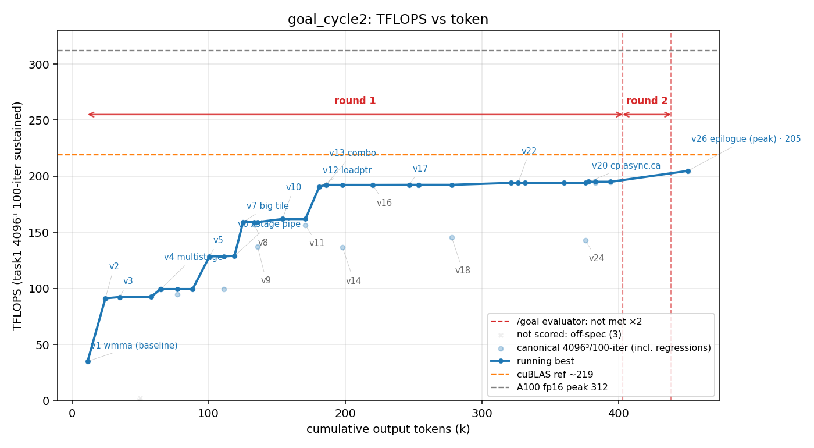

# 方法结果 — `goal_cycle2`(naive seed + 外部 evaluator 看门狗 `/goal`;ncu 可用;⚠️ **死于 ECONNRESET、非干净自停**)

> harness = **/goal**:`claude -p "/goal <condition>"`,condition = **与 naive 完全相同的 seed**(共享 `scripts/seed_gemm.txt`);唯一增量 = 一个**不让 worker 自愿停**的外部 evaluator(Haiku)。worker = opus-4-8 / effort max。
> 🔴 **本轮死于网络崩溃,不是干净自停**:在 v26(204.7)后约 478k token / 186 turn 处 `API Error: Unable to connect to API (ECONNRESET)`(`is_error:true`)。看门狗只挡**自愿停**、挡不了**进程级崩溃**(runbook §机制已注明)。**204.7 是崩前到达的「地板」,不是收敛终值**——若不崩可能更高,也可能很快自停。**当部分轮、不当干净数据点**;干净 /goal 自停以 `results/goal`(cycle1,206.8)为准,cycle3 在重跑。

## 一句话结论

同一个 naive worker(opus max),纯手写冲到 **204.7 TFLOPS(v26 epilogue,scored 4096³/100)**,与 cycle1 的 206.8 几乎打平;**崩前** 2.61h / 186 turn / 478k token / $41.4 / **0 sub-agent**。防作弊门通过(纯手写、零库)。**关键:worker 靠自己冲到 ~195(v20)第一次想停,看门狗顶 2 次把它推到 204.7(崩前 +9.7)**——与 cycle1(自达 205.5、看门狗仅 +1.3)形成鲜明对照,坐实"看门狗贡献 = 高方差的地板抬升,不是天花板抬升"。

## 环境与口径

| 项 | 值 |
| --- | --- |
| GPU / 形状 | A100-80GB / 4096³ fp16 |
| 计分口径 | task1 二进制 **4096³、iters==100**(sustained);8192²/暖机长跑/-t1 全 off-口径,不计分 |
| 参照 | 无库基线(基座已去 cuBLAS);v0 cBLAS 仅 CPU 正确性 GT;目标 = A100 fp16 峰值 312 |
| worker | claude-opus-4-8,`--effort max` |
| **evaluator(看门狗)** | **Haiku**(small-fast 槽;只读 transcript 判 condition、不跑工具) |
| profiler | ncu **可用** |
| 手写校验 | `check_handwritten.sh` **通过**(扫 14 文件,ver≥1 无 cutlass/cublas/cute) |
| 总计(权威 result 事件) | wall **2.61h(9392s)**、out_tok **478,431**、turns **186**、cost **$41.44** |
| **结束方式** | 🔴 **ECONNRESET 崩**(`is_error:true`、`result:"…(ECONNRESET)"`)——**非自停、非判达成**。3 个 `goal_status`:1 sentinel(启动占位)+ **2 次 met:false**(顶回去续);从没判过 met:true |
| sub-agent(Task) | **0**(cycle1=129;本轮纯串行,同样冲到 ~205) |

## `/goal` 机制实况(本方法的核心)

- **evaluator 共接入 2 次**(transcript 的 `goal_status` 非-sentinel、均 met:false,接入时累计 token ≈ **403k / 438k**;曲线红色竖虚线 + `round 1`/`round 2` 区间箭头就是它们)。`Stop hook feedback` 旁证也是 2 次。
- **头次接入时 worker 已到 ~195(v20 cp.async.ca)**(round 1 = 起点→403k 的自驱大爬升:v1 wmma 35 → … → v12/v13 ~192 → v20 ~195)。这一段**全程没触发 evaluator**——worker 在进步、没想停、就没被判。
- **第一次想停(~195)被顶回去 → 又顶一次 → 崩前做出 v26 epilogue 优化到 204.7**。即看门狗在 cycle2 把"195 就想收"的 worker **多压出 ~+9.7**(崩前值,非终值)。
- ⚠️ **与 cycle1 的关键对照**:cycle1 worker 自驱到 **205.5** 才第一次想停 → 看门狗 3 次仅 +1.3 到 206.8;cycle2 worker **195** 就想停 → 看门狗 2 次压到 204.7(+9.7)。**两轮峰值都 ~205,但"worker 自愿停点"差了 10(195 vs 205.5)**——看门狗的边际贡献几乎全由这个高方差的自停点决定:**它是「地板抬升器」(救那些过早想停的轮),不是「天花板抬升器」**。

## 迭代曲线(每版本最佳一行;wall / token 为累计)

| cycle | wall(s) | tokens | err | tflops | 方法改进说明 |
| --- | --- | --- | --- | --- | --- |
| 1 | 173 | 11,477 | 4.2e-05 | 34.9 | v1 wmma(基线) |
| 4 | 955 | 64,910 | 3.4e-05 | 99.4 | v4 multistage |
| 7 | 2,005 | 125,323 | 3.7e-05 | 159.1 | v7 big tile |
| 12 | 3,168 | 181,128 | 3.6e-05 | 190.8 | v12 loadptr(大跳) |
| 13 | 3,278 | 185,957 | 3.5e-05 | 192.3 | v13 combo |
| 17 | 4,609 | 246,798 | 5.3e-05 | 192.3 | v17 |
| **18** | **7,110** | **378,268** | 3.4e-05 | **195.0** | **v20 cp.async.ca(头次想停点)** |
| 22 | 6,264 | 326,591 | 4.1e-05 | 194.1 | v22 |
| **21行** | **8,598** | **450,854** | 3.6e-05 | **204.7** | **v26 epilogue(崩前峰值)** |

> 完整 21 个计分版本 / 34 次 scored 点见 `result.csv`(canonical/scored/invalid 三列)。**注意 round 1(自驱)就到 195(v20),round 2(被顶回去)崩前推到 204.7**。

> 曲线含 **/goal `round` 区间**:红色竖虚线 = evaluator 判 not met(worker 想停被顶回去),`round i` 箭头 = 第 i-1 → 第 i 条红线之间。round 1 = 起点→首次接入(自驱段),round 2 = 两次接入之间。v26 峰值在末次接入之后(崩前)。两条参照线为全局标尺,含义见 META §6。

## 关键发现

1. **🎯 看门狗 = 高方差的「地板抬升」,本轮 +9.7、cycle1 仅 +1.3。** 接入 2 次(token ≈403k/438k),头次接入前 worker 自驱到 **195**;被顶回去后崩前推到 **204.7**。**与 cycle1 合看**:两轮 worker 自愿停点 195 vs 205.5(差 10),看门狗边际 +9.7 vs +1.3——**贡献几乎全由"worker 在哪想停"决定**,而那是 N=1 路径变异。结论:`/goal` 救的是"过早想停"的轮,把它顶回 ~205;不救则不抬。**它压缩下行方差(抬地板),不抬天花板(两轮峰都 ~205)。**
2. **0 sub-agent,峰值照样 ~205 —— cycle1 的 129 sub-agent 是路径变异,不是 /goal 效应。** cycle1 曾自发 spawn 129 个 Task 做并行微实验,当时存疑"是 /goal 放大了 agentic 程度还是路径变异"。**cycle2 同 harness、0 sub-agent、纯串行,照样冲到 204.7**——**坐实 129 是路径变异**,不是看门狗机制带来的。
3. **峰值 204.7 与 cycle1 的 206.8 实质打平(且本轮还是崩前地板)。** 两轮 /goal 峰值 {206.8, 204.7≥},贴着 naive 家族上沿(naive_cycle4 干净自停 196.9)。**两轮都纯手写、无库参照、ncu 驱动**。
4. **🔴 方法学教训:ECONNRESET 不可由看门狗救,长跑要挂成本/重试兜底。** 这是继 naive_cycle1、naive_strong 之后第三次 ECONNRESET 崩(都 `is_error:true`)。/goal 的 Stop hook 只挡自愿停、救不回崩掉的进程。**长无界跑建议加 `--max-budget-usd` 优雅兜底**;崩了的轮按"部分轮"归档(本轮即是),干净结论以未崩的轮为准。

## 复现 / 数据来源

- kernel 源快照:`src/`(`matmul_f16/` v1–v26,8 个里程碑文件;peak `v26_epi.cu`);全部改动:`worker.patch`(1979 行,`git apply` 复现)。
- transcript(token / 墙钟 / 曲线 / goal_status 权威源):`transcript.jsonl`(session `3a5c6a91`,770 行)。
- stream-json 重定向(取最终 result 事件 = ECONNRESET 实锤 + 总量):`run.jsonl`。
- task1 计分 log(18 个):`logs/`。
- 曲线 / 表标注源:`labels.json`(里程碑技法)。
- 防作弊:`check_handwritten.sh` **通过**;无 `invalid.json`(全程纯手写)。
