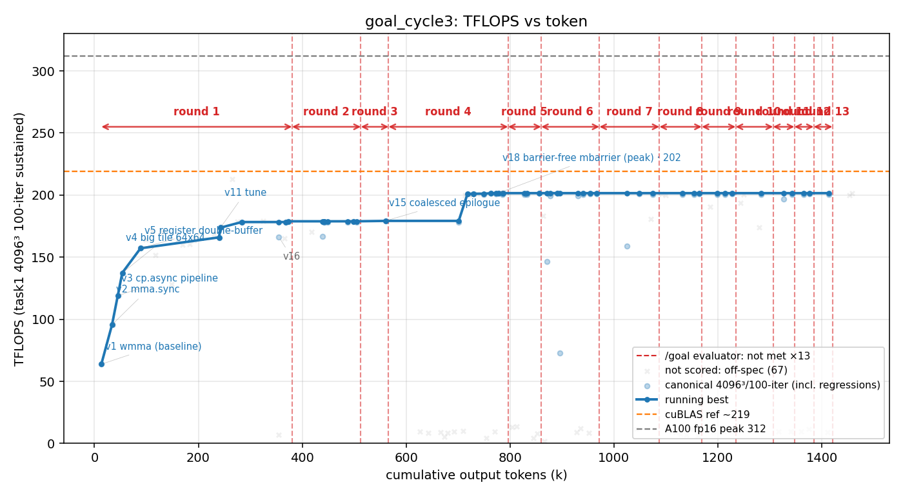

# 方法结果 — `goal_cycle3`(naive seed + 外部 evaluator 看门狗 `/goal`;ncu 可用;**用户手动 kill 收尾**)

> harness = **/goal**:`claude -p "/goal <condition>"`,condition = **与 naive 完全相同的 seed**;唯一增量 = 不让 worker 自愿停的外部 evaluator(Haiku)。worker = opus-4-8 / effort max。
> ⏹️ **结束方式 = 用户手动 kill**(跑到 v18=201.6、6h18m、~1.46M out-tok、**13 次 evaluator 接入**后人为停)。非自停、非崩溃。run.jsonl 无最终 result 事件(kill 截断),口径数据取自 transcript。
> 🔒 **隔离复核:本轮与 `naive_cycle5` 并行跑过(编排失误,见 §并行串味),但 goal_cycle3 经【整条 transcript 全量核】= 干净**(0 处引用 naive 的 memory / session / 标志词);只读自己的 worker-memory。**它是被读的一方、不是读人的一方** → 合法数据点。被污染作废的是 `naive_cycle5`(读了本轮 memory)。

## 一句话结论

纯手写 fp16 GEMM,**scored 4096³/100 峰值 201.6 TFLOPS(v18 `barrier-free mbarrier` 流水,fp32 累加 err 3.7e-5)**。**最强看门狗证据:worker 自驱到 v15=178.9 就宣告"validated optimum"想停,被 evaluator 顶了 13 次,之后才做出 v18 的 `__syncthreads`-free mbarrier 流水(+13% → 201.6)——这次看门狗逼出的是【真突破】,不只是长尾打磨。** 防作弊门通过(纯手写、零库)。0 sub-agent。

## 环境与口径

| 项 | 值 |
| --- | --- |
| GPU / 形状 | A100-80GB(与 naive_cycle5 并行→已复核隔离)/ 4096³ fp16 |
| 计分口径 | task1 4096³ / iters==100;**fp32 累加**(err ~3.7e-5);排除 67 个 off-口径点 |
| worker / evaluator | opus-4-8 effort max / **Haiku**(只读 transcript 判停) |
| 手写校验 | `check_handwritten.sh` **通过**(扫 17 文件,无库) |
| 结束方式 | ⏹️ **用户手动 kill**(无 result 事件);非自停非崩 |
| 规模(transcript) | wall **~6h18m**、out_tok **~1.46M**、turns ~(kill 截断)、**evaluator 接入 13 次**、**0 sub-agent** |

## `/goal` 机制实况 —— 三轮里看门狗贡献最大的一轮

- **evaluator 接入 13 次**(全 met:false,token ≈ 380k/513k/566k/796k/860k/972k/1087k/1169k/1234k/1306k/1347k/1384k/1421k;+1 启动 sentinel)。曲线红竖虚线 + round 区间标的就是它们。
- **头次接入(380k)时 worker 已自驱到 178.9(v15)**,而且它当时把 v15=178 写进 memory 当 **"the validated hand-optimization optimum"**(自认到顶、想收)。
- **被顶 13 次后,worker 在 ~718k token 处做出 v18 `barrier-free mbarrier` 流水**(用 `cp.async.mbarrier.arrive` + `mbarrier.test_wait.parity` 干掉 mainloop 的 `__syncthreads`,省那 ~13%)→ **178.9 → 201.6,+22.7**。
- **三轮合看,「地板抬升器」论再被强化、且这次升级为「能逼出真突破」**:

  | 轮 | worker 自停点 | 接入次数 | 看门狗净加 | 性质 |
  |---|---|---|---|---|
  | cycle1 | **205.5** | 3 | +1.3 | 长尾打磨(L2 persist) |
  | cycle2 | **195** | 2(崩) | +9.7 | 中段提升(崩前) |
  | **cycle3** | **178.9** | **13** | **+22.7** | **真突破(mbarrier 流水)** |

  **自停点越低,看门狗加得越多**(205.5/195/179 → +1.3/+9.7/+22.7,干净的反相关)。cycle3 worker 自停得最低(179、还自封"optimum"),于是看门狗的价值最大——**它拒绝接受"178 到顶"这个假结论,逼出了 mbarrier 这条 worker 本来要放弃的路**。这是 /goal 机制目前最有力的正面证据:**不只是"不让停的长尾",在 worker 过早自封顶时它能逼出范式级改进**。

## 迭代曲线(每版本最佳;wall/token 累计)

| ver | tokens | tflops | 改进 |
| --- | --- | --- | --- |
| v1 | 13,240 | 63.8 | wmma 基线 |
| v5 | 88,732 | 157.2 | register double-buffer |
| v11 | 242,536 | 173.8 | ldmatrix 地址预算 + 调优 |
| **v15** | 372,931 | **178.9** | **coalesced epilogue(worker 自封"optimum"、想停点)** |
| **v18** | 777,541 | **201.6** | **barrier-free mbarrier 流水(被顶 13 次后的真突破,峰值)** |

> 完整见 `result.csv`。**round 1(起点→380k)= 自驱到 178.9;之后 13 条红线 = 被顶回去,v18 突破出现在第 4~5 次接入附近(~718k)。**

## 📌 库对照(cuBLAS / CUTLASS / 实习生手写)—— 本轮讨论落档

> 本节把"为什么 201.6、离 cuBLAS/CUTLASS 差在哪"这几轮讨论固化下来。**核心:先分精度档,再比;同档差距是【实现结构成熟度】,不是手写 SASS、不是没用 mbarrier。**

**这台 A100 的实测全景(全 4096³,task1 口径):**

| 实现 | 累加 | TFLOPS | err | 备注 |
|---|---|---|---|---|
| **cuBLAS** | **f16** | **219.85** | 0.018 | `cublasGemmEx(...computeType=CUDA_R_16F)` 实锤 f16 累加(最新实测;早先一次测 222.6,`results/naive_ncu_cublas`) |
| **cuBLAS** | **f32** | **218.74** | 3.4e-5 | `computeType=CUDA_R_32F`(最新实测)——**与 goal/naive fp32 同档可比**;注 cuBLAS f16≈fp32 只差 1 |
| **CUTLASS** | **f32** | **217.9** | 3.2e-5 | `cutlass::gemm::device::Gemm<half_t, ..., float acc, Sm80, **128×256 / 64×64 / BK32**>`(`results/naive_no_ncu` v7)—**与本轮 tile 配置完全相同** |
| 实习生手写 | f16 | 214 | ~0.02 | `__syncthreads` 流水(非 mbarrier)+ XOR swizzle + 256×128;= cuBLAS f16 档的 97% |
| **goal_cycle3** | **f32** | **201.6** | 3.7e-5 | 本轮;v18 no-barrier mbarrier |
| goal_cycle1 / 2 | f32 | 206.8 / 204.7 | 3.7e-5 | L2-persist / 崩前 |

**结论一:201.6 的对标对象是 CUTLASS 的 217.9(同精度档、同 tile 配置),= 92.5%。** 二者都是 fp32 累加、都是 128×256/64×64/BK32/Sm80 —— **除了实现本身,所有变量都一样**。所以这 7.5% 的差**纯粹是实现结构的成熟度**(CUTLASS 那条 tuned multistage mainloop 比手写排得更满),**不是精度档、不是 tile 选择、不是手写 SASS**。

**结论二:差距不是"手写 SASS",CUTLASS 自己就证明了。** CUTLASS 开源、**纯 C++ 模板 + inline PTX(`mma.sync`/`cp.async`/`ldmatrix`/mbarrier via `cute`/`arch`),最终 SASS 调度+寄存器分配照样交给 ptxas**,没有一行手写汇编 —— 它不碰 SASS 也能到 217.9(fp32)。所以 201.6→217.9 那一截**在可读的 C++/PTX 里就能拿**,是结构精雕,不是够不着的汇编层。(我前面"剩 10% 是库 SASS"那句据此修正。)

**结论三:逼近 cuBLAS 不需要 mbarrier-无-sync。** 实习生 214(= cuBLAS f16 档 96%)用的就是普通逐 tile `__syncthreads`。**本轮 goal_cycle3 的 no-barrier mbarrier 流水在"去 barrier"这条轴上反而比实习生【更先进】**(它实测 +13%)—— 但它把这先进性花在了 **fp32 这个更低吞吐的精度档**上。warp-spec / mbarrier-无-sync 那套主要是 **Hopper(sm_90 + TMA)** 的范式;A100 上可选。

**结论四:goal_cycle3 "做不到 214/218" 是【精度档选择 + 结构差距】,不是能力天花板。**
- vs 实习生 214:不同精度档(214 是 f16-acc err 0.02,本轮是 fp32-acc err 3.7e-5)。本轮自己的 f16-acc 旁支只到 194.9。
- vs CUTLASS 217.9:同档同配置,差 7.5% 的实现成熟度。
- **它漏掉的具体一招 = smem XOR swizzle**(本轮用 PAD=8 padding;它为"塞 BK=64"纸面算过 swizzle、算出"192KB even swizzled 仍 >163KB 装不下"就放弃了,**从没把 swizzle 当成 f16-acc ground-up 设计的拼图去实测**)。
- **根子是 seed**:那份 prompt 奖励"诚实的 fp32 正确性",于是 worker 往 **fp32 精度 + no-barrier 优雅工程**走(做出 201.6 这个干净结果),而不往 **f16-acc 降精度换裸吞吐**(实习生那条到 214 的路)走。

> 一句话:**goal_cycle3 的 201.6 = "fp32 档、CUTLASS 同配置的 92.5%、靠看门狗逼出 mbarrier 突破"的干净结果**;它和实习生 214 不同档,和 CUTLASS 217.9 差的是结构成熟度(非 SASS、非 mbarrier)。要破 214 需换到 f16-acc 框架(+XOR swizzle + 它已有的 no-barrier 流水)——那是干净串行重跑该验的格子。详见 [[f16-accumulate-precision-confound]] / `results/SUMMARY.md`。

## ⚠️ 并行串味(编排失误,本轮是受害的"被读方")

本轮与 `naive_cycle5` **并行跑** → worker auto-memory 按 git 仓库键、两 worktree 共享同一份(详见 memory `concurrent-runs-share-worker-memory`)。**naive_cycle5 读了本轮写进共享 memory 的设计笔记**(172/178 config、sustained-clock、"fp16-acc 1-block 没收益")→ naive_cycle5 被判污染作废。**本轮反向核查 = 干净**(整条 transcript 0 处引用 naive 文件/session/标志词),且发现 naive 文件后已把它移出共享 dir 保护本轮跑完。结论:goal_cycle3 有效,naive_cycle5 作废重跑。

## 复现 / 数据来源

- kernel 快照:`src/`(`matmul_f16/` v1–v18,11 文件;峰 `v18_nobar.cu`)+ `worker.patch`(2368 行)。
- transcript(权威源,1416 行):`transcript.jsonl`(session `9ce2dce9`)。
- stream-json 重定向:`run.jsonl`(kill 截断,无最终 result 事件)。
- task1 计分 log(115 个):`logs/`。曲线/表标注:`labels.json`。
- 防作弊:`check_handwritten.sh` **通过**;无 `invalid.json`。
- 库对照原始数:cuBLAS=最新实测 f16 219.85 / fp32 218.74(早测 222.6 见 `results/naive_ncu_cublas/`);CUTLASS=`results/naive_no_ncu/`(v7,fp32-acc 217.9)。
