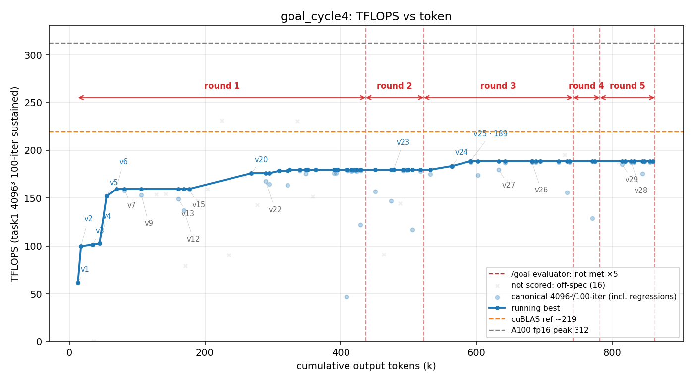

# 方法结果 — `goal`(naive seed + 外部 evaluator 看门狗 / Stop-hook)· cycle4

> 由 `results/parse_run.sh goal_cycle4 run.jsonl transcript.jsonl` 自动生成骨架 + 手工补「关键发现」。
> ⚠️ **本轮分两段跑(API 两次崩 + resume 续上),日志有两个**:`run.jsonl`(part1)+ `run.part2.jsonl`(part2);transcript 是同一 session(`7e2a74fb…`)连续的,曲线/token/接入点已含两段。

## 一句话结论

纯手写 f16 **峰值 188.7 TFLOPS**(v25,err 0.017,= 312 的 **60%** / cuBLAS f16 219.85 的 **86%**);**两段共 ~287 min(4.78h)、223 turns、862.8k out-token、$79.69**(part1 $50.73 崩于 401 → resume → part2 $28.96 崩于 ECONNRESET)。看门狗接入 **5 次**(全 not-met),**首次接入在 178.9(v23 自封"179 是天花板")处把它顶回去 → 才做出 epilogue 合并 → +9.8 到 188.7**;part2 的 3 次接入全在 v25 收敛之后 = 净加 0 的打磨长尾。**0 sub-agent**,手写校验通过。

## 环境与口径

| 项 | 值 |
| --- | --- |
| GPU / 形状 | A100-80GB / 4096³ fp16 |
| 计分口径 | task1 二进制 100 轮均值(sustained);**231/230 是 pure-HMMA 探针(err 223/147,非真 GEMM)→ 已排除** |
| 参照 | 无库基线(基座已去 cuBLAS);`v0` cBLAS 仅 CPU 正确性 ground truth;目标 = A100 fp16 峰值 312 |
| 模型 | worker = claude-opus-4-8 `--effort max`;evaluator = Haiku(small-fast 槽) |
| profiler | ncu **可用**(全程 profile-driven;每个 win 都有 `ncu --set full` 佐证) |
| 手写校验 | `scripts/check_handwritten.sh` **通过**(扫 16 文件,无 cutlass/cute/cublas/cudnn) |
| 总计(两段合) | wall_clock **17,224s(287min)**,output_tokens **862,819**,turns **223**(184+39),cost **$79.69**(50.73+28.96) |
| 中断 | part1 → **401 Invalid auth**(用户重新登录后 resume);part2 → **ECONNRESET**。两次都是进程级崩溃(看门狗救不了),非自然终止 |

## 迭代曲线(每个版本最佳一行;wall_clock / tokens 为累计,跨两段连续)

| cycle | wall_clock(s) | tokens(累计 out) | correctness(err) | tflops | 方法改进说明 | 瓶颈分析 | log |
| --- | --- | --- | --- | --- | --- | --- | --- |
| 1 | 257 | 12636 | 4.5e-05 | 61.4 | v1 wmma | — | |
| 2 | 350 | 17167 | 5.6e-05 | 99.7 | v2 cp.async | — | |
| 3 | 599 | 34485 | 2.8e-04 | 101.5 | v3 mma | — | |
| 4 | 782 | 44629 | 5.8e-05 | 102.8 | v4 | — | |
| 5 | 974 | 54848 | 0.027 | 152.0 | v5 **f16-accumulate** | 降精度换吞吐(err 3e-5→0.027) | |
| 6 | 1232 | 69185 | 0.017 | 159.6 | v6 bigwarp 64×64 | 撞 160 plateau(k16 操作数寄存器爆) | |
| 11 | 3254 | 176671 | 0.021 | 158.9 | v15 | 仍卡 ~160(k16) | |
| 12 | 4854 | 268625 | 0.020 | 176.1 | v20 **m16n8k8** lean | k8 半操作数寄存器 → 2 blk/SM 双缓冲装得下,破 160→179 | |
| 13 | 5255 | 289196 | 0.019 | 167.7 | v22 | 回归 | |
| 14 | 9016 | 477881 | 0.026 | 179.7 | **v23 pf2** | 179 plateau;worker 自封"78% of 230 探针、occupancy 墙、179 是天花板" | |
| 15 | 10647 | 563914 | 0.019 | 183.5 | **v24 epi**(coalesced epilogue) | C-store sector 50%→100%;+2.4% | |
| 16 | 11079 | 591424 | 0.017 | **188.7** | **v25 cspad**(Cs 错位消 bank 冲突) | **part1 峰值**;tensor 74.6%、2 blk/SM、0 bank 冲突 | |
| 17 | 13525 | 681480 | 0.023 | 188.3 | v26 swizzle(part2) | ≈持平,无增益 | |
| 18 | 12694 | 633068 | 0.018 | 179.5 | v27(part2) | 回归 | |
| 19 | 16215 | 828099 | 0.020 | 187.7 | v28(part2) | 回归 | |
| 20 | 15941 | 814813 | 0.019 | 185.3 | v29(part2) | 回归 | |

> 全量逐次散点见 `result.csv`(65 个 scored 点 / 29 版本);本表为每版最佳。

## 关键发现

### 1) 看门狗 = 地板抬升器,本轮**首次接入就逼出真增益**(+9.8),part2 接入全是净 0 打磨

evaluator 接入 5 次(全 `met:false`),接入时累计 token = `[436783, 522301, 742047, 781975, 862819]`,落在性能曲线上:

| 接入# | token | 该刻 peak | 段 | 解读 |
| --- | --- | --- | --- | --- |
| 1 | 436783 | **178.9 (v23)** | part1 | worker 在 179 plateau 上**自封"179 是 occupancy 天花板"想停** → 被顶回去 |
| 2 | 522301 | 178.4 (v23) | part1 | 仍在 plateau → 再顶 |
| → | — | → **188.7 (v25)** | part1 | 被顶后做出 **epilogue 合并(v24)+ Cs 消冲突(v25)**:**179→188.7 = +9.8** |
| 3 | 742047 | 187.4 (v25) | part2 | v25 已收敛后接入 |
| 4 | 781975 | 187.9 (v25) | part2 | 同上 |
| 5 | 862819 | 188.2 (v25) | part2(崩点) | 同上;v26–v29 全回归 → **净加 0** |

**结论:本轮净看门狗增量 = 首接入 178.9 → 峰值 188.7 = +9.8(~+5.5%),全部发生在 part1**;part2 三次接入是真·收敛后的"不许停"长尾,$29 烧在反复确认 + 自检上,没有任何性能进展,最后被 ECONNRESET 终结。

这是 /goal 正面证据:**worker 过早自封顶(179 plateau,写满"为什么 179 是天花板"的论证)时,看门狗逼它继续 → 找到 epilogue 这条它本要放弃的 lever**。机制与 cycle3 同形(被顶才有突破),但本轮**突破幅度小、且很快真收敛**。

### 2) 跨 cycle:同一个 178.9 plateau,不同突破路径(路径变异)

诡异巧合:**cycle4 的首接入点 178.9 = cycle3 的自停点 178.9**——两轮 worker 都独立爬到 v23 级 ~179 kernel、都用**同一套机理论证**(78% of 230 pure-HMMA 探针、64-reg f16 累加器硬卡 2 blocks/SM)自封天花板。但之后:

- **cycle3**:被顶 13 次 → 摸到 **barrier-free mbarrier 流水** → 201.6(**+22.7**)
- **cycle4**:被顶 2 次 → 摸到 **epilogue 访存合并** → 188.7(**+9.8**)然后真收敛

→ 同起点、不同 lever、不同幅度 = **净增量由 worker 的随机探索路径主导,不是看门狗剂量**。

**⚠️ 精度档不同,别直接并列**:goal **c1-c3 峰值是 fp32-acc**(206.8/204.7/201.6,err 3.7e-5);**c4 走的是 f16-acc 路**(188.7,err 0.017——它的 fp32-acc 版本只到 ~100,早期 WMMA)。所以严格说 c4 不在 c1-c3 同档。但**这反而坐实 c4 是最弱结构路径**:f16-acc 累加器(64 reg)给 **2 blocks/SM** 的 occupancy 优势(fp32-acc 128 reg 只 1 block),c4 拿着这优势仍只到 188.7——**比 naive 自己的 f16-acc 208.3 还低**、更比 c1-c3 fp32-acc 201-207 低。即:**这条路径没摸到 c1-c3 的 mbarrier/深流水(那是 1-block 下靠结构藏延迟的真本事),精度选择救不回它**。goal 峰值按档:fp32-acc `{206.8,204.7,201.6}`(c1-c3)/ f16-acc `{188.7}`(c4),**c4 两档比都最低**。

### 3) 为什么收敛在 188:occupancy / register 墙(worker 实测,非臆测)

worker 用 **pure-HMMA 探针**(去 smem/barrier 的裸 tensor-core 发射,err 223 = 不算真 GEMM)实测:**这个 2-block / 16-warp / 512-累加链 occupancy 的算力天花板 ≈ 230-231 TFLOPS(不是 312)**;v25 的 188.7 = **该 230 探针的 82%**。occupancy 被 **64×64 f16 累加器的 64 寄存器硬卡在 2 blocks/SM**(强行 3 blocks → 累加器 spill → 79 TFLOPS)。到 312 的剩余缺口是**寄存器墙下不可手写恢复的**(HMMA 延迟 + 16-warp 下的 barrier stall)。另:**wave-quant ~6%**(v25 在 4096³ 是 188,在 clean-2-wave 形状如 3456×4096 是 197-200——但那是 off-口径,已排除;power-of-2 tile 在 108 SM 上凑不出整波,stream-K 修了只净 +1%)。

### 4) 关键技法解锁(worker auto-memory 留证,见 `worker_memory/`)

- **破 160 plateau = 用 `mma.m16n8k8` 而非 `m16n8k16`**(自驱、在首次接入之前):k8 操作数寄存器减半(A=2/B=1 vs 4/2)→ 跨 stage 操作数双缓冲能塞进 128-reg/2-block 预算;k16 下 64-reg 累加器 + 64-reg 双缓冲 = 160 regs → 只能 1 block。
- **破 179 plateau = epilogue 访存合并(被顶之后)**:C-store 经 smem 暂存写 128-bit float4(sector 50%→100%)+ Cs 暂存错位消 8-way bank 冲突。**关键 lesson:即便"compute-bound",降访存流量仍有效**——低效 store 在和下一波 cp.async load 抢带宽。
- dead-ends(别重复):3 blocks/SM(spill)、更小 warp tile(访存限)、1-block 全双缓冲(warp 太少)、mma-before-sync 重排、threadblock-swizzle(latency-bound 非 L2-bound)、cp.async.ca、XOR swizzle(-4.5%,padding 更优)、split/stream-K(净 +1% 不值)。

### 5) 方法学:resume 实操 + 两段日志口径

- **resume 续上是有效的**:`claude -p "/goal $CONDITION" --resume 7e2a74fb…`,session_id 保持不变 → transcript **同文件续写**、worker 完整记得 v1..v25 + 全部 ncu 结论(part2 第一句就准确接上"current best v25=188… re-test L2 swizzle on v25",正是崩前的下一步)。前置:resume 前用 haiku one-shot 验明 auth 已恢复(否则白烧)。
- **token/cost 必须手工合两段**:`parse_run` 的"总计(权威)"只读 `run.jsonl` 的末 result 事件 = **part1 单段**(11282s / 601018)。真总计 = 两段 result 事件相加(见上表)。曲线/接入点不受影响(走 transcript,连续)。

## 复现 / 数据来源

- kernel 源快照:`results/goal_cycle4/src/`(v0..v29,deliverable = `matmul_f16_v25_cspad.cu`)+ `worker.patch`(2393 行,`git apply` 复现)
- transcript(token/曲线/接入点权威源,**两段连续同一 session**):`results/goal_cycle4/transcript.jsonl`(998 行)
- stream-json 重定向(**两段各一个,仅取各自末 result 事件的总 wall/token/cost**):`run.jsonl`(part1)+ `run.part2.jsonl`(part2)
- worker auto-memory(worker 本轮记的 best-kernel + dead-ends):`results/goal_cycle4/worker_memory/`
- session_id(resume 用,worktree 已删):`results/goal_cycle4/session_id.txt`
