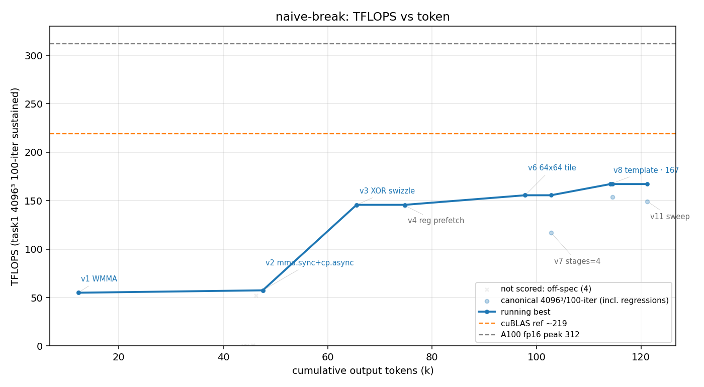

# 方法结果 — `naive-break`(naive cycle1:纯 prompt、NEVER STOP、ncu 可用 —— **被 ECONNRESET 中断、非自停**)

> 曲线/表由 `results/parse_run.sh naive-break …` 自动生成;「关键发现/瓶颈分析」人工补自 transcript 简报。
> **本轮是 cycle1(崩了);干净自停的 cycle2 在 `results/naive/`(峰值 178)——两者一起看才是 naive 的完整画像。**
> ⚠️ **本轮非自停**:worker 在第 42 turn 因 **API 连接错误(ECONNRESET,10 次重试耗尽)** 被中断,**不是模型自己决定停**。故"停在哪"对 naive 的「内在持续力」**无效**;下方性能是**崩溃前的下界**,非自然终点。需重跑取自停点(见关键发现 #1)。

## 一句话结论

纯 prompt 单 session,**手写** mma.sync+cp.async+XOR-swizzle fp16 GEMM,峰值 **167.2 TFLOPS(≈ 53.6% of 312 理论峰值)**,用时 **~1.75h / 121k output tokens / 42 turns**——但**被 API 错误中断、未自然收敛**。防作弊门通过(纯手写)。

## 环境与口径

| 项 | 值 |
| --- | --- |
| GPU / 形状 | A100-80GB / 4096³ fp16 |
| 计分口径 | task1 二进制 100 轮均值(sustained) |
| 参照 | **无库基线**(基座已去 cuBLAS);`v0` cBLAS 仅作 CPU 正确性 ground truth;目标 = A100 fp16 峰值 312。历史非正式对照:含 cuBLAS 那次 naive 顶 v18≈195.5(`results/naive_ncu_cublas/`) |
| 模型 | claude-opus-4-8, `--effort max` |
| profiler | ncu **可用**(CAP_SYS_ADMIN,worker 全程靠它定位瓶颈) |
| 手写校验 | `scripts/check_handwritten.sh` **通过**(共扫 15 文件含真 kernel 头 `mma_gemm.cuh`) |
| 总计(权威,result 事件) | wall_clock 6294s,output_tokens 121229,turns 42 |
| 结束方式 | ⚠️ **API Error ECONNRESET**(非自停),正在试 MINBLK 模板参数时中断 |

## 迭代曲线(每版本最佳一行;wall_clock / tokens 为累计)

| cycle | wall_clock(s) | tokens | correctness | tflops | 方法改进说明 | 瓶颈分析(ncu) |
| --- | --- | --- | --- | --- | --- | --- |
| 1 | 686 | 12211 | 3.3e-05 | 55.0 | v1 WMMA 基线(`nvcuda::wmma` + f32 累加,求正确性 + 基准) | 单缓冲、无 cp.async、WMMA 开销大 |
| 2 | 1605 | 47555 | 5.8e-05 | 57.5 | v2 手写 `mma.sync.m16n8k16` + `ldmatrix` + `cp.async` 双缓冲 | **tensor 仅 20%;shared bank conflict 2.18 亿次**、L1/shared 84% 饱和(元凶);DRAM 6.9%(cp.async 没问题) |
| 3 | 2088 | 65521 | 4.7e-05 | 145.7 | v3 **XOR swizzle**(16B atom 粒度)消 bank conflict + 3-stage 流水 + BK=64 | bank conflict **归零**;tensor 20%→57%;新瓶颈 occupancy 12.5%(1 blk/SM,96KB smem 限) |
| 4 | 2468 | 74777 | 3.4e-05 | 144.9 | v4 inner-loop 寄存器级 prefetch(mma 当前 ks 时预取 ks+1) | 与 v3 持平,**无效**(编译器已重排);stall=wait(2.60)+math_throttle(1.67),证实瓶颈是 occupancy |
| (v5) | — | — | 2.2e-05 | ~167 | **v5 16 warps/block(BM=256),occupancy 12.5%→25%**(峰值家族) | tensor 65%;`math_pipe_throttle` 6.35(近 tensor-bound);**acc 寄存器 64/线程从根本限 occupancy≤25%** |
| 5 | 3707 | 97819 | 3.6e-05 | 155.6 | v6 64×64 warp tile(8 warps,更高算术强度) | **比 v5 差**:8 warps→12.5% occ、245 regs;证实 occupancy 比 warp-tile 强度更重要 |
| 6 | 3969 | 102760 | 3.6e-05 | 117.1 | v7 STAGES=4 + BK=32(更深流水) | **退化**:BK=32 时 A 仅 4 atom,swizzle 退化 + barrier 翻倍;废弃 |
| 7 | 4523 | 114174 | 3.4e-05 | **167.2** | v8 = v5 配置(`pg_mma::launch<256,128,64,4,4,3>`),模板化复现峰值 | 重构成模板 kernel 头 `mma_gemm.cuh`,薄 dispatcher 实例化,便于 sweep 配置 |
| 8 | 4955 | 121229 | 3.6e-05 | 149.2 | v11 `<128,128,64,4,4,2,2>` sweep 变体 | 配置 sweep 中;v9 32×64=153、v10 BK=32=117,均不及 167 |

> **峰值 = 167.2 TFLOPS @ v8(= v5 的 16-warp/BM=256 家族),≈ 53.6% of 312。**

> 图注:灰线 = A100 fp16 峰值 312。浅点 = 每次计分(含回归 / k=64 调试小分);每个版本取「最佳一点」打标(vN + 技法),刷新 running-best 的前沿点在上、回归版在下。(图上的参照线为全局可视化标尺,含义见 META §6,本文不展开。)

## 关键发现

1. **⚠️ 非自停,被 API 中断 → 本轮不能用作 naive「持续力」结论。** 末尾 `result` 事件:`is_error:true`、`API Error: Unable to connect to API (ECONNRESET)`,前面 `api_retry` 已到 10/10。崩溃时 worker 正给模板加 `MINBLK` 参数试「2 blocks/SM 的 barrier 相互独立、可填 tensor 管线气泡」——**仍在主动迭代,远未自己停**。naive 要测的"纯 prompt 下能持续多久 / 冲到多少"这轮没测到自然终点;**167.2 是下界,需重跑**(LLM 有随机性,本就该多跑取均值/方差)。**→ 重跑已完成:`results/naive/`(cycle2,自停有效、worker 主动收尾,峰值 178 TFLOPS / 128 turns / 1.68h);本轮 cycle1 的 167.2 作下界对照保留。**
2. **反复撞 occupancy 墙(naive 自己诊断出的硬约束)**:acc 寄存器 64/线程 → occupancy 上限 25%(50% 需 regs≤64 不可能)。v5(16 warps,25% occ)= 峰值;v6 堆 warp-tile 强度、v7 加深流水都更差。它正确推断"不能靠堆 occupancy,得减气泡",并据此重构模板做系统 sweep——**naive 全程无人提示,自己 ncu→假设→实验→证伪**,方法论扎实。
3. **inf 不是 kernel bug,是 harness 的「数据彩票」**:worker 正确诊断出偶发 `isinf` 来自误差度量 `|GT−C|/|GT|`——某随机种子下个别 `GT[i]` 舍入到 f16 的 0 → 除零,约 0.6%/run、影响所有版本(含 v1)。**它没有为了刷分回避,而是定位到根因**(实事求是)。这点值得记进框架已知问题。
4. **路线判断正确**:WMMA 基线(55)→ 手写 mma.sync+cp.async+swizzle 一举到 145(消 2.18 亿次 bank conflict)→ occupancy 调到 167。三步都由 ncu 真实指标驱动,无瞎猜。
5. **数据口径提醒**:小 shape / 调试点(worker debug `isinf` 时的 k=64,0.1–0.5 TFLOPS)现由 parser **自动判 off-spec、降浅灰叉、不计分**(见 `result.csv` 的 `canonical`/`scored` 列)。v5 的 167 里程碑其计分行与 `--ver` 配对落到了 v8 复现点(峰值家族 v5≡v8);另有一个 ~153 的 scored 点(= v9 32×64,见上 v11 行注)未解析出版本号,作散点保留、不单独打标。

## 复现 / 数据来源

> 本轮(cycle1,因 ECONNRESET 中断)已整体归档到 `results/naive-break/`;kernel 源快照在 `src/` + `include/`,下面路径均相对该归档。重跑的新一轮落 `results/naive/`。
- kernel 源快照:`src/` + `include/`(真 kernel `include/playground/mma_gemm.cuh`,薄 dispatcher v8–v12)
- transcript(token/墙钟/曲线权威源):`results/naive-break/transcript.jsonl`(session `e6e90e1d`)
- stream-json 重定向(仅取最终 result 事件总量):`results/naive-break/run.jsonl`
- 曲线/表标注源:`results/naive-break/labels.json`(ver→技法短描述,供 `parse_run.sh` 的图与表共用)
- 计分行口径见 `CLAUDE_For_KernelAgent.md`;防作弊:`scripts/check_handwritten.sh playground-base`(对复现树扫 ver≥1)✓
