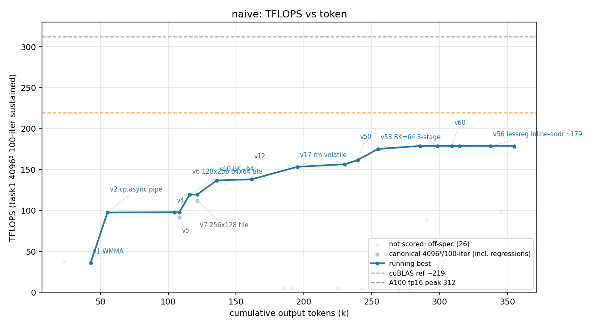

# 方法结果 — `naive`(纯 prompt、NEVER STOP、零脚手架、ncu 可用)

> 曲线/表由 `results/parse_run.sh naive …` 自动生成;「关键发现/瓶颈分析」人工补自 transcript 简报。
> ✅ **本轮自然终止、有效**:worker 在第 128 turn **自己收尾**(`result` 事件 `is_error:false` / `stop:end_turn` / `terminal_reason:completed`),不是 cycle1 那种 API 中断。故"停在哪、冲到多少"对 naive 的「内在持续力」**有效**,可作正式结论。(cycle1 因 ECONNRESET 作废,见 `results/naive-break/`。)

## 一句话结论

纯 prompt 单 session,**手写** mma.sync+cp.async fp16 GEMM,4096³ 计分口径峰值 **178 TFLOPS(≈ 57% of 312 理论峰值)**,用时 **~1.68h / 370k output tokens / 128 turns**。worker 全程 ncu 驱动,最终自行判定"只剩 stream-K 能再榨 ~4%、但改造风险过高",**保留 v56 为交付、主动收尾**。防作弊门通过(纯手写)。

## 环境与口径

| 项 | 值 |
| --- | --- |
| GPU / 形状 | A100-80GB / 4096³ fp16 |
| 计分口径 | task1 二进制 **4096³、100 轮均值**(sustained);parser 只认 `shape=4096³ && iters≥100 && 误差<0.1` 的点 |
| 参照 | **无库基线**(基座已去 cuBLAS);`v0` cBLAS 仅作 CPU 正确性 ground truth;目标 = A100 fp16 峰值 312 |
| 模型 | claude-opus-4-8, `--effort max` |
| profiler | ncu **可用**(CAP_SYS_ADMIN,worker 全程靠它定位瓶颈) |
| 手写校验 | `scripts/check_handwritten.sh` **通过**(扫 10 文件,无 cutlass/cublas/cute/cudnn) |
| 总计(权威,result 事件) | wall_clock 6035s,output_tokens 370206,turns 128 |
| 结束方式 | ✅ **自停**(`end_turn` / `completed`,`is_error:false`) |

## 迭代曲线(每版本最佳一行;wall_clock / tokens 为累计;仅 canonical 4096³/100 轮计分点)

| cycle | wall_clock(s) | tokens | correctness | tflops | 方法改进说明 | 瓶颈分析(ncu) |
| --- | --- | --- | --- | --- | --- | --- |
| 1 | 592 | 42717 | 3.1e-05 | 36.0 | v1 WMMA 基线(`nvcuda::wmma`,单缓冲,fp32 累加;首版写错 err 11.4 已剔,取修正后) | WMMA 开销大、无流水 |
| 2 | 753 | 55030 | 3.4e-05 | 97.5 | v2 3-stage **`cp.async.cg`** 软件流水 | — |
| 3 | 1443 | 104325 | 4.0e-05 | 98.0 | v4 手写 **`mma.sync.m16n8k16` + `ldmatrix`**(.x4/.x4.trans) | — |
| 4 | 1515 | 108232 | 3.8e-05 | 91.3 | v5(回归) | — |
| 5 | 1645 | 115714 | 4.6e-05 | 119.4 | v6 **128×256 block + 64×64 warp tile**(↑算术强度、↓L2) | — |
| 6 | 1761 | 121321 | 4.0e-05 | 111.9 | v7 256×128 tile(回归) | — |
| 7 | 2027 | 135723 | 3.3e-05 | 136.7 | v10 **BK=64** | — |
| 8 | 2389 | 161444 | 3.2e-05 | 138.1 | v12 | — |
| 9 | 2955 | 195260 | 4.5e-05 | 153.4 | v17 去 `volatile`(+ v14/v15 cross-tile 寄存器流水、4-stage) | tensor 65% |
| 10 | 3777 | 235618 | 3.6e-05 | 163.6 | v34(128×256 + GROUP_M swizzle 调 L2) | L2 91% 命中、DRAM 13% |
| 11 | 3856 | 239553 | 4.2e-05 | 161.5 | v50 | — |
| 12 | 4149 | 254639 | 4.4e-05 | 175.2 | v53 **BK=64 + 3-stage + 优化流水**(推翻早先"BK=64 差"的结论) | tensor 74.1%、barrier 0.48 |
| 13 | 5490 | 337665 | 3.3e-05 | **178.8** | v56 **inline 寻址消寄存器溢出**(BK=64 3-stage + cross-tile + interleave 全集) | tensor 74%,`wait`+`math_pipe_throttle` 主导 |
| 14 | 5001 | 309008 | 3.6e-05 | 178.8 | v60(最终清理版) | — |
| 15 | 3635 | 230033 | 3.4e-05 | 156.5 | v?(版本号未解析出) | — |

> **峰值 = 178.8 TFLOPS @ v56(4096³/100 轮),最终官方复测 177.2,≈ 57% of 312。** 36 → 178 ≈ **5×**。

> 图注:蓝点 = 4096³/100 轮 canonical 计分(含回归),蓝线 = running-best,里程碑标 `vN + 技法`;**浅灰叉 = 未计分点(off-口径或结果无效)**——含 ncu `-t1` 调试、`-t30/50` 短测、8192² 大 shape、以及首版写错。灰线 = A100 fp16 峰值 312。参照线含义见 META §6。

## 关键发现

1. **✅ 自然终止 = naive 持续力有效结论。** worker 跑满 128 turn 后,自行得出"4096³ 剩余 ~4% 差距纯属**波量化尾部**(512 blocks / 108 SM = 4.74 波),唯一解是 **stream-K**,但需重写整条调好的流水 + 跨 CTA 部分和归约,风险/收益不划算",于是**保留 v56 为交付并收尾**——这是 naive 在纯 prompt 下的自然终点。对比 cycle1(ECONNRESET 中断、无效),本轮 token 用量 3×(370k vs 121k)、版本数远多(v60 vs v12),真正跑到收敛。
2. **tensor-throughput bound 是天花板**:峰值时 HMMA-pipe-active **74%**,`math_pipe_throttle` + 累加器依赖 `wait` 两大 stall 主导;SASS 干净(32 条背靠背 HMMA 带 `.reuse`)。已逼近这套结构的吞吐上限。
3. **occupancy 被证伪(4 个角度)**:16 warps(25% occ)、强制 2 blocks/SM 都**更差**(寄存器溢出 / L2 过载)。64×64 warp tile(128 个 fp32 累加寄存器)= 1 block/SM 下寄存器文件能给的最大 ILP。**naive 自己推翻了"堆 occupancy"的直觉**。
4. **swizzle 这轮没用上**:cp.async + ldmatrix **天然绕过** STS/LDS,shared 访问 0 bank conflict,故 XOR-swizzle 加了也白加——worker 实测确认后没投入。**与 cycle1 形成有趣对比**(cycle1 那条路径靠 XOR-swizzle 消了 2.18 亿次 bank conflict;本轮换了 cp.async 路径后 swizzle 变多余),说明优化路径不唯一。
5. **fp16 累加零收益**:v57 改 fp16-accumulate 省了 58 个寄存器(254→196)但**不提速**——反证瓶颈是 tensor 吞吐、不是寄存器/occupancy。
6. **口径诚实性(parser 已加固)**:本轮 44 次出分里 **25 次未计分**被自动剔除——含 8192²×4096 的 **191.9(61.5%,尾部消失)**、ncu `-t1` 的 ~0.x、`-t30/50` 短测、首版写错(err 11.4)。**191.9 不是 4096³ 计分口径,不作峰值**;真实峰值 178。明细见 `result.csv` 的 `canonical`/`scored` 列。

## 瓶颈与后续优化方向(深度分析)

> 基于 v56 源码(`task-1/src/matmul_f16/matmul_f16_v56_lessreg.cu`)+ worker 自测 ncu 指标,并对照一份**同结构家族、达 214 TFLOPS 的参考实现**。**结论(已据参考实现修正):178 是 v56 这个实现把 HMMA-pipe 卡在 74% 的结果,不是结构极限——经典 `__syncthreads` 多级流水本身能到 ~214(见下「对比」),178→214 是流水工艺差距、非范式差距。**

**瓶颈 = Tensor Core 吞吐气泡(非 memory、非时钟)。** 峰值时 HMMA-pipe-active 仅 **74%**,主导 stall 是 `wait`(累加器/操作数依赖,~1.8–2.1k)+ `math_pipe_throttle`(~1.5–1.7k),次要 `lg_throttle`(cp.async,~0.76k);同时 shared **0 bank conflict**、L2 命中 **91%**、DRAM **13%**、GPU 满 1410 MHz 不降频。即 Tensor Core 有 **~26% 时间空转**,来自两处:

1. **块级 `__syncthreads` 气泡(主因,结构性)**:每跨一个 K-tile,8 个 warp 一起 `cp.async.wait_group`+`__syncthreads`(源码行 191-192)。**而本 kernel 是 1 block/SM**,barrier 期间整个 SM 无其它 block 可填 Tensor Core → 管线抽干。
2. **累加器 RAW `wait`**:`mma` 是 in-place `d=a·b+d`(行 57),同一 `acc[mi][ni]` 跨 64 tile×4 slice 串行;一个 slice 内 32 个独立累加块的 ILP 不足以填满 HMMA 发射间隙。

**为什么"提 occupancy"这条路堵死(铁律)**:高算术强度的 64×64 warp tile 需要 `acc[4][8][4]=128` 个 fp32 累加器(行 86)→ **254 regs/线程 × 256 = 65024,逼近 64K/SM 寄存器上限**;同时 3-stage shared = **~153 KB,逼近 163 KB/SM 上限**。**两者各自都把 occupancy 锁死在 1 block/SM(12.5%)**——要塞第二个 block 必须砍 tile 或 BK,导致算术强度掉、L2 过载。worker 实测 `v58 强制 2 block = 89`、`BK=32 回归`,全更差;fp16 累加省 58 寄存器却**零提速**(反证:瓶颈是 tensor 吞吐,不是寄存器/latency)。**所以"occupancy 无关"是这套结构的必然,不是调参不到位。**

**两个峰值数是同一 kernel 的两种 shape**:192(8192²,61.5%)= **v56 这个实现的天花板**(非结构极限,见下对比);178(4096³)= 192 再扣 **~7% 波量化尾部**(512 blocks / 108 SM = 4.74 波;8192² 有 19 波摊薄了)。

### 对比:同结构家族的参考实现 214 TFLOPS(4096³,68.6%)

一份**同结构家族**的手写实现(同样 1 block/SM、8 warp、64×64 warp tile、经典 `__syncthreads` 多级 cp.async 流水,**无 warp 专门化**)达 **214 TFLOPS**——证明 v56 的 178 不是结构极限,而是流水工艺没拉满:

| 维度 | naive v56(178, **fp32**) | 参考(214, **fp16**) |
| --- | --- | --- |
| block tile / BK / stage | 128×256 / 64 / 3 | 256×128 / **32** / **4** |
| 累加精度 | fp32(err 3e-5) | **fp16**(err ~1.7e-2) |
| 累加器寄存器 | **128**(`acc[4][8][4]` f32) | **64**(`RC[4][8][2]` f16) |
| 寄存器 / spill | 254 regs,**10 spill** | ~128 named,**0 spill** |
| shared 布局 / 大小 | padding,**153 KB** | **permuted/XOR-swizzle(零浪费),96 KB** |
| occupancy | 1 block/SM,8 warp | **相同** |
| MMA 遍历 | 平铺 i,j | **zig-zag 蛇形**(复用 B frag) |
| epilogue | half2 直接散写 global | smem 暂存 + int4(128-bit)合并写 |

**它好在哪(贡献排序;从代码结构推,未 profile 确证)**:
1. **fp16 累加 → acc 64 vs 128 寄存器 → 消掉 v56 的 10 个 spill**。fp16-acc 真正价值不是本身快,而是**腾寄存器、消除热循环 LDL/STL spill 流量**;acc 正是 v56 唯一比参考多的部分,把它顶过 spill 阈值。
2. **permuted/XOR-swizzle 的 shared(零 padding,96KB)** → 腾出空间做 4-stage。
3. **zig-zag MMA 遍历** → 复用 B fragment、减 ldmatrix/操作数 `wait`。
4. **4-stage**(BK=32 迭代翻倍,更深流水才盖得住延迟)。
5. int4 合并写 epilogue(compute-bound 下是小头)。

⚠️ **精度口径**:参考用 **fp16 累加**(err ~1.7e-2,压在 ≲0.02 内),v56 用 fp32(3e-5),**非完全 apples-to-apples**。但关键证据:**naive 自己试过 fp16 累加(v57=176)几乎零提升**——所以 214 vs 178 **不是 fp16 累加本身**,而是上面整套**协同设计**。

### 后续优化方向(按收益/难度,据参考实现修正)

| 方向 | 攻击的瓶颈 | 预期 | 难度 |
| --- | --- | --- | --- |
| **① 经典流水打磨到位**(fp16 累加**配合**消 spill + permuted swizzle 省 shared + zig-zag + 4-stage) | 把 HMMA-active 从 74% 拉向 ~83% | **178 → ~214**(参考实现实证可达) | 中(同范式重构,非推倒) |
| **② async barrier / warp 专门化**(`mbarrier`/`cuda::pipeline`,去块级 `__syncthreads` 气泡) | barrier 气泡 | **214 → 80%+**(CUTLASS-class) | 高(范式级重写) |
| **③ Stream-K** | 仅 4096³ 波量化尾部 | 4096³ **再 +~4%** | 中(跨 CTA 部分和归约) |

**核心观察(方法对比价值,据参考实现锐化):** naive 把 fp16 累加、swizzle **各自孤立测试、各自因"单独无增益"丢弃**(v57 fp16-acc 零提升;swizzle"已 0 冲突没用"),**从未把它们组装**成参考那套协同设计——这是**贪心局部搜索的典型失效:拒绝单独中性、但组合起来才有效的招**。它的局限**不是"没想到 async 重写"那么高阶**,而是**连同范式内的协同调优(178→214)都没做满**。⚠️ 我此前(本节初稿)把"192=结构天花板、要 async 才能破"判重了,参考实现已证伪、上文已修正。可作 `/goal` 等带提示方法的对照假设:**给一句"fp16 累加要配合消 spill、swizzle 是为省 shared 上深流水"的提示,带提示方法能否把 178 推到 214?**

## 复现 / 数据来源

- kernel 源码快照:`results/naive/src/`(真 kernel `src/matmul_f16/matmul_f16_v56_lessreg.cu`,128×256·64×64·8warp·BK=64、3-stage cp.async.cg + cross-tile 寄存器预取 + interleaved cp.async + hoisted 寻址);相对干净基座的全部改动:`results/naive/worker.patch`(`git apply` 可复现)
- transcript(token/墙钟/曲线权威源):`results/naive/transcript.jsonl`(session `bf259faa`)
- stream-json 重定向(仅取最终 result 事件总量):`results/naive/run.jsonl`
- 曲线/表标注源:`results/naive/labels.json`(ver→技法)
- 计分行口径见 `CLAUDE_For_KernelAgent.md`;防作弊:`scripts/check_handwritten.sh playground-base`(对复现树扫 ver≥1)✓
