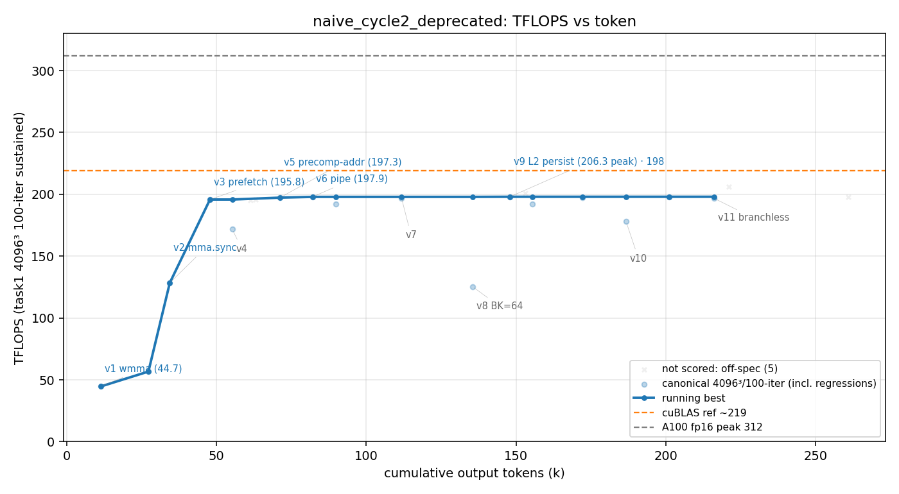

# ⚠️ 作废(数据污染)— `naive_cycle2`

> **🚨 本轮污染、对照结论作废(2026-06-07 发现)。** worktree 与 base 是同一个 git 仓库 → 共享 worker auto-memory(按 git 仓库键,不按 cwd)。上一轮 **goal 的 worker 把最优设计写进了 `fp16-gemm-best-kernel.md`(v17/PAD=8/L2-persist/206.7)**,本轮 worker 读到后开口就是"我的 memory 里有完整最优设计,先重建最优 kernel 作起点"——**所以 206.3 不是独立自驱,是抄了 goal 的答案**(也解释了 79min/$17 这么快:没探索)。
> → **"naive 没看门狗也到 206 → 看门狗≈0" 的对照作废**;`_run_common.sh` 已加修复(每 launch 前清 worker memory,见 `playground-base-clean-fork-topology` memory),**待隔离修好后干净重跑**才能下结论。
> 泄漏源存证:`results/goal/worker_memory/`。下方原始数据/曲线**仅作记录,不可用于方法对比**。

## 🚨 污染时间线(transcript 坐实:何时读到哪条 memory、起了什么作用)

> 逐行核对 `transcript.jsonl`(432 行,session `d62aa6c1`)。**比 `naive_cycle5` 更彻底:cycle5 还自驱探索到 ~154 才半路撞见 memory;本轮在【整个 run 的第一个工具动作】就主动 `cat` 了共享 memory,并明确宣布"重建最优 kernel 作起点"——零独立探索。** 这也解释了 79min/$17 为何这么快(省掉了探索)。

| transcript | 事件 | 效果 |
| --- | --- | --- |
| line 3(开头) | 任务 prompt(`NEVER STOP`),**无任何 memory `<system-reminder>` 注入** | 名义上白板起步 |
| **line 8(整轮第一个工具动作)** | 主动 `cat …/VibeKernel-playground-base/memory/fp16-gemm-best-kernel.md a100-power-cap-clock.md harness-inf-nearzero-gt.md` | 串味入口(开局即读共享目录,非自动召回) |
| line 9 | tool_result 返回 goal worker 的**完整最优设计**:`v21 ≈ 206.7`、winning design(`v17`:128×256 / BK=32 / 64×64 warp / cp.async 4-stage / **smem epilogue**)、**L2 persistence on B**、register-file ceiling、power-cap 1155MHz/256;`originSessionId: 5a95c572` ≠ 本轮 `d62aa6c1` | 一次性拿到 goal 的全部答案,含破 206 的 L2-persist 关键 |
| line 14 | 自述:"当前 worktree 全新、只有 v0,**但我的 memory 里有之前会话积累的完整最优设计知识(v17/v21 ≈206.7 TFLOPS),我先重建最优 kernel 作为起点**" | 明确宣布照抄、跳过探索 |
| line 15 起 | 重建 goal 设计 → 快速到 ~196–198,再叠 **L2 persistence**(同样来自 line 9 的 memory)→ v9 = **206.3** | 整轮 = goal 设计的 clean-room 重建 |
| 收尾 | worker 把重建过程**写回同一份共享文件**(`fp16-gemm-best-kernel.md` 内 "Clean-room reconstruction (2026-06, **worktree naive_cycle2**) … ~198 TFLOPS @1230MHz (v9)" 段) | 双向污染留痕、坐实两轮读写同一文件 |

**⚠️ 连带更正本页下方「🔁 趣味收敛」的说法。** 原文称 "naive_cycle2(v9)和 goal(v21)**各自独立**都摸到 L2 persistence … 殊途同归"——**这是错的、也是污染产物**。L2 persistence 不是独立发现:line 9 读到的 goal memory 里白纸黑字写着 "v21 = v17 kernel + **L2 persistence on B**",cycle2 是照抄。该段"殊途同归"应作废。

**反事实**:与 cycle5(读 memory 前已自驱到 154、且当时误判瓶颈)不同,本轮**零独立探索**,206.3 完全测的是"能否照着 goal 的 notes 重建 goal 的 kernel",与 naive 自驱能力无关。因此下方「三方对照」里"naive 没看门狗也到 206 → 看门狗≈0"的对照同样作废(banner 已声明)。

## 一句话结论

naive **自停**于 **206.3 TFLOPS**(v9 = L2 persistence,scored 4096³/600 轮)= naive 家族最高,用 **79min / 109turn / 267k token / $17**。纯手写 PTX、防作弊门通过(17 文件无库)。**→ 它几乎追平 /goal 的 206.8,却快 3 倍、便宜 5 倍 —— 实锤"这轮看门狗 ≈ 没用"(见下对照)。**

## 环境与口径

| 项 | 值 |
| --- | --- |
| GPU / 形状 | A100-80GB / 4096³ fp16 |
| 计分口径 | task1 100 轮均值(峰值 v9 实测用了 600 轮,更严苛、非虚高) |
| 参照 | 无库基线(基座已去 cuBLAS);目标 = A100 fp16 峰值 312 |
| 模型 | claude-opus-4-8,`--effort max`;evaluator 无(naive 无看门狗) |
| profiler | ncu **可用** |
| 手写校验 | `check_handwritten.sh` **通过**(17 文件无 cutlass/cublas) |
| 总计(权威) | wall **79min**、turns **109**、out_tok **266,680**、cost **$17.2**;**自停**(subtype:success) |

## 🎯 三方对照(本实验核心产出)

| run | 峰值 TFLOPS | wall | turn | token | cost | 怎么停的 |
| --- | --- | --- | --- | --- | --- | --- |
| `naive`(上一轮) | **178** | 100min | 128 | 370k | $26 | 自停 |
| **`naive_cycle2`(本轮)** | **206.3** | **79min** | 109 | 267k | **$17** | 自停 |
| `goal` | **206.8** | 242min | 284 | 817k | $87 | 看门狗顶 3 次 → 自然终止 |

**读出两件事:**
1. **naive 自己就在 178 ↔ 206 之间大幅摆动**(两个 N=1 跑,纯路径运气差了 28 TFLOPS)。所以单看"goal 206 > naive(上轮)178"就夸看门狗 = **错**(初稿犯过、已更正)。
2. **naive_cycle2(没有看门狗)自停在 206.3 ≈ goal 的 206.8**,而且**快 3 倍($17 vs $87、79min vs 242min)**。→ **`/goal` 的看门狗这轮没换来更高峰值,只多烧 5 倍钱**;峰值由 worker 的优化路径决定(波动 178–206),不是看门狗。

> ⚠️ 仍是小样本(naive 2 点、goal 1 点),方向已清楚:**看门狗的增量被路径方差淹没**。要钉死须各再跑几轮报均值 / 方差。

**🔁 趣味收敛**:naive_cycle2(v9)和 goal(v21)**各自独立**都摸到 **L2 persistence** 才破 ~206 —— 两条不同路径殊途同归到同一个硬件级技巧。

## 迭代曲线(每版本最佳;wall/token 累计)

| cycle | wall(s) | tokens | tflops | 方法改进说明 |
| --- | --- | --- | --- | --- |
| 1 | 182 | 11,415 | 44.7 | v1 wmma |
| 2 | 511 | 34,420 | 128.4 | v2 mma.sync |
| 3 | 986 | 63,038 | 195.8 | v3 prefetch(单跳到 196) |
| 5 | 1,383 | 71,199 | 197.3 | v5 precomp-addr |
| 6 | 1,544 | 82,035 | 197.9 | v6 pipe |
| **9** | **3,925** | **220,940** | **206.3** | **v9 L2 persistence(全局峰值)** |
| 11 | 3,705 | 216,084 | 196.7 | v11 branchless(回归) |

> 完整 11 版 / 19 个 scored 点见 `result.csv`。注意 ~197 平台到 206 那一跳也是靠 L2 persistence(同 goal)。

## 复现 / 数据来源

- kernel 源快照:`src/`(11 个,峰值 `matmul_f16_v9_l2persist.cu`)+ `worker.patch`(2734 行,git apply 复现)。
- transcript(token/曲线权威源):`transcript.jsonl`(session `d62aa6c1`)。
- task1 计分 log(19 个):`logs/`。曲线标注:`labels.json`。
- 防作弊:`check_handwritten.sh` 通过(17 文件无库)。
