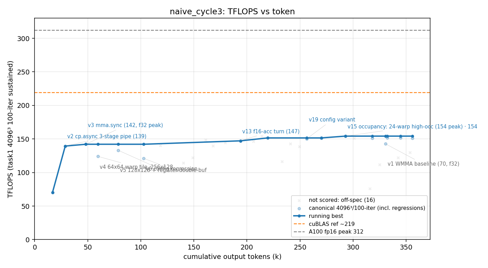

# 方法结果 — `naive_cycle3`(纯 prompt、NEVER STOP、零脚手架、ncu 可用;**干净 worktree 重跑**)

> 曲线/表由 `results/parse_run.sh` 自动生成;「关键发现/瓶颈分析」人工补自 transcript。
> ✅ **本轮自然终止、有效**:worker 第 92 turn **自己收尾**(`terminal_reason:completed` / `is_error:false`),自判"已收敛到该 kernel 家族的最优、每个剩余 config 都再确认 v15"。
> 🔒 **这是 cycle2 污染后第一个【干净独立】的 naive 自停点**:`_run_common.sh` 每 launch 前清 base-slug worker auto-memory(见下「隔离验证」),与 `results/goal` 构成可用对照(naive_cycle2 因 memory 泄漏作废,见 `results/naive_cycle2_deprecated/`)。

## 一句话结论

纯 prompt 单 session,**手写** mma.sync + cp.async fp16 GEMM。我们的默认计分口径(err<0.1)峰值 **154.2 TFLOPS(v15,但用 f16 累加、err≈0.016)**;若按 goal 的**严格 fp32 级精度**(err≈3e-5)口径,本轮天花板只到 **~142(v3)**。用时 **1.53h / 360k output tokens / 92 turns / $20.7**,**0 个 sub-agent**。worker 全程 ncu 驱动,自判"49% of peak、residual 是 mma-latency `wait`+barrier、需 SASS 级手排,源码层到顶",主动收尾。防作弊门通过(纯手写)。

## 环境与口径

| 项 | 值 |
| --- | --- |
| GPU / 形状 | A100-80GB / 4096³ fp16 |
| 计分口径 | task1 二进制 **4096³、100 轮均值**(sustained);parser 只认 `shape=4096³ && iters≥100 && err<0.1` 的点 |
| 参照 | **无库基线**(基座已去 cuBLAS);`v0` cBLAS 仅作 CPU 正确性 ground truth;目标 = A100 fp16 峰值 312 |
| 模型 | claude-opus-4-8, `--effort max` |
| profiler | ncu **可用**(CAP_SYS_ADMIN,worker 全程靠它定位瓶颈) |
| 手写校验 | `scripts/check_handwritten.sh` **通过**(扫 9 文件,ver≥1 无 cutlass/cublas/cute/cudnn) |
| 总计(权威,result 事件) | wall_clock **5492s(1.53h)**、output_tokens **360,368**、turns **92**、cost **$20.70** |
| 结束方式 | ✅ **自停**(`terminal_reason:completed`,`is_error:false`);**无 evaluator / 无 goal_status**(纯 naive,0 次) |
| sub-agent(Task) | **0**(对比 goal 的 129) |

## 🔒 隔离验证(本轮的核心意义:证明 memory 泄漏已修)

cycle2 作废的根因 = worktree 与 base 共享 worker auto-memory(按 git 仓库键),上轮 goal 写的 `fp16-gemm-best-kernel.md`(v17/PAD=8/206.7/L2-persist)被下轮 naive 读到、直接重建最优 kernel = 抄答案。本轮 launch 前 `_run_common.sh` 清掉了 base-slug worker-memory(`🧹 已清 worker auto-memory(base slug)→ 本 run 白板`)。transcript 实测:

| 泄漏标记(goal 的设计知识) | 本轮 transcript 出现次数 |
| --- | --- |
| `fp16-gemm-best-kernel`(泄漏文件名) | **0** |
| `206.7` / `206.8`(goal 峰值) | **0** |
| `L2 persist` / `PAD=8`(goal 独有技法) | **0** |

- worker **自己**在 L332/382(跑到尾段)Write 了一份**自己**的 `gemm-f16-best-config.md`(文件名都不同)——这是 auto-memory **保持开启**带来的【本 run 内】持久化(跨 context 压缩记自己的发现),不是读泄漏。`v17`(12 次)是它**自己**的版本号(L266 起、本轮自己迭代到 v19)。
- 结论:**白板起步确认,Fix B 生效**。本轮自停点对 naive「内在持续力」有效,可作正式对照。
  (它跑完又把自己的 memory 写回 base-slug;无妨——下次 launch 会再清。设计自洽。)

## 迭代曲线(每版本最佳一行;wall/token 为累计;仅 canonical 4096³/100 轮计分点)

| cycle | wall(s) | tokens | err | tflops | 累加 | 方法改进说明 |
| --- | --- | --- | --- | --- | --- | --- |
| 1 | 234 | 16,780 | 3.4e-05 | 70.1 | fp32 | v1 WMMA 基线 |
| 2 | 395 | 28,826 | 5.2e-05 | 139.4 | fp32 | v2 mma.sync |
| 3 | 639 | 48,278 | 4.4e-05 | **142.1** | **fp32** | **v3(fp32 级精度天花板)** |
| 5 | 1,060 | 78,566 | 3.9e-05 | 133.2 | fp32 | v5 |
| 13 | 2,773 | 193,798 | 1.9e-02 | 147.2 | **f16** | v13(转 f16 累加,err 跳 ~500×) |
| 16 | 3,144 | 219,513 | 1.9e-02 | 151.6 | f16 | v15 occupancy(128×128·warp32×64·3stage·3CTA/SM) |
| 20 | 3,699 | 256,330 | 1.8e-02 | 150.2 | f16 | v19 |
| **22** | **4,328** | **292,803** | **1.6e-02** | **154.2** | **f16** | **v15(全局峰值,f16 累加)** |
| 27 | 4,963 | 330,451 | 3.6e-05 | 142.8 | fp32 | v1 复测(末段回到 fp32 级,142.8) |

> ⚠️ **两个精度口径并存,务必分开看**:
> - **f16 累加(err≈0.016–0.033)**:峰值 **154.2(v15)**——这是 parser 默认 headline(err<0.1 即计分)。
> - **fp32 级(err≈3e-5,= goal 的精度契约)**:峰值只 **~142(v3 / v1 复测 142.8)**。
> - **公平对照 goal(206.8 @ err 4e-5,fp32 级)应取 142,不是 154**;154 是靠**放宽到 f16 累加**换来的。完整 32 行(含未计分 off-口径点)见 `result.csv`。

## 关键发现

1. **🔒 隔离修复经实测验证(本轮第一价值)。** 泄漏标记全 0、worker 自己写自己的 memory——cycle2 的污染**不会重演**。这把"看门狗到底有没有用"从"无干净对照"推进到"有一个干净 naive 自停点可比"。

2. **干净对照下,naive 自停明显低于 goal——但这跟"看门狗机制"基本无关。**
   - **本轮(干净、无看门狗)自停天花板:fp32 级 ~142 / f16 级 154。** 对比 `results/naive`(cycle2 单工作区、有效)自停 **178**,`results/goal`(有看门狗)**206.8**。
   - **关键:goal 那轮 worker 是【靠自己】冲到 ~205.5 的(看门狗全程没接入),看门狗只在 205.5 之后顶了 3 次、净加 +1.3。** 所以 **205.5 vs 142–178 这个大 gap 不是看门狗机制造成的**(它在 205.5 之后才动)——要么是路径变异,要么是 `/goal` framing 让 worker 从第 1 turn 起就更"较劲"(但**机制上无法归给 evaluator 接入**)。
   - **naive 家族自停聚在 142–178,goal worker 自达 205.5**:gap(~45)略大于 naive 内部方差(~36),**疑似有 `/goal` framing 效应,但 N 太小、且与"探索强度"混杂**(见下条),**未定论,需多跑**。

3. **探索强度差异极大,可能才是主因:本轮 0 个 sub-agent vs goal 129 个。** 本轮 worker 早早"收敛"(自称"every remaining config re-confirms v15"),只串行迭代到 v19 就收尾;goal 那轮 spawn 了 129 个并行 config 微实验、挖出更深流水 / L2 persistence / PAD 调参才到 205+。**到底是 `/goal` framing 逼出了更狠的探索,还是单纯路径变异(N=1)——本数据分不开。**

4. **成本/效率:naive 远更省。** 1.53h / 360k tok / **$20.7** / 0 sub-agent,对比 goal 4.03h / 817k / **$87.5** / 129 sub-agent。符合"naive 觉得做完就停;`/goal` 不让停 → 长尾打磨 + 海量 token"。但本轮 naive 停得**更早更低**(142–154),不像 cycle2 的 178——**naive 自停点本身就高方差**。

5. **诚实的瓶颈收尾(无虚报)。** worker v15 ncu:49% of peak、tensor pipe 63%、residual = mma-latency `wait` + barrier stall(deeper ILP 到 64 也消不掉),结论"源码层到顶,closing to CUTLASS-class(~270)需手排 SASS,nvcc 不从此 PTX 生成"。并主动给**双交付**:v15(154,f16,快)/ v3(142,fp32 级,精确)——口径透明,不算 reward-hack。

> **一句话**:有了这个干净对照,可以说——**看门狗的【机制性】增量仍只是 goal 自身的 +1.3(它在 205.5 后才接入);naive 干净自停只有 142–154,但那主要源于本轮 worker 探索浅(0 sub-agent)/ 路径变异,不能反推成"看门狗带来 +50"。** 想把"`/goal` framing 是否让 worker 更较劲"坐实,得 naive 和 goal 各再跑几轮看分布。**当前 N:naive 干净自停 {142–154(c3), 178(c2-valid)},goal {205.5 自达 → 206.8}。**

## 复现 / 数据来源

- kernel 源快照:`src/matmul_f16/`(v0 cblas、v1 wmma、v3 mma、v15 occ);相对干净基座的全部改动 `worker.patch`(`git apply` 复现)。
- transcript(token/墙钟/曲线权威源):`transcript.jsonl`(session `c931e04f`);stream-json 重定向 `run.jsonl`(取 result 事件总量)。
- task1 计分 log(24 个):`logs/`。曲线/表自动产物:`result.csv` / `result_table.md` / `curve.png`。
- 防作弊:`check_handwritten.sh` **通过**;无 `invalid.json`(本轮全程纯手写、无库参照版本)。
