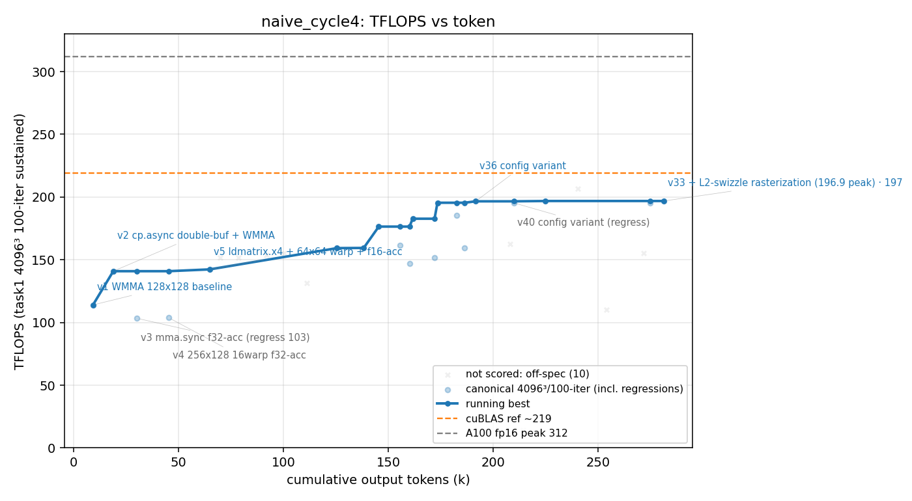

# 方法结果 — `naive_cycle4`(纯 prompt、NEVER STOP、零脚手架、ncu 可用;**干净 worktree 重跑**)

> 曲线/表由 `results/parse_run.sh` 自动生成;「关键发现/瓶颈分析」人工补自 transcript。
> ✅ **自然终止、有效**:worker 第 97 turn 自己收尾(`terminal_reason:completed` / `is_error:false`),自判"~197 是这套手写设计在 sm_80 的天花板,超越需 cuBLAS 级 SASS 或 Hopper wgmma/TMA"。
> 🔒 **干净独立**(隔离修复第二次坐实,见下「隔离验证」)。这是 naive 家族**目前最高的干净自停**(t=100 口径 196.9),也是**最 agentic 的一轮**(自己迭代到 v40 + 重构了 dispatcher 头)。

## 一句话结论

纯 prompt 单 session,**手写** mma.sync f32-accumulate + cp.async 4-stage GEMM,**canonical t=100 计分峰值 196.9 TFLOPS(v33,fp32 级 err 3.3e-5)**。1.38h / 287k output tokens / 97 turns / $17.6 / **0 个 sub-agent**。worker 全程 ncu 驱动,诚实收尾(明确区分 t=100 的 196.9 与暖机长跑的 206.8)。防作弊门通过(纯手写、零库)。

> ⚠️ **别被 206.8 误导(关键口径纠正)**:transcript 里有个 **206.8**,但那是 worker 跑 **`-t2000` 暖机长跑**的数(它自己写"the longer t=2000 run hit 206.77 — more efficient when warm",GPU 跑久了时钟 boost → 虚高),**不是 task1 标准 100 轮口径**。worker **自己**把结果定为"~197"(原话"Surpassing ~197 would require…"、champion=v33)。**parser 旧逻辑 `iters≥100` 误收了这个 t=2000 点 → 已修为 `iters==100`**(暖机长跑和 8192²/-t1 一样算 off-口径)。**本轮诚实峰值 = 196.9;206.8 是暖机镜像,已排除。** 注:206.8 与 goal 的 206.8 数值撞车纯属巧合(都贴着暖机功耗墙),但只有 goal 那个是 t=100 实打实。

## 环境与口径

| 项 | 值 |
| --- | --- |
| GPU / 形状 | A100-80GB / 4096³ fp16 |
| 计分口径 | task1 二进制 **4096³、iters==100**(标准计分轮数);parser 认 `4096³ && iters==100 && err<0.1`,**-t2000 暖机长跑 / 8192² / -t1 全 off-口径** |
| 参照 | **无库基线**(基座去 cuBLAS);v0 cBLAS 仅 CPU 正确性 GT;目标 = A100 fp16 峰值 312 |
| 模型 | claude-opus-4-8, `--effort max` |
| profiler | ncu **可用**;worker 用它做了详尽 occupancy / clock / SOL 实验 |
| 手写校验 | `check_handwritten.sh` **通过**(扫 17 文件,ver≥1 无 cutlass/cublas/cute) |
| 总计(权威,result 事件) | wall **4977s(1.38h)**、out_tok **286,720**、turns **97**、cost **$17.56** |
| 结束方式 | ✅ **自停**(`completed`,`is_error:false`);**无 evaluator / goal_status 0 次**(纯 naive) |
| sub-agent(Task) | **0**(goal=129、cycle3=0;本轮纯串行但迭代到 v40) |

## 🔒 隔离验证(blank-slate 第二次坐实)

| 检查 | 结果 |
| --- | --- |
| 启动时 Read 任何 memory 文件 | **0**(只在 L343+ 尾段 Write 自己的 `hgemm-a100-ceiling.md` 等) |
| 访问 `results/`、`worker_memory`、goal 设计文件 | **0**(worktree 只见 playground-base 内容) |
| 泄漏文件名 `fp16-gemm-best-kernel` | **0** |
| `206.7` 出现 3 次 | = worker **自己**的暖机实测("t=2000 run hit 206.77"),非 goal 泄漏值 |
| `PAD=8`(63 次) | = 它**自己** kernel 源码里的 smem padding(fp16 教科书选择),非抄 |

结论:**0 startup 读、0 越界访问 → 污染按机制排除**(泄漏要靠 Read,这里 Read 数=0;Fix B 已在 launch 前清空 base-slug)。与 goal 206.7 的数值撞车是收敛到同一物理天花板,非串味。

## 迭代曲线(每版本最佳一行,canonical t=100;wall/token 累计)

| cycle | wall(s) | tokens | err | tflops | 说明 |
| --- | --- | --- | --- | --- | --- |
| 1 | 136 | 9,225 | 2.1e-02 | 114.0 | v1 WMMA 128×128 baseline(f16 累加) |
| 3 | 439 | 30,174 | 4.4e-05 | 103.4 | v3 mma.sync **f32 累加**(正确但回退;warp/scheduler 太少、mma 管线吃不满) |
| 4 | 664 | 45,279 | 1.1e-04 | 103.8 | v4 256×128·16warp f32(仍 103,算术强度/寄存器未拉满) |
| 5 | 933 | 64,890 | 1.8e-02 | 142.3 | v5 ldmatrix.x4 + 64×64 warp + f16 累加 |
| 13 | 2,295 | 145,474 | 1.8e-02 | 176.4 | 大 tile |
| 16 | 2,693 | 161,659 | 1.7e-02 | 182.7 | swpipe |
| 18 | 2,943 | 173,466 | 3.4e-05 | 195.5 | **回到 fp32 级、破 195** |
| 21 | 3,354 | 191,632 | 3.9e-05 | 196.6 | v36 |
| **30** | **4,883** | **281,343** | **3.2e-05** | **196.9** | **v33(champion,fp32 级,×2 复现)** |

> v33 在 cycle 25 / 30 两次复现 196.9(err 3.2–3.3e-5,**fp32 级**),稳。off-口径暖机 t=2000=206.8 已排除。完整点 + 排除项见 `result.csv`(canonical/scored/invalid 三列)。

## 关键发现

1. **🔒 隔离修复第二次坐实**:0 startup memory 读、0 越界访问。cycle2 那种抄答案污染不会重演。

2. **naive 自停【方差极大】,本轮冲到 196.9 = 家族最高(干净 t=100)。** 三个干净 naive 自停:**142/154(c3)、178(c2)、196.9(c4)** —— 跨度 142→197,**全看那一轮 worker 探索多深**:c4 自己迭代到 **v40 + 重构 dispatcher 头**(`mma_gemm.cuh`),c3 在 v19 就宣布收敛。**0 sub-agent 也能很 agentic**(纯串行 40 版)。

3. **对照 goal(看门狗 206.8 @ t=100):c4 196.9,差 ~10(~5%)。** 这把 naive-vs-goal 的差从"看着很大"收窄到 **~5%**。结合 goal worker 是**自己**冲到 205.5(看门狗 205.5 后才接入、净 +1.3):
   - **看门狗的机制性增量仍 ≈ +1.3**(不变)。
   - **naive 最好的一轮(196.9)距 goal worker 自达点(205.5)~9** —— 这点差**仍可能是 framing / 探索强度 / 路径方差**,但鉴于 naive 自身就横跨 142→197(55 点),**~9 完全在 naive 方差量级内,不足以坐实 framing 效应**。
   - ⚠️ **教训(我自己踩的)**:初看 c4=206.8 差点下"naive 能自达 goal 峰值、framing 被证伪"的结论 —— 错,那是暖机镜像;纠正后 c4=196.9,故事回到"goal 仍略高、但差很小且被 naive 方差淹没"。**N 还是太小,framing 问题未决。**

4. **收尾分析:一半我认可,另一半是和 naive 一样的"过早宣布撞墙"(已据 `results/naive` 修正)。**
   - ✅ **认可的部分**:worker **主动**区分 t=100(196.9)与暖机 t=2000(206.8)、用前者当结论——无虚报(parser 旧口径 `≥100` 虚收暖机点,锅在 parser);occupancy 一组**控制实验**真且结论成立(`f32-acc@16warps=178`、`single-buffer@16warps=161`,加 warp/砍缓冲都更差 → 1 block/SM 寄存器墙锁死 occupancy,与 naive「occupancy 4 角度被证伪」一致);power-cap ~1230 MHz(→ **时钟标定峰 ~272**,这是 100% tensor util 的理论上限、实际无人达到——本机连 cuBLAS 也只 222)也真,与 goal(~1200 MHz)一致。
   - ❌ **不认可 worker 的"超 ~197 需 cuBLAS 手排 SASS 或 Hopper wgmma/TMA"这个收尾判断** —— 这是和 naive 那轮**一模一样的"撞到硬件墙"误判**。`results/naive` 已据一份**同结构家族参考实现**证伪:同样 1 block/SM、8 warp、64×64 warp tile、经典 `__syncthreads` 多级 cp.async 流水(**无 warp 专门化、无新硬件**)在**同一张 A100 sm_80** 上达 **~214**。所以 196.9→~214 是**同范式内的协同流水工艺没做满**(fp16 累加配合消 spill + permuted/XOR-swizzle 省 shared 上深流水 + zig-zag MMA 遍历 + 4-stage),**不是"需要 SASS / 新硬件"**。
   - ⚠️ **TMA / warp 专门化 / "~250 那一档" 都要纠正(都是红鲱鱼)**:**A100(sm_80)没有 TMA**(Hopper sm_90+ 才有;worker 原话写了 "unavailable on sm_80",对的);**warp 专门化(producer/consumer + async barrier)也是 Hopper 的玩法**,不是 Ampere 高性能 GEMM 的机制(Ampere CUTLASS 就是 multistage cp.async,**和我们 agent 同一个范式**)。**而"CUTLASS-class ~250"是我上一版编错的——本机实测根本没有那一档。** 这台 **power-capped** A100 的真实天花板链(全是同一个 multistage cp.async 范式):
     > agent:178(c2)/196.9(c4)/**206.8(goal)** → 同范式最佳手写参考 **~214** → **CUTLASS ~218**(`naive_no_ncu` 偷库那次实测)→ **cuBLAS ~222**(`naive_ncu_cublas` 222.6 / `naive_no_ncu` 220.5 实测)→ [理论:power-capped 时钟标定峰 ~272 / 满频 spec 312,**没有任何实现摸到**]。
     >
     > **库(cuBLAS 222 / CUTLASS 218)只比最佳手写(~214)高 ~4%**,那点差 = cuBLAS 的手排 SASS 调度,**仍是同范式**。**goal 206.8 = cuBLAS 的 93%、cycle4 196.9 = 89%** —— agent 离这台机器的库上限只差 **~7–11%**,且全在一个范式内。**"超 ~197 需新硬件/SASS"是过早撞墙;312 是 power-cap 下连 cuBLAS 都摸不到的红鲱鱼。**
   - **一句话:cycle4 和 naive 一样,在同范式还没榨干、且离库上限只差 ~10% 时就宣布到顶。** 用户已确认的"**基本还是同范式、只是更精细**"(见 `results/naive` §瓶颈、`results/naive_ncu_cublas` 的 cuBLAS 222.6 实测)在 cycle4 同样成立 —— naive 家族"贪心局部搜索 + 上不去就过早强制再论证"的又一次复现。

> **一句话**:naive_cycle4 干净自停 **196.9(t=100)**,把 naive 拉到离 goal 仅 ~5%;但 naive 自停方差极大(142→197),**看门狗/framing 到底贡献几何仍未决**,需各再多跑几轮看分布。**别再被暖机长跑的热峰值骗。**

## 复现 / 数据来源

- kernel 源快照:`src/matmul_f16/`(v1–v33,含 champion `v33_sweep.cu`)+ **dispatcher 头 `include/playground/mma_gemm.cuh`**(worker 重构过);全部改动 `worker.patch`(1607 行,`git apply` 复现)。
- transcript(权威源):`transcript.jsonl`(session `3cf93dd6`);stream-json `run.jsonl`(取 result 事件总量)。
- task1 计分 log(51):`logs/`。自动产物:`result.csv` / `result_table.md` / `curve.png`。
- 防作弊:`check_handwritten.sh` **通过**;无 `invalid.json`(纯手写;唯一被排除的是 off-口径暖机 t=2000 点,由 parser 的 canonical 列处理,非作废)。
