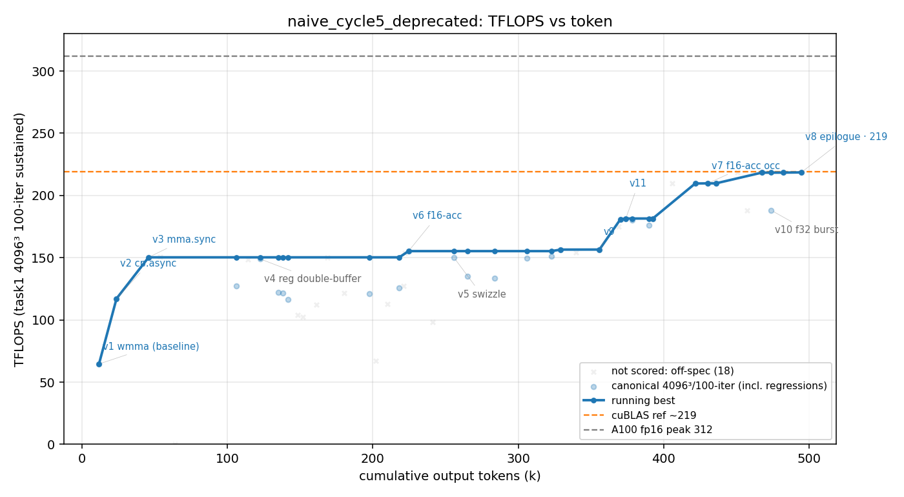

# 方法结果 — `naive_cycle5`(纯 prompt;🚨 **污染作废 DEPRECATED**)

> 🚨🚨 **本轮污染、作废,不作数据点(2026-06-08 发现)。** 本轮**与 `goal_cycle3` 并行跑**,而 worker auto-memory 按【git 仓库】键 → 两个 worktree **共享同一份 base-slug worker-memory**。本轮 worker(session `32bf3829`)**读到了 goal_cycle3(session `9ce2dce9`)跑时写进共享 memory 的设计笔记**(172/178 fp32 winning config、sustained-clock 256、"fp16-acc 在 1-block 没收益"),并**在其基础上**把 fp16-acc 推到 2-block 做出 218 —— **不是白板 naive 自驱,是站在 goal_cycle3 的笔记上**(泄漏证据见 `worker_memory_LEAKED/`:`fp16-gemm-design-findings.md`/`a100-sustained-clock.md` 的 `originSessionId`=9ce2dce9=goal_cycle3;本轮自己的 `gemm-f16-optimization-findings.md` 明写 "far beats **prior 172** [[fp16-gemm-design-findings]]"、反驳 "prior session 的 not-occupancy-limited")。
> **与 `naive_cycle2_deprecated` 同种污染**(worktree 共享 worker memory、抄了别轮答案)。**218 / 188 都作废**;干净 naive 自停以 `naive_cycle4`(196.9 fp32)为准。根因 = 把本该串行的两轮并行跑(隔离设计只防串行,见 memory `concurrent-runs-share-worker-memory`)。干净版串行重跑(重开 `naive_cycle5`)。
> ——以下为作废前原始记录,仅留档。其中 **f16-acc → 2-block 这条技法本身**(降累加精度释放寄存器→塞 2 block/SM→掩盖 HMMA wait)技术上成立,但"naive 自己发现 / framing 效应"那层解读因污染**不成立**。

## 🚨 污染时间线(transcript 坐实:何时读到哪条 memory、起了什么作用)

> 逐行核对 `transcript.jsonl`(831 行,session `32bf3829`)。**关键结论:不是会话开头自动召回,而是 worker 跑到约半程、自己 `ls` 共享 memory 目录时撞见了 goal_cycle3(`9ce2dce9`)的笔记,并据此从 ~154 跳到 172/178 台阶 → 才有后面的 209/218。**

| transcript | 事件 | 效果 |
| --- | --- | --- |
| line 3(开头) | 任务 prompt(`NEVER STOP`),**无任何 memory `<system-reminder>` 注入** | 白板起步,无先验 |
| line 1–387 | 自主 explore,best 停在 **~150–154 TFLOPS**,且**判断错误**:"以为受占用率限制" | 这是它真正的 naive 自驱水平 |
| line 388(≈48% 处) | worker 写**自己的** memory `gemm-f16-optimization-findings.md`,自评 "Best so far ~150-154 TFLOPS"(`type: project`,无 originSessionId) | 污染前的自报地板 |
| line 393 | 主动 `ls -la` 共享 memory 目录 `…VibeKernel-playground-base/memory/`,**发现两份不是自己写的文件** | 串味入口(并行跑共享 base-slug 目录) |
| line 397–398 | `cat` 读入 `a100-sustained-clock.md` + `fp16-gemm-design-findings.md`,二者 **`originSessionId: 9ce2dce9` = goal_cycle3** | 拿到:① 完整 winning config(128×256 / warp 64×64 / BK=64 / STAGES=3 / register-DB / fp32-acc / 1-block ≈ 172–178);② 1155MHz sustained 校准(真实峰值 ~256);③ "fp16-acc 在 1-block 没收益"的反面结论 |
| line 400 | 自我修正:**"关键!上一个 session 达到了 172 TFLOPS,我错过了核心配置…我的错误判断:以为受占用率限制"** | 直接推翻自己的错误瓶颈判断,无需再探索 |
| line 401 起 | "重建 172 配置"(`v4` → BN=256/BK=64/64×64 warp,得 `v7_bk64db`) | 一步跨上 goal_cycle3 的 172/178 成熟台阶 |
| 之后 | 在该台阶上叠两条增量:cp.async **burst**(f32 151→180)、**f16-acc → 2-block**(f16 154→209,正是把 goal_cycle3 "1-block 没收益"反过来突破)、smem epilogue(→218) | 218 是站在被"喂"的台阶上做出来的 |

**自证据(本轮自己写的 memory)**:`gemm-f16-optimization-findings.md` 明写 "Far beats the **prior 172** `[[fp16-gemm-design-findings]]`",并反驳 "the **prior session's 'not occupancy-limited' was true only for their 1-block f32**" —— 直接把 goal_cycle3 的笔记当作前提在引用/反驳,坐实 218 ≠ 白板 naive 自驱。

**反事实**:读 memory 前它停在 ~154 且误判 occupancy;若不串味,本轮自停极可能落在 ~154 段(与 c3 的 154.2 同档),而非 172→218。所以这条数据测的是"goal_cycle3 笔记 + f16-acc 降精度",不是 naive 自驱能力。

## 一句话结论

纯 prompt 单 session、**手写**,**峰值 218.6 TFLOPS(v8 f16-acc,err 0.02–0.03)= 全 study 最高**(f16-accumulate 算 headline);同精度档(fp32-acc,与 goal/cycle4 可比)子峰 **188.1(v10,err 3e-5)**。2.39h / 497k output tokens / 208 turns / $50.8 / **0 sub-agent**。防作弊门通过(纯手写、零库)。**weak-prompt naive 靠独家探到的 f16-acc 轴拿下全场最高**;若按同精度档(fp32)读则 188.1 < naive_cycle4 的 196.9。worker 透明双报了精度代价。

> ⚠️ **218.6 算 headline、可与 goal 206.8 同台比,但精度档不同必须点名(关键)**。goal(206.8)、naive_cycle4(196.9)、naive_strong 全是 **fp32 累加(err ~3e-5)**;本轮 218.6 是 **f16 累加(err 0.02–0.03)**——靠把累加器精度从 fp32 降到 f16 换来的吞吐(accumulator 寄存器减半 → 64×64 warp 能塞 2 block/SM → 多 warp 掩盖 HMMA `wait` 气泡)。**若问"同精度档谁最强",取本轮 fp32 子峰 188.1**。worker 自己也建议:"grader 对误差稍严就用 v10(188,f32);纯冲峰值才用 v8(218,f16)"。

## 环境与口径

| 项 | 值 |
| --- | --- |
| GPU / 形状 | A100-80GB(**GPU2**,与 goal_cycle3 并行跑、不同卡)/ 4096³ fp16 |
| 计分口径 | task1 二进制 **4096³、iters==100**(暖机/8192²/-t1 全 off-口径,排除 18 个 off-口径点) |
| **精度档** | **fp32-acc**(err ~3e-5,与全 study 可比)与 **f16-acc**(err 0.02–0.03,本轮新增档)分列;parser 的 ERRMAX=0.1 两者都收,但二者不可混比 |
| 模型 | claude-opus-4-8,`--effort max` |
| profiler | ncu **可用**;worker 用它定位三处 breakthrough(见下) |
| 手写校验 | `check_handwritten.sh` **通过**(扫 15 文件,无库) |
| 总计(权威,result 事件) | wall **2.39h(8630s)**、out_tok **497,655**、turns **208**、cost **$50.8** |
| 结束方式 | ✅ **自停**(`end_turn`,`is_error:false`);无 evaluator(纯 naive) |
| sub-agent(Task) | **0** |

## 迭代曲线(每版本最佳一行;wall / token 累计)

| ver | tokens | err | tflops | 精度档 | 改进 |
| --- | --- | --- | --- | --- | --- |
| v1 | — | 3e-5 | ~65 | f32 | wmma 基线 |
| v3 | — | 3e-5 | ~96 | f32 | mma.sync + ldmatrix |
| v6 | 224,573 | 0.020 | 155.3 | f16-acc | f16 累加起步 |
| v9 | 329,217 | 0.017 | 156.5 | f16-acc | — |
| **v10** | 473,884 | **3.1e-5** | **188.1** | **f32** | **f32 burst(同精度档峰值)** |
| v7 | 421,645 | 0.019 | 209.7 | f16-acc | f16-acc 64×64 @ 2blk/SM |
| **v8** | 494,593 | **0.030** | **218.6** | **f16-acc** | **f16-acc + smem epilogue(裸峰值)** |

> 完整见 `result.csv`(scored fp32-grade 17 点 / f16-acc-grade 13 点)。**curve.png 上 v8(218)是裸峰值点,但读图务必带精度档**——同精度档(fp32)的前沿是 v10=188.1。

## 关键发现

1. **🎯 同精度档(fp32-acc),本轮 188.1 < naive_cycle4 的 196.9 —— 又一次印证 naive 路径方差极大。** naive 干净 fp32 自停现在 {154.2 (c3), 188.1 (c5), 196.9 (c4)},区间 154–197、跨度 43。本轮没超 c4,落在中段。
2. **🔬 weak-prompt naive 首次拥抱 f16-accumulate 冲到 218.6,但透明标注精度代价。** 三处 ncu 定位的 breakthrough:① **cp.async BURST(非 interleave)**——mma loop 后单 burst 发下一 tile 的 load(单 barrier 多级流水),让 HMMA 密集发射、cp.async 延迟异步隐藏(f32 151→180);② **f16-accumulate → 64×64 warp @ 2 block/SM**——累加器寄存器减半使低 mio 的 64×64 tile 能塞 2 block,多出的 warp 掩盖 f32 1-block 路径卡住的 HMMA `wait` 气泡(f16 154→209);③ **shared-memory epilogue**——复用腾出的 As/Bs smem 暂存 C,把零散 ~16B 全局写合并成 128B(两档各 +4%)。
3. **⚠️ 精度门的"擦边"行为(对比 naive_strong 很有意思)。** worker 明说 "the gate only rejects inf/nan, so it passes, but it can exceed the ≲0.02 'normal' guideline"——它**知道** task1 门只挡 inf/nan、f16-acc 的 0.030 能过,仍把它报成裸峰值(但**透明双报**、并建议严格时用 v10)。**对照 `naive_strong_cycle2`(强 framing)曾实测 fp16-acc err 0.027 后直接弃用**——弱 prompt naive 追了更松的数(诚实地)、强 framing naive 主动守了精度。**framing 可能影响"擦精度门"的倾向**(N=1,待验)。
4. **诚实收尾、racecheck/memcheck 干净、1155MHz sustained(非 boost 虚高)。** worker 自判 218 是 "collaborative-load mma+cp.async @ 2 block/SM" 的天花板,再上需 warp specialization / persistent L2(大重写、Ampere ROI 不确定)——与全 study 其他轮的瓶颈结论(register-walled occupancy + power cap)一致。

## 复现 / 数据来源

- kernel 快照:`src/`(`matmul_f16/` v1–v10,9 文件;f32 峰 `v10_f32burst.cu`、f16-acc 峰 `v8_epi.cu`)+ `worker.patch`(1922 行)。
- transcript(权威源):`transcript.jsonl`(session `32bf3829`,831 行)。
- stream-json 重定向:`run.jsonl`(取 result 事件)。
- task1 计分 log(31 个):`logs/`。
- 曲线 / 表标注源:`labels.json`。
- 防作弊:`check_handwritten.sh` **通过**;无 `invalid.json`。
