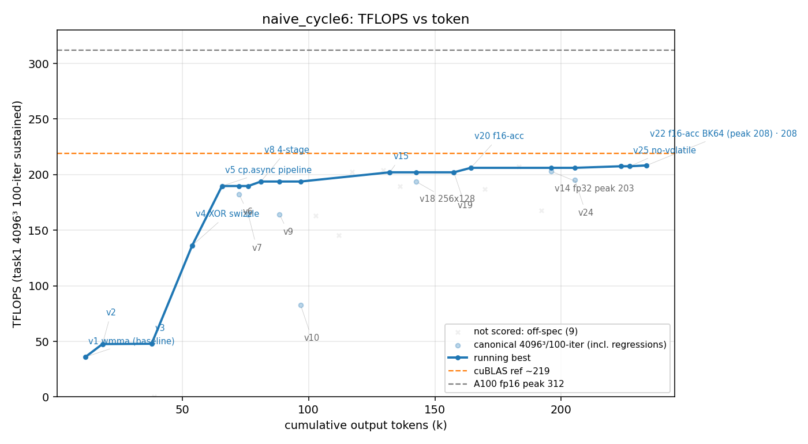

# 方法结果 — `naive_cycle6`(纯 prompt、NEVER STOP、零脚手架;**干净串行 + 优化后 base**;⚠️ 死于 ConnectionRefused)

> 曲线/表由 `results/parse_run.sh` 自动生成;「关键发现/瓶颈」人工补自 transcript。
> 🔒 **干净独立**:串行单跑(全箱唯一 worker)、blank-slate worker memory、跑在**优化后基座 `playground-base@c3bdacd`**(选择性编译 + 快 ninja + 修了 GT==0 inf)。**全程 0 处读到别轮 memory**——这是 `naive_cycle5` 想要但因并行串味没拿到的"干净 naive f16-acc"对照。
> 🔴 **死于 ConnectionRefused、非干净自停**:turn 72 / 233k tok / 1.54h 处 `API Error: Unable to connect to API (ConnectionRefused)`(`is_error:true`)。这是本箱第 4 次 API 级崩溃(naive_strong×2、goal_cycle2、本轮)。**203/208.3 是崩前到达值,非收敛终值**;当部分轮。

## 一句话结论

纯 prompt 单 session、**手写**,崩前两个精度档:**fp32-acc 峰值 203.0 TFLOPS(v14,err 3.1e-5)/ f16-acc 峰值 208.3 TFLOPS(v22,err 0.018)**。1.54h / 234k token / 72 turn / $12.6 / **0 sub-agent**。防作弊门通过(纯手写、零库)。**意义:干净隔离的 naive 这次【自己】摸到了 XOR swizzle 和 f16-accumulate**(cycle3 没用 swizzle、cycle5 的 f16-acc 是抄 goal 的)——证明 naive 能独立走到这两招;但其干净 f16-acc 208.3 < 被污染的 cycle5 的 218(cycle5 有 goal 的完整 config 当跳板)。

## 环境与口径

| 项 | 值 |
| --- | --- |
| GPU / 形状 | A100-80GB(串行单跑)/ 4096³ fp16 |
| base | **playground-base@c3bdacd(优化后)**:选择性编译 + 快 ninja + GT==0 不再 inf |
| 计分口径 | task1 4096³ / iters==100;**fp32-acc(err 3e-5)与 f16-acc(err 0.018)分列**,排除 9 个 off-口径点 |
| 模型 | claude-opus-4-8,`--effort max` |
| profiler | ncu **可用**(worker 用它定位瓶颈,见下) |
| 手写校验 | `check_handwritten.sh` **通过**(扫 31 文件,无库) |
| 总计(权威 result 事件) | wall **1.54h(5562s)**、out_tok **233,790**、turns **72**、cost **$12.55** |
| 结束方式 | 🔴 **ConnectionRefused 崩**(`is_error:true`);非自停、非判达成 |
| sub-agent(Task) | **0** |

## 迭代曲线(running-best;wall/token 累计;⚠️ 分精度档)

| ver | tokens | err | tflops | 档 | 改进 |
| --- | --- | --- | --- | --- | --- |
| v1 | — | 3e-5 | 35.8 | f32 | wmma 基线 |
| v4 | — | 3e-5 | 136.2 | f32 | XOR swizzle |
| v5 | — | 3e-5 | 189.8 | f32 | cp.async 多级流水 |
| v8 | — | 3e-5 | 193.8 | f32 | 4-stage |
| **v14** | — | **3.1e-5** | **203.0** | **f32** | **128×256/64×64/register-DB 冠军(fp32 峰)** |
| v20 | — | 0.022 | 206.1 | f16-acc | f16 累加(自己摸到) |
| **v22** | 227k | **0.018** | **208.3** | **f16-acc** | **f16-acc + BK64(崩前裸峰)** |

> 完整见 `result.csv`。**curve.png 上 v22(208)是裸峰,但读图带精度档**——同精度档(fp32)前沿是 v14=203。

## 关键发现

1. **🔒 干净 naive 独立摸到 XOR swizzle + f16-acc(本轮最大价值)。** 这是 memory-隔离、串行、跑在优化 base 上的干净轮:transcript 0 处读别轮 memory。它**自驱**用上了 **XOR swizzle**(`goal_cycle3` 当初纸面算后没实测的那招)并在 v13+ **自己拥抱 f16-accumulate** → 坐实 `naive_cycle5_deprecated` 的 218 不是"只有抄 goal 才到的",naive 自己也能走 f16-acc 这条轴(只是干净版到 208.3、低于抄了 goal config 的 cycle5 的 218)。
2. **fp32 203 = naive 家族干净 fp32 新高(> cycle4 196.9)。** naive 干净 fp32 现在 {154.2 (c3), 196.9 (c4), 203.0 (c6)}——区间 154–203、跨度 49,路径方差依旧极大。fp32 203 已逼近 goal 的 fp32(201.6–206.8)→ **再次印证 naive 与 goal 的差主要是路径变异**。
3. **🔬 瓶颈(worker ncu 实测):tensor-core-bound ~82%,寄存器墙锁 1 block/SM,提 occupancy 反而更慢。** sm tensor throughput ~82%、DRAM 仅 17%(非访存限);剩 ~18% = HMMA `wait` 延迟 + 每 scheduler 仅 2 warp 的 barrier stall。**每次试 2 block/SM 或 16 warp(更小 warp tile / 4-warp block / fp16 split)都更慢**——缩小 warp tile 杀掉 ILP/reuse。f16-acc 的价值 = 累加器减半解锁 2 block,但实测只微增,worker 把 fp32 v14(203、err 3e-5 更稳)留作冠军。**与全 study 一致的天花板:register-walled occupancy + tensor-latency,~200/312。**
4. **🔴 又一次 API 崩(本箱第 4 次)。** 1.54h 崩在 v25。崩前 v22=208.3 是有效"地板",但没干净自停。长跑务必有兜底/重试。

## 复现 / 数据来源

- kernel 快照:`src/`(`matmul_f16/` v1–v25,25 文件;fp32 峰 `v14_warp64.cu`、f16-acc 峰 `v22_bk64f16.cu`)+ `worker.patch`(5938 行)。
- transcript(权威源):`transcript.jsonl`(session 见 run.jsonl,72 turn)。
- stream-json:`run.jsonl`(result 事件 = ConnectionRefused)。task1 log(30):`logs/`。标注:`labels.json`。
- 防作弊:`check_handwritten.sh` **通过**;无 `invalid.json`。
