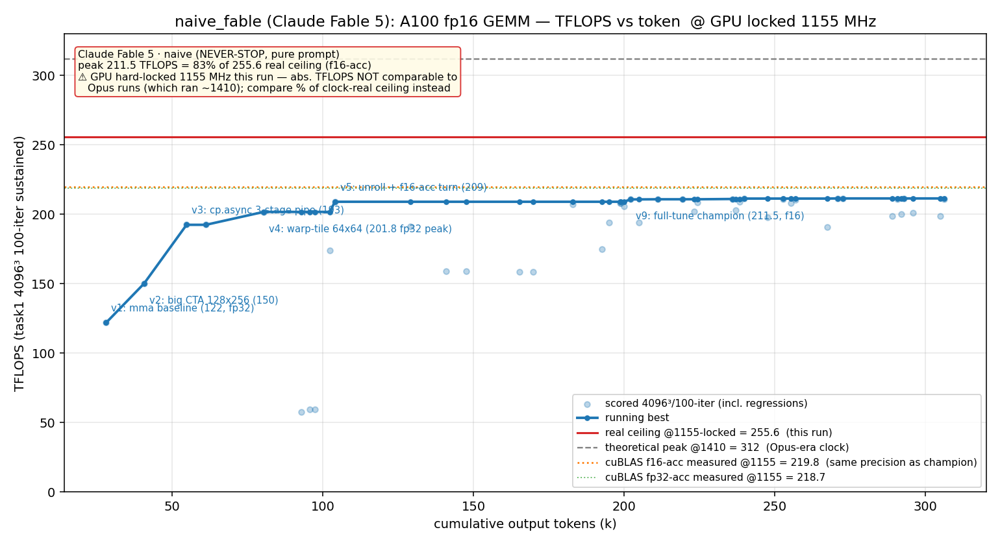

# 方法结果 — `naive_fable`(naive harness + Claude **Fable 5**)

> naive 范式的**模型对比臂**:与 `launch_naive.sh` 逐字相同,唯一变量 = 主 worker 模型 `claude-opus-4-8` → `claude-fable-5`。
> 逐版改进 + 瓶颈见 **[`method_table.md`](method_table.md)**;本文写**分析与关键发现**(含用户要的「输出文字是否少了很多」对比)。

## 一句话结论

Fable 5 在纯 prompt / NEVER-STOP 下,**手写** fp16 GEMM 自停于 **f16-acc 211.5 / fp32-acc 201.8 TFLOPS**(13 版,峰值 v9)。⚠️ **本轮评测 GPU 卡在 1155 MHz(NVRM 驱动 assertion 故障,非软锁,见下)**,有效天花板 255.6,故 211.5 = **占真峰 82.7%**——这是 naive 家族里**占真天花板比例最高**的一轮。耗时 96min / 309,897 out_tok / 145 turns / **$53.14** / 0 sub-agent。防作弊门通过(纯手写、零库)。

## 环境与口径

| 项 | 值 |
| --- | --- |
| GPU / 形状 | A100-80GB / 4096³ fp16 |
| 计分口径 | task1 二进制 100 轮均值(sustained) |
| 参照 | 无库基线(基座已去 cuBLAS);`v0` cBLAS 仅 CPU 正确性 ground truth |
| **时钟(关键)** | **GPU 卡 1155 MHz = NVRM 驱动故障**(`pSmIssueThrottleCtrl != NULL` assertion,dmesg 反复刷;**非 `-lgc` 软锁,`-rgc/-lgc` 解不掉**;满载也死钉 1155 不 boost,只能 GPU reset/驱动重载)。实测:v9 跑 211.7 时 SM 全程钉 1155、321W、不 boost → 有效天花板 = 312×1155/1410 = **255.6 TFLOPS**,非 312。**故障态下跑过的所有 run 绝对 TFLOPS 带 ~−18% 病态偏置,跨时钟态只能比「占真天花板 %」** |
| 模型 | **claude-fable-5**, `--effort max`(naive/Opus 臂为 claude-opus-4-8) |
| profiler | ncu 可用(CAP_SYS_ADMIN ✓);worker 全程 ncu 驱动 |
| 手写校验 | `scripts/check_handwritten.sh` 通过(19 文件无 cutlass/cublas/cudnn) |
| 总计(权威 result 事件) | wall 5769s(96min)、out_tok 309,897、turns 145、cost $53.14 |

## 迭代曲线

完整逐版表(改进 + 瓶颈)见 **[`method_table.md` §A](method_table.md)** / 自动生成的 [`result_table.md`](result_table.md)。



> 本轮 curve.png 是**针对本轮时钟特制**的(`plot_fable.py`):画了 **实红线 255.6(本轮 1155 锁定真天花板)** 与 **灰虚线 312(1410 理论峰,Opus 老跑所处时钟)**,外加**本机实测库天花板**(同 1155、可直接比):**cuBLAS f16-acc 219.85 / fp32-acc 218.74**(源 `results/_baseline_cublas_f16.log` + memory `library-ceilings-a100-gemm`;**不是估计**)。据此 cycle1 的 f16-acc 211.5 = 实测 cuBLAS f16 的 **96%**。版本注记为英文(matplotlib 无 CJK 字体)。

## 关键发现

### 1. 🎯 时钟混淆 = 本轮最大方法学坑(必须先讲)
- **实测坐实**:重跑 v9 并以 20ms 高频采样,SM 时钟**全程钉 1155**(172 采样 min=max=1155),功耗冲到 321W 仍不 boost。
- **真因 = NVRM 驱动故障(不是软锁)**:dmesg 反复刷 `Assertion failed: pStaticInfo->pSmIssueThrottleCtrl != NULL @ kernel_graphics.c:3369`;`nvidia-smi -rgc/-lgc` 解不掉,applications-clock 显示 1410 也无效。满载也**死钉 1155 完全不 boost** → 是**驱动级故障**(只能 GPU reset / 驱动重载,容器内修不了)。详见 memory `gpu-1155-driver-fault-not-lgc`。**后果:故障态下的 run 绝对 TFLOPS 带 ~−18% 病态偏置。**
- **Fable worker 自己测出来了**:它的 auto-memory 写明"GPU locked 1155 → 真天花板 255.6,所有分数按 255.6 判";而 Opus 的 naive_cycle3 worker 全程默认 1410/312(引用 1410 共 34 次)。**Fable 的环境态势感知更准**。
- **后果**:`naive_cycle3`(~1410)与本轮(1155)**绝对 TFLOPS 不可直接比**。公平指标 = 占当轮真天花板 %:Fable **82.7%** vs cycle3 **49%**。对 cycle6/goal,**历史没记录时钟** → 无法定论(若 1410 则 Fable 完胜,若也 1155 则打平 ~81%)。**今后每轮必须 log SM 时钟**(见复现节)。
- 注意此前编排 memory `ncu-base-clock-vs-bench-boost` 记的是"裸跑 boost 1410"——**GPU 状态已变(现锁 1155)**,该 memory 已更新。

### 2. 📉 输出文字确实少了非常多(回答用户的提问)
对比 `results/naive_cycle3/`(Opus)与本轮(Fable),均从 transcript.jsonl 按 message.id 去重统计:

| 指标 | naive_fable(Fable 5) | naive_cycle3(Opus) | 倍数 |
| --- | --- | --- | --- |
| **可见叙述文字(text 块字符数)** | **1,684**(11 块) | **22,510**(54 块) | **Opus 多 ~13×** |
| tool_use 动作 | 144(123 Bash / 11 Write / 7 Edit) | 91 | Fable 多 ~1.6× |
| assistant 消息 | 310 | 204 | Fable 多 |
| **output_tokens(总)** | 309,897 | 360,368 | 相近(Fable 略少) |
| thinking 块 | 155(内容加密、字符不可读) | 59(同) | — |

**结论:是,Fable 5 的可见输出文字少了约 13 倍**(1.7k vs 22.5k 字符)。但这**不是少干活**——它的 tool_use 反而更多(144 vs 91)、总 output_tokens 与 Opus 相当(310k vs 360k)。差异全在**叙述/简报文字**:尽管 seed 明确要求"每轮简报当前 TFLOPS/Error/改了什么/下一步",Fable 基本**跳过了散文式简报,直接动手**(改代码、跑 task1、跑 ncu、git commit)。它把 token 花在 thinking + 工具调用(代码)上,而非自然语言叙述。**这是 Fable 5 的行为签名:极简叙述、动作密集**。

> 口径说明:thinking 块内容在 headless transcript 里被加密(两边都读不到明文字符,故不计入"文字"对比);output_tokens 是把 thinking+text+tool_use 都算进的总量,两边相近 → 进一步印证"少掉的恰恰是可见叙述文字"。

### 3. 🔧 Fable 自发用 git commit 给里程碑打点(Opus 不会)
worktree git log 有 **4 个 worker 自己打的 commit**,message 还写了决策,如 *"lock v9 at ~211.4 TFLOPS; v12 (256x128) measured 199, rejected"*、*"v13: fp32-acc insurance variant — 201.0 @ 3.4e-05"*。Opus 跑则把改动留在工作区不提交。
- **harness 踩坑**:`finish_run.sh` 的 `worker.patch` 用 `git diff --cached HEAD` 算,假设"改动未提交" → 对自提交的 Fable **算出空 patch(0 行)**。已手工用 `git diff <base>..HEAD` 重生成正确 patch(**4348 行 / 13 文件 / 4270 插入**)。这条 harness 缺陷已记进 memory,待修(见下)。

### 4. 🏆 工程纪律高、瓶颈诚实、自停干净
- 13 版里 v6–v8、v10–v12 是**系统化消融并逐一否决**(stream-K / dual-launch / 手动 straddle / BK32 / CUDA-graph / 256×128,理由全在 method_table)。worker auto-memory 留了完整 rejected-experiments 清单 + ptxas codegen 教训(哪些重构会把 REG 从 168 顶到 255 触发 spill)。
- 瓶颈结论诚实:v9 ncu = TC-pipe-active 89%、REG 168、零 bank conflict、零 spill;残差 = k-step 交接 stall,**需手写 SASS**,本环境无汇编器 → **源码层到顶,主动收尾**(stop_reason=end_turn,非崩溃)。与 Opus naive 撞的是**同一堵墙**(源码层 ~ ceiling、再上需 SASS)。
- **双交付**:v9(211.5,f16-acc,err 0.018,快)+ v13(201.0,fp32-acc,err 3.4e-5,精确)——精度档透明,不算 reward-hack。注意 f16-acc 是降精度换吞吐(见 memory `f16-accumulate-precision-confound`),跨轮比峰值要先对齐精度档。

### 5. 💰 成本签名:贵,但贵在 turn 多 / cache-read 重
$53.14 是 naive 家族单轮偏贵的($53 vs cycle6 $12.6 / cycle3 $20.7),却**只用了更少的 output_tokens**(310k)。原因:145 turns(vs cycle6 72 / cycle3 92),每 turn 重读全 context → **cache_read 高达 32.8M tokens**(cycle3 17.8M)。"极简叙述 + 多短 turn"的风格天然 cache-read 重 → 成本高。(goal 的 $87 是另一种贵:284 turn + 121M cache-read + 看门狗长尾。)

## 复现 / 数据来源

- kernel 源快照:`results/naive_fable/src/`(13 版)+ **`worker.patch`(已修正,base..HEAD,4348 行)**;worker 自提交,worktree git log 有 4 个里程碑 commit。
- transcript(token/曲线/文字对比权威源):`results/naive_fable/transcript.jsonl`
- run.jsonl(仅取最终 result 事件总量):`results/naive_fable/run.jsonl`
- 曲线/表标注源:`results/naive_fable/labels.json`(ver→技法+瓶颈);本轮特制图脚本:`results/naive_fable/plot_fable.py`
- worker 自写 auto-memory(环境/best-config/ptxas 教训,极有价值):`results/naive_fable/worker_memory/`
- **时钟复现(今后每轮都该做)**:
  ```bash
  cd worktrees/naive_fable && source ../../env.sh
  nvidia-smi --query-gpu=clocks.sm,power.draw --format=csv,noheader -lms 20 > /tmp/clk.csv &
  FLOAT=f16 VER=9 ./task1.sh run          # 跑分;同时高频采样
  # /tmp/clk.csv 里 SM 全 1155 = 锁定确认,真天花板 255.6
  ```
- **resume(Ralph-Loop 式继续跑)**:见同目录 [`RESUME.md`](RESUME.md)。worktree 已保留、session_id 已存、worker_memory 已备份。
