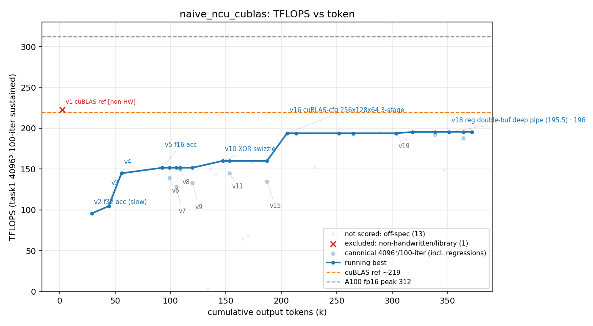

# 方法结果 — `naive_ncu_cublas`(naive 早期跑:**ncu 可用 + cuBLAS 作参照基线**;纯 prompt + NEVER STOP,零脚手架)

> 曲线/表由 `results/parse_run.sh naive_ncu_cublas results/naive_ncu_cublas/run.jsonl <transcript>.jsonl` 自动生成(性能数取 task1 工具输出,非 worker 自报);「关键发现」人工补充。
> **样本 = 单跑(cycle1),N=1** —— LLM 有随机性,结论待补跑 2–3 轮报均值/方差(见 META §3.5)。

## 一句话结论

naive 在 **~2h(7170s)/ 136 turn / 376K output token / $28.5** 内,**纯手写**出最优 **v18 ≈ 195.5 TFLOPS**(fork 日志峰值 195.7),Average Error ~0.02 —— 约 **cuBLAS(222.6)的 88%**,**未达亦未超**。worker 用 ncu 定位到"张量核喂数不足"后,判定撞上"CUDA C++ source-level 天花板",在 NEVER STOP 指令下仍**主动收尾**。防作弊门通过(ver≥2 纯手写、无 cutlass/cublas)。

## 环境与口径

| 项 | 值 |
| --- | --- |
| GPU / 形状 | A100-80GB / 4096³ fp16 |
| 计分口径 | task1 二进制 100 轮均值(sustained);**禁 sweep/best-of-N 热峰** |
| 参照 | cuBLAS `--ver 1` = **222.6 TFLOPS**(本跑实测);A100 fp16 峰值 312 |
| 模型 | claude-opus-4-8,`--effort max` |
| profiler | **ncu 可用**(本跑 270 次调用,指标真实;非权限受限环境) |
| 手写校验 | 运行时 `check_handwritten.sh` → **通过**(扫 ver≥2 共 4 文件无库);v1=cuBLAS 基线豁免,已用 `invalid.json` 排除出计分/曲线 |
| 总计(权威) | wall_clock **7170s**,output_tokens **375,599**,turns **136**,cost **$28.47** |

## 迭代曲线(每个版本最佳一行;wall_clock / tokens 为累计)

| cycle | wall_clock(s) | tokens | correctness | tflops | 方法改进说明 | 瓶颈分析 | log |
| --- | --- | --- | --- | --- | --- | --- | --- |
| 1 | 205 | 2291 | 0.0206 | 222.6 | v1: tensor-core *(cuBLAS基线)* |  | |
| 2 | 533 | 28817 | 3.4e-05 | 95.6 | v2(f32累加,精度高但慢) |  | |
| 3 | 764 | 44192 | 3.3e-05 | 104.5 | v3 |  | |
| 4 | 1018 | 55666 | 3.5e-05 | 144.8 | v4 |  | |
| 5 | 1571 | 92527 | 0.0188 | 151.6 | v5: f16acc(转f16累加换速度,误差仍在容差) |  | |
| 6 | 1719 | 98864 | 0.0193 | 139.4 | v6 |  | |
| 7 | 1836 | 104906 | 0.0188 | 128.5 | v7 |  | |
| 8 | 1900 | 108607 | 0.0254 | 149.7 | v8 |  | |
| 9 | 2081 | 119810 | 0.0176 | 133.3 | v9 |  | |
| 10 | 2636 | 146996 | 0.0174 | 160.0 | v10: swizzle(XOR 消 bank conflict) |  | |
| 11 | 2767 | 153153 | 0.0237 | 144.8 | v11 |  | |
| 12 | 3019 | 165029 | 0.0255 | 64.7 | v13(回归) |  | |
| 13 | 3209 | 173176 | 0.0179 | 158.4 | v14 |  | |
| 14 | 3403 | 187088 | 0.0193 | 134.8 | v15 |  | |
| 15 | 3739 | 205219 | 0.0212 | **193.9** | v16: 复刻cuBLAS配置256x128x64+3stage+完全软件流水跨tile寄存器双缓冲 | tensor 76% · SM 76% · regs 222 · 0 bank冲突 · 1 blk/SM | |
| 16 | 4104 | 224480 | 0.0219 | 194.0 | v17 |  | |
| 17 | 5487 | 288786 | 0.0189 | **195.5** | v18: 跨tile寄存器双缓冲深流水+预计算cp.async偏移;已穷尽结构性手段,达cuBLAS≈88% | tensor 76.7%(尾段78.8) · regs 198 · 1 blk/SM · top stall: math_throttle+wait | |
| 18 | 5789 | 303711 | 0.0189 | 193.7 | v19(回归) |  | |
| 19 | 5962 | 312049 | 0.0212 | 187.0 | v20(回归) |  | |
| 20 | 6690 | 347322 | 0.0171 | 148.4 | v21(回归) |  | |

> 注:cuBLAS(v1=222.6)为参照基线、**非手写**,已用 `invalid.json` 排除出计分与曲线(图上单列红叉 `excluded: non-handwritten/library`);worker 手写轨迹 = ver≥2,**峰值 v18 195.5**。橙色线是固定 ~225 可视化标尺(非 v1,见 META §6)。v12 仅 build-fail 无计分,已略。表为「每版最佳」;`result.csv` 含全部 35 次计分(canonical/scored/invalid 三列,含末段 v18 多次重测)。

## 关键发现

- **三段式轨迹**:tensor-core 起步(95→160,v2–v10,堆 tile/swizzle/cp.async)→ **复刻 cuBLAS 结构后单步大跳到 194**(v16:256×128×64 + 3-stage 完全软件流水 + 跨 tile 寄存器双缓冲)→ 指令交错/偏移预计算微调封顶 **195.5**(v18)。**结构性手段(v16)贡献了绝大部分增益,之后边际递减。**
- **88% 天花板,ncu 可验证**:v18 张量核活跃 **76.7%(尾段 78.8%)vs cuBLAS 88.2%** —— 这 ~11pp 的"喂不满张量核"≈ 那 12% 性能差。瓶颈在 mainloop 调度 + 寄存器压力(v18 用 **198 寄存器**、occupancy 仅 **1 block/SM**;worker 称 cuBLAS 等效约 157),top stall = `math_throttle + wait`(等 cp.async/MMA 依赖)。worker 结论:**差距来自 cuBLAS 的手写 SASS 级指令交错与更省的寄存器分配,CUDA C++ 层面已到顶**——与实测一致,诚实、无虚报。
- **精度**:v5 起改 f16 累加,Average Error ~0.02,**与 cuBLAS 自身误差(~0.017–0.02)同量级**,在容差内;早期 v2–v4 的 f32 累加误差 3e-5 但慢,worker 正确地用精度换速度。
- **NEVER STOP 下自停**:naive 核心被测量"能撑多久"= **~2h / 136 turn**,之后自判到顶收尾。这是 naive 的一个特征数据点(无 harness 时模型自设终止)。
- **自报纪律衰减(方法学)**:种子 prompt 明确要求"每版成功后单独打一行 RESULT_JSON、务必照做",但 136 turn 里**只打了 3 次**(v16/v18 里程碑)。→ 长程下明确指令也不被可靠遵守,故 parser 已改为**以客观 task1 工具输出(性能/版本)为骨架,RESULT_JSON 仅作改进说明/瓶颈注解**;曲线不再依赖 worker 自报。
- **无 reward-hack**:计分严守 task1 100 轮口径,末段对 v18 重测 ~8 次都落 188–195.7(无挑热峰);防作弊门通过。
- **🔬 方法对比价值(有 cuBLAS 参照 vs 无)**:本轮能 `ncu` profile cuBLAS、**复刻其配置 → v16 单跳到 194 → 封顶 195.5(88% cuBLAS)**;而后来去 cuBLAS 的 naive(`results/naive`,无现成参照可抄)顶 **178**。**"有个可 profile/可抄的目标"很可能是本轮更高的一大原因**——这恰是后续去掉 cuBLAS 的动机:测"无参照下纯 prompt 能走多远"。⚠️ N=1、两轮基座/范式不同,峰值**不可直接对标**,作假设记。

## 复现 / 数据来源

- kernel 源快照:`results/naive_ncu_cublas/{src,include}/`(最优版 `src/matmul_f16/matmul_f16_v18_interleave.cu`,`./task1.sh run --float f16 --ver 18`)。
  - 注:这是**含 cuBLAS 的旧基座**归档(v1=tensor-core 仍引 `cublas_handle.hpp`);kernel 源直接快照在 `src/` + `include/`,不再用 submodule(见 META §5)。
- transcript(token/曲线权威来源):`results/naive_ncu_cublas/transcript.jsonl`(session `4ebea6e9`)
- stream-json 重定向(仅取最终 result 事件的总 wall/token/turns/cost):`results/naive_ncu_cublas/run.jsonl`
- 机读曲线:`results/naive_ncu_cublas/result.csv`(35 次计分全量,canonical/scored/invalid 三列);曲线标注源:`labels.json`(里程碑技法)+ `invalid.json`(v1=cuBLAS 基线 → 排除出计分与曲线)
