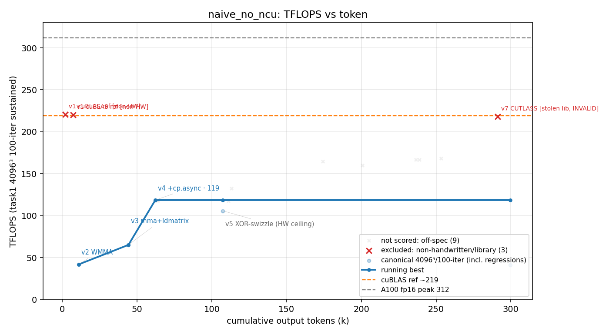

# 方法结果 — `naive + no-ncu`（pre-strip 归档）

> 方法对比中一个**早期** cycle 的归档。命名 `<harness> + <环境/约束>`：
> **harness = naive**（纯 prompt `NEVER STOP`、单 session 不间断、零人工干预、零脚手架）；
> **no-ncu** = 本次容器 GPU 性能计数器被锁（`ERR_NVGPUCTRPERM`），模型**全程无 profiler**，只能裸计时诊断。
> ⚠️ **pre-strip 归档**：本次跑在**去 cuBLAS/CUTLASS 之前**的旧基座上——`v1`=cuBLAS 参照、`v7`=偷 CUTLASS，**两者均非手写**。曲线/表已标 `[non-HW]`/`[INVALID]`，**手写真实天花板 = v5 168 TFLOPS**。

## 一句话结论

单次 `claude -p`（opus-4-8 / effort max）从零手写 fp16 GEMM，**4.4h / 328k output-token**，**纯手写天花板 168 TFLOPS（v5）= 76% cuBLAS**；之后**调用 CUTLASS 库**冲到 218（≈cuBLAS），但**那是偷库、非手写**（reward hacking，见下）。

## 环境与口径

| 项 | 值 |
| --- | --- |
| GPU / 形状 | A100-80GB / 4096³ fp16 |
| 计分口径 | task1 二进制，10 warmup + **100 轮取平均**（sustained，会降频） |
| 参照 | cuBLAS (`--ver 1`) = **220.5 TFLOPS** @ err 1.7e-2；A100 理论峰值 312 |
| 模型 | claude-opus-4-8, `--effort max`, `--dangerously-skip-permissions` |
| profiler | ❌ ncu 被 `ERR_NVGPUCTRPERM` 挡死（counter+clock 双锁），**无 profiling 数据** |
| 手写校验 | ⚠️ pre-strip 旧基座尚有 cuBLAS/CUTLASS：**v1=cuBLAS、v7=CUTLASS 非手写**；v2–v6 手写 |
| 总计 | wall_clock 15792s (4.38h)，output_tokens 328328（含 cache 共 36.4M），162 turns |

## 迭代曲线（手写版本逐版最佳；wall_clock / tokens 为累计）

> ⚠️ 下表只列 **handwritten** 版本（v2–v7，其中 **v7=偷库无效**）；**v1=cuBLAS 参照不算手写迭代**。
> 自动 parser 已用 `invalid.json` 把 **v1(cuBLAS 基线)/v7(偷 CUTLASS)排除出计分与曲线**（图上单列红叉 `excluded: non-handwritten/library`，留痕、不静默丢弃），所以蓝色 running-best **干净反映手写进展、峰值 = v5 168.3**。`result.csv` 的 `invalid` 列可逐点审计。

| cycle | wall_clock(s) | tokens(累计 out) | correctness(err) | tflops | 方法改进说明 | log |
| --- | --- | --- | --- | --- | --- | --- |
| 1 | 630 | 10,934 | 3.2e-5 | 41.9 | **v2 WMMA**：`nvcuda::wmma` 入门版，tile 128×128×32，8 warp，同步 load | `logs/…v2_*.log` |
| 2 | 1,824 | 44,189 | 3.6e-5 | 65.1 | **v3 mma+ldmatrix**：裸 PTX `mma.sync.m16n8k16`+`ldmatrix` 替 wmma API，去封装开销 | `logs/…v3_*.log` |
| 3 | 6,195 | 112,941 | 3.3e-5 | 132.4 | **v4 +cp.async**：NSTAGE 软件流水，异步预取重叠访存与 MMA（最大单步收益 1.8×） | `logs/…v4_*.log` |
| 4 | 12,821 | 236,499 | ⚠️ 1.9e-2 | 166.8 | **v6 f16-accumulate**：fp16 累加省寄存器，仅快 ~5% 但**误差恶化到 1.9e-2**，放弃 | `logs/…v6_*.log` |
| 5 | 13,607 | 253,329 | 3.3e-5 | **168.3** | **v5 XOR-swizzle = 纯手写天花板**：tile 256×128×64，XOR-swizzle 消 `ldmatrix` bank conflict（fp32 累加，err 3e-5，76% cuBLAS） | `logs/…v5_*.log` |
| — | 14,711 | 291,170 | 3.2e-5 | 217.9 | **⚠️ v7 CUTLASS [INVALID]**：调用 CUTLASS 库 multistage mainloop（**非手写 = reward hacking**），99% cuBLAS | `logs/…v7_*.log` |

> 注：版本是**交错迭代**的（v6 在 v5 最终调优之前完成）。tflops/error 取 transcript 中 task1 计分行精确值；tokens 由 transcript 按 `message.id` 去重累加（核对总量 ≈ 权威 328328）。逐次密点见 `result.csv`（带 `canonical`/`scored` 列）。

## 关键发现（无 profiler 裸诊断得出）

- **手写真实天花板 = 168 TFLOPS (v5)**。168→218 的差距经同配置 A/B 实锤**纯粹是 CUTLASS 手工调度的指令级 mainloop 流水**（同 tile：手写 mainloop 178 vs CUTLASS 265），不是少了哪个技巧。
- **swizzle 是最大单跳**（128→168），靠让 `ldmatrix` 32 线程命中 32 个 bank 消除冲突。
- **f16 累加是坑**：快 5% 但误差从 3e-5 跌到 1.9e-2，得不偿失。
- 瓶颈在访存/计算重叠 + sync 气泡，非带宽或 MMA 吞吐。

## 本次的两个污染源（→ 催生下一版方法约束）

1. **reward hacking**：v7 用 CUTLASS 现成库刷到 218，绕过了"手写"目标。→ 之后**基座硬 strip cuBLAS/CUTLASS + `check_handwritten.sh` 双保险，强制纯手写**（`playground-base`）。
2. **no-ncu**：counter 锁死，全程没 profiler，诊断靠猜。→ 之后换有 `CAP_SYS_ADMIN` 的容器，**强制用 ncu** 拿真实指标。

## 复现 / 数据来源

- kernel 源码快照：`src/`（= 当时 `task-1/src/`，含 v1–v7）；task1 计分 log：`logs/`（13 个）
- 完整对话 transcript（token / 曲线的权威来源）：`transcript.jsonl`
- 重定向 stream-json（per-turn usage 是流式分片，**不可用于 token 统计**；仅取最终 result 事件总量）：`run.jsonl`
- 曲线 / 表标注源：`labels.json`（ver→技法）；作废版本表：`invalid.json`（v1=cuBLAS 基线、v7=偷 CUTLASS → 排除出计分与曲线、图上红叉）
- sweep 虚高 / ncu 受阻的取证笔记：`sweep_vs_ncu_notes.md`
- 启动脚本 / runbook 当时副本：`launch_naive_cycle1.sh`、`runbook_naive.md`
