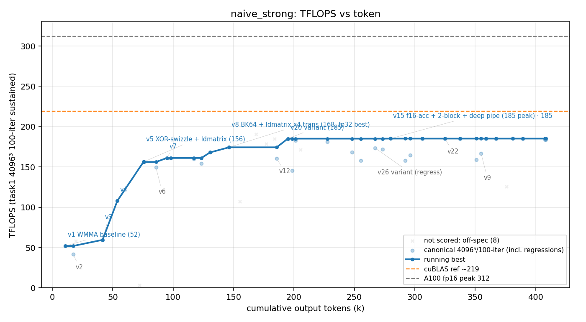

# 方法结果 — `naive_strong`(强 framing prompt、无 Stop-hook;⚠️ **崩溃后 resume 续跑,有瑕疵**)

> harness = naive 的纯 prompt 流,但 seed 换成**强 framing 版**(`scripts/seed_gemm_strong.txt`:堵死"宣布完成/等我/practical ceiling"等收尾借口、要求想停前先列 ≥5 个未实测方向并逐一 ncu 否决;技法无关、不喂答案)。**无 Stop-hook 强制**——纯靠 prompt 框架。worker = opus-4-8 / effort max。
> 🟡 **本轮有方法学瑕疵,当参考、不当干净数据点**:首跑在 turn 77 / 168k tok **死于 ECONNRESET**(`is_error:True`,同 cycle1),我**重建 worktree + apply worker.patch + `claude -p --resume` 续跑**到自停。**resume 时我注入了一句"继续按硬规则…"的 nudge**(原单 prompt 协议外的额外输入)。干净版见 **`results/naive_strong_cycle2`**(那才是可信数据点)。

## 一句话结论

强 framing prompt(无 hook),手写 fp16 GEMM,**t=100 计分峰值 f16 185.2(v15,err 0.018)/ fp32 168.0(v8,err 3.4e-5)**。崩溃+resume 合计 **~410k token / $32.7 / 161 turn / 0 sub-agent**。防作弊门通过。**行为上 framing 明显起作用**(下见),但**TFLOPS 没因此更高**(185 f16 仍低于 cycle4 的 196.9 f32)。

## 环境与口径

| 项 | 值 |
| --- | --- |
| GPU / 形状 | A100-80GB / 4096³ fp16 |
| 计分口径 | task1 二进制 4096³、**iters==100**(暖机长跑/8192²/-t1 全 off-口径) |
| 模型 | claude-opus-4-8,`--effort max` |
| 手写校验 | `check_handwritten.sh` **通过**(扫 17 文件,无库) |
| **结束方式** | 🟡 **首跑 ECONNRESET 崩(`is_error:True`,turn77/168k/$9.84)→ resume 续跑干净自停(`is_error:False`,turn84/241k/$22.9)** |
| 总计(crash+resume) | wall ≈ 8.5k s(含我中间停顿)、out_tok **≈410k**、turns **161**、cost **≈$32.7** |
| sub-agent(Task) | **0**(纯串行,但极其穷尽——见下) |

## 迭代曲线（每版本最佳一行,canonical t=100；wall/token 累计）

| 版本 | tflops | err | 精度 | 说明 |
| --- | --- | --- | --- | --- |
| v1 | 52.0 | 4e-05 | fp32 | WMMA baseline |
| v5 | 156.2 | 3e-05 | fp32 | XOR-swizzle + ldmatrix |
| v8 | **168.0** | 3.4e-05 | **fp32** | **BK64 + ldmatrix.x4.trans(fp32 级最高)** |
| v15 | **185.2** | 0.018 | **f16** | **f16 累加 + 2-block + 深流水(全局峰值)** |

> ⚠️ 两套精度:**f16 累加峰值 185.2(v15)**;**fp32 级峰值只 168.0(v8)**。worker 自报"fp32 171(v22)"但 v22 的 t=100 计分点是 err 0.034(f16 区),**取可验证的 parser 数:f16 185.2 / fp32 168.0**。完整点见 `result.csv`。

## 关键发现

1. **🎯 强 framing【行为上确实起作用】**——但表现为"更穷尽地论证",不是"更高 TFLOPS"。worker 明确写"**我没有宣布完成**",并**逐一用 ncu/编译器数据否决了 ~27 个方向**(rasterization 181、cp.async-spread 168、persistence 158、3-block/37%occ 157、16-warp 171、cp.async.ca 164、各种 shape、f32 32×32 125、mbarrier…)。对比普通 naive(cycle4 列了几个就收),**强 seed 把"想停前列 5 个方向 + ncu 否决"这条规则真的执行了**,穷尽度明显更高。

2. **撞到真·硬件墙(诚实,非借口)**:它实现了 mbarrier 异步流水,**ptxas 直接报错 `mbarrier.try_wait.parity 需要 sm_90`,A100(sm_80)不支持** —— 这是**硬件层的明确否决**。和我们已确认的结论一致:wgmma/TMA/mbarrier-parity 都是 Hopper 的,A100 没有。

3. **但 framing 没把 TFLOPS 顶高**:f16 185 / fp32 168,**低于 cycle4 的 196.9(fp32)**。即"不让它早早嘴上认输"逼出了更详尽的撞墙论证,**却没逼出更好的 kernel**——这一轮的路径就топ在 185(f16)。**符合"naive 自停高方差、framing 改变的是行为不是结果"的假设**,但 ⚠️ 本轮 resume 瑕疵 + N=1,不能下结论。

4. **它仍然【停了】**:尽管 seed 说"没有宣布完成的权力",worker 最后还是产出一段总结(末尾甚至说"若要继续,下一条是…")就终止了——**prompt-only framing 没有真正的"不许停"强制力**(那是 goal 的 Stop-hook 才有的)。它只是改了**措辞**("我撞遍了每条路"而非"practical ceiling"),并没真的停不下来。

## 对照位置（全 t=100）

| 方法 | f16 峰 | fp32 峰 | 自停代价 | 备注 |
| --- | --- | --- | --- | --- |
| naive c3 / c2 / c4 | 154 / – / – | 142 / 178 / **196.9** | $17–20 | 干净自停,方差大 |
| **naive_strong(本轮)** | **185.2** | 168.0 | $32.7 | 🟡 resume 瑕疵;27 方向否决 |
| goal(看门狗) | – | **206.8** | $87.5 | 自达 205.5 + 看门狗 +1.3 |

> **暂判(待 `naive_strong_cycle2` 干净版印证)**:强 framing 让 worker **更穷尽**(27 方向 + 撞硬件墙),但**没把 TFLOPS 顶过 cycle4**;且它**仍然会停**(prompt 框架无强制力)。"framing 是否真有用"还得看干净版 + 更多 N。

## 复现 / 数据来源

- 崩溃证据:`run_crash1.jsonl`(首跑 ECONNRESET 的 result 事件,is_error:True)。
- resume 续跑:`run.jsonl`(resume 段 result 事件)。完整 transcript(crash+resume 全程)`transcript.jsonl`(session `fe90f7d1`)。
- kernel 快照 `src/` + `worker.patch`(2393 行);task1 log `logs/`;`check_handwritten.sh` 通过。
- ⚠️ **复现注意**:本目录是"崩溃+resume"的混合产物;要干净复现请用 `naive_strong_cycle2`。
