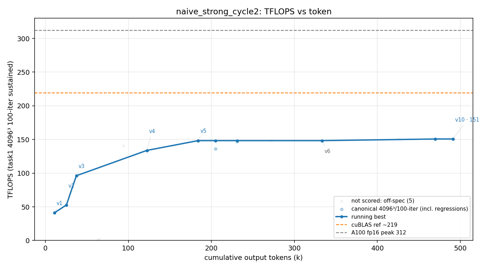

# 方法结果 — `naive_strong_cycle2`(强 framing prompt、无 Stop-hook;⚠️ **崩+resume,但 resume 未注入 nudge**)

> harness = naive 纯 prompt 流,seed = 强 framing 版(`scripts/seed_gemm_strong.txt`:堵死收尾借口、想停前先列 ≥5 个未实测方向逐一 ncu 否决;技法无关、不喂答案)。**无 Stop-hook**——纯靠 prompt。worker = opus-4-8 / effort max。
> 🟡 **方法学瑕疵(比 cycle1 轻)**:首跑在 turn 121 / 330k tok **死于 ECONNRESET**(`is_error:true`),`--resume` 续跑到干净自停。**与 cycle1 不同:本次 resume 的首条消息是 worker 自己读 v 文件的 tool_result,未发现注入的人工 nudge**(cycle1 注入过)。仍是崩+resume、非一气呵成,**当参考、不当完全干净点**。

## 一句话结论

强 framing(无 hook),纯手写 fp16 GEMM,**t=100 计分峰值 150.7(v10,fp32 级 err 4e-5)**。崩+resume 合计 **~492k token / ~$43.7 / 176 turn(121崩+55) / 0 sub-agent**。防作弊门通过。worker 干净自停,自报 "thoroughly-characterized optimum",**并逐条列出每个被 ncu 实测否决的方向**(framing 行为显著)——但**峰值 151 低于 naive_cycle4 的 196.9**(framing 改行为不改天花板,与 cycle1 同结论)。

## 环境与口径

| 项 | 值 |
| --- | --- |
| GPU / 形状 | A100-80GB / 4096³ fp16 |
| 计分口径 | task1 二进制 4096³、**iters==100**(暖机/8192²/-t1 全 off-口径) |
| 模型 | claude-opus-4-8,`--effort max` |
| 手写校验 | `check_handwritten.sh` **通过**(无库) |
| **结束方式** | 🟡 **首跑 ECONNRESET 崩(turn121/330k/$23.0)→ resume 干净自停(`is_error:false`/`end_turn`,turn55/162k/$20.7)** |
| 总计(crash+resume) | out_tok **≈492k**、turns **176**、cost **≈$43.7** |
| sub-agent(Task) | **0**(纯串行) |

## 迭代曲线(running-best;wall/token 累计,跨 crash+resume)

| ver | tokens | tflops | 改进 |
| --- | --- | --- | --- |
| v1 | 10,807 | 41.1 | wmma 基线 |
| v2 | 25,235 | 52.8 | cp.async |
| v3 | 37,191 | 96.2 | mma.sync + ldmatrix |
| v4 | 122,251 | 133.8 | 2-block occupancy |
| v5 | 184,039 | 148.3 | 1-sync pipeline |
| **v10** | **469,941** | **150.7** | **volatile ldmatrix/mma interleave(峰值)** |

> 完整见 `result.csv`。曲线 token 轴已合并 crash+resume(0→~492k 累计)。两条参照线为全局标尺,含义见 META §6。

## 关键发现

1. **framing 改行为、不改天花板(与 cycle1 同向坐实)。** 自停前 worker 把 16-warp 256×128(126.7)、128×128 2-block no-spill(141)、NS4 深流水(126)、4-warp decoupled-barrier(139)、rasterization/cp.async.ca/mma-order/kt-unroll(126–147)、fp16-accumulate(误差超门)**逐一 ncu 实测否决**——比 naive 更穷尽地"证明到顶"。**但峰值 151 仍落在 naive 区间下沿**(naive {154, 197})。强话术 → 更彻底自证,≠ 更高 TFLOPS。
2. **本轮自判瓶颈 = ILP-vs-occupancy Pareto 前沿(mma-bound)**:`wait` 35% + `math_pipe_throttle` 22% stall,tensor pipe ~60% active @ 12.5% occupancy;32-tile ILP 需 128 acc 寄存器(fp32)= 整个 2-block 预算 → 2-block 对高 ILP tile 数学上不可能;16-tile ILP @2-block(25% occ)实测 141 < 151 → **per-warp ILP 决定性胜过 occupancy**。诚实收尾,无虚报。
3. **0 sub-agent**(同 cycle1、naive_cycle4;goal c1=129 是路径变异,见 `goal_cycle2/result.md`)。

## 复现 / 数据来源

- kernel 快照:`src/`(peak `matmul_f16_v10.cu`)+ `worker.patch`。
- transcript(权威源):`transcript.jsonl`(resume session `ba071218`)。
- stream-json:`run.jsonl`(resume)+ `run_crash1.jsonl`(首跑崩,turn121/$23.0)。
- 防作弊:`check_handwritten.sh` **通过**;无 `invalid.json`。
